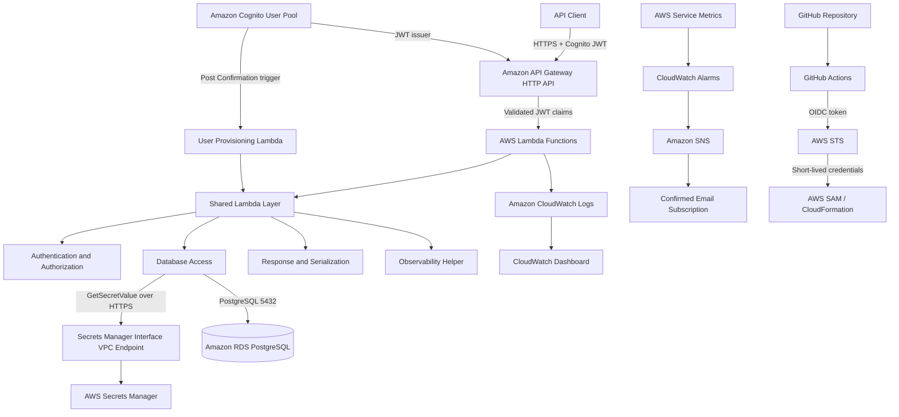
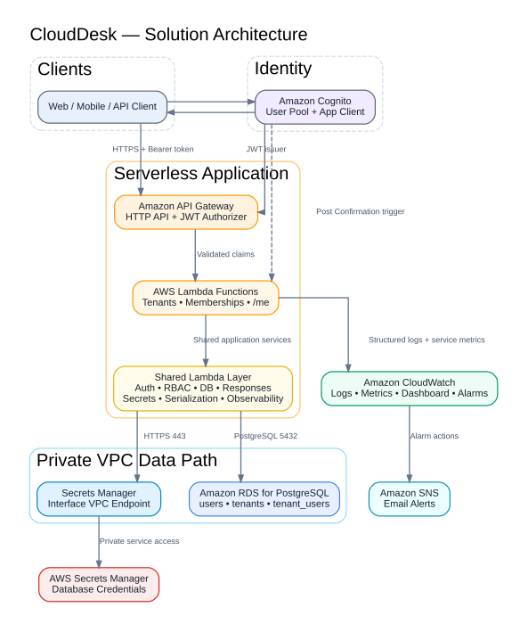
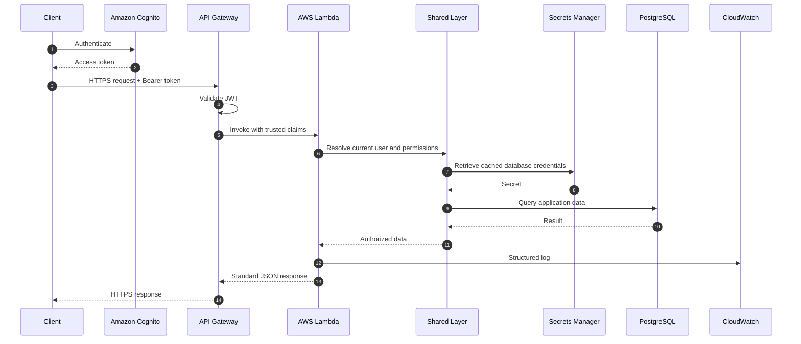
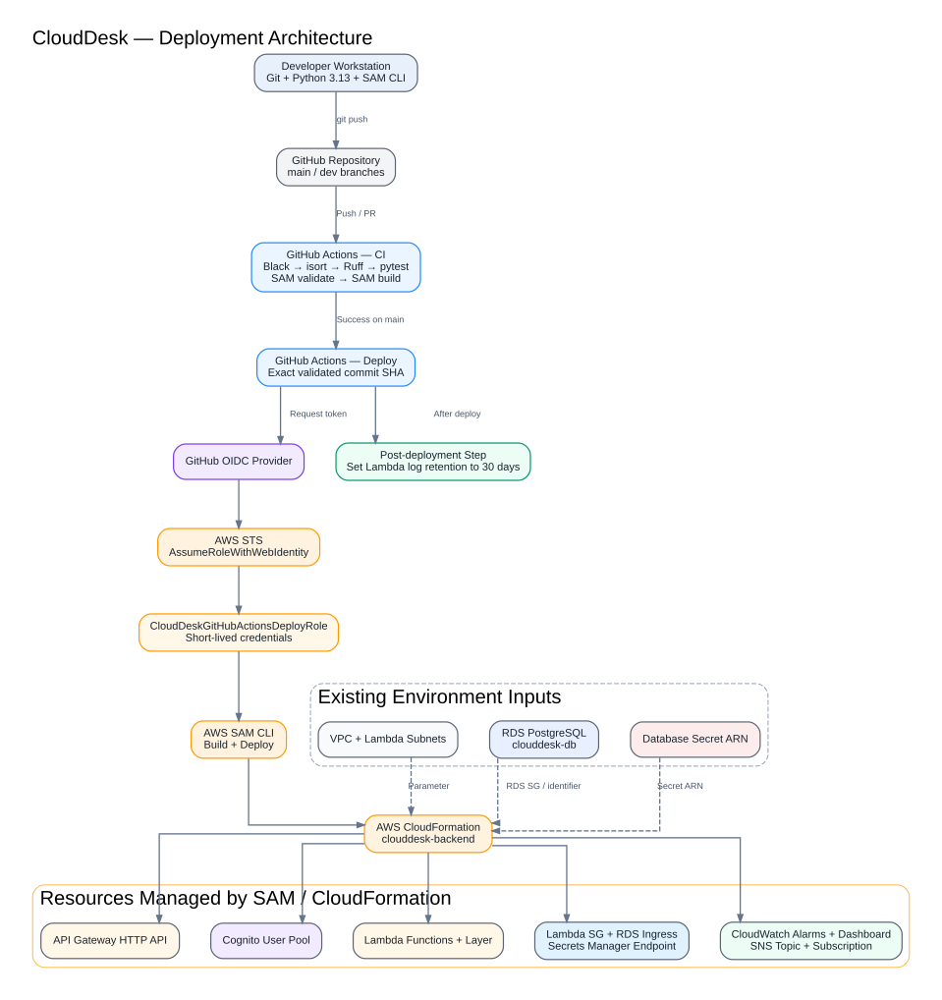
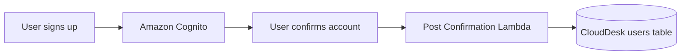
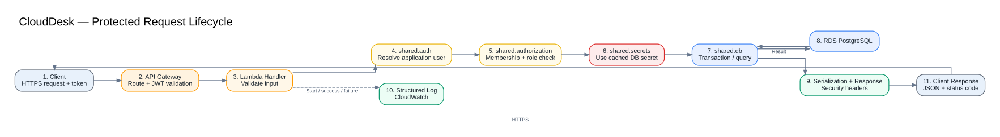
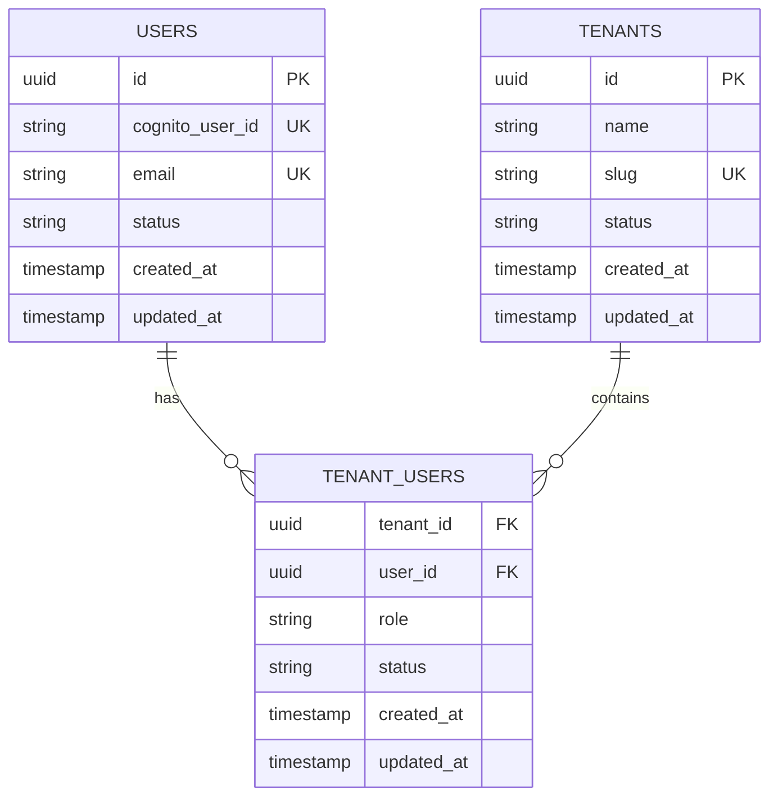
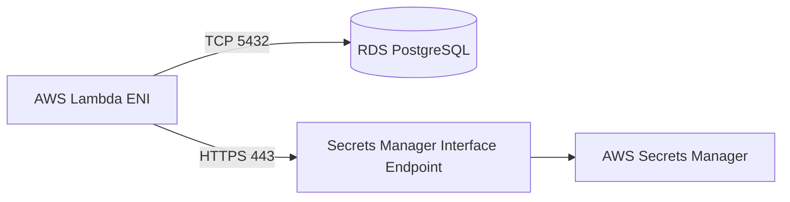
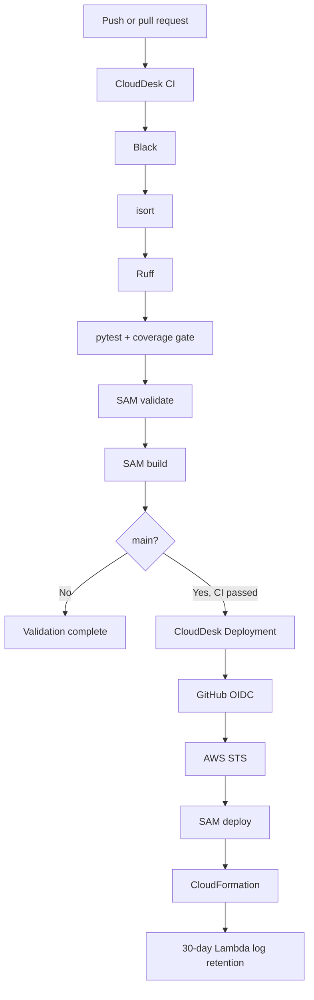

# CloudDesk Multi-Tenant SaaS Backend

> A production-inspired multi-tenant SaaS backend on AWS with secure identity, tenant-level RBAC, PostgreSQL persistence, automated testing, GitHub OIDC deployment, and CloudWatch observability.


---

## Executive Summary

CloudDesk is a serverless backend for a multi-tenant Software-as-a-Service platform. It demonstrates how a shared AWS application can serve multiple organizations while enforcing tenant isolation, secure authentication, and role-based authorization.

A confirmed user is provisioned from Amazon Cognito into the CloudDesk PostgreSQL database. Authenticated users can create tenants, become tenant owners, join multiple tenants, and manage tenant memberships according to an `owner`, `admin`, or `member` role.

The project was built as part of the **AWS 80 Projects portfolio** to demonstrate practical Cloud Infrastructure Engineering skills beyond a basic tutorial:

- Serverless application design
- Identity and access management
- Multi-tenant authorization
- Private AWS networking
- Secure secret retrieval
- Infrastructure as Code
- Automated testing and quality gates
- GitHub OIDC deployment
- Logging, alarms, notifications, and dashboards
- Production-style documentation and troubleshooting

CloudDesk currently represents a well-engineered **development environment**. It applies production-grade practices, but further controls would be required before hosting real customer workloads.


---

## Table of Contents

- [Business Scenario](#business-scenario)
- [Requirements](#requirements)
- [Key Capabilities](#key-capabilities)
- [Solution Architecture](#solution-architecture)
- [Identity and User Provisioning](#identity-and-user-provisioning)
- [Multi-Tenant Data Model](#multi-tenant-data-model)
- [Authorization Model](#authorization-model)
- [API Endpoints](#api-endpoints)
- [Network Architecture](#network-architecture)
- [Security Architecture](#security-architecture)
- [CI/CD Pipeline](#cicd-pipeline)
- [Testing and Code Quality](#testing-and-code-quality)
- [Monitoring and Observability](#monitoring-and-observability)
- [Infrastructure as Code](#infrastructure-as-code)
- [Repository Structure](#repository-structure)
- [Deployment](#deployment)
- [API Usage Examples](#api-usage-examples)
- [AWS Well-Architected Alignment](#aws-well-architected-alignment)
- [Engineering Decisions](#engineering-decisions)
- [Lessons Learned](#lessons-learned)
- [Future Improvements](#future-improvements)
- [Documentation](#documentation)

---

## Business Scenario

CloudDesk provides the backend foundation for a collaborative business platform.

Multiple companies use the same backend infrastructure, but each company operates as an isolated tenant. A registered user may belong to multiple tenants and hold a different role in each one.

A user can:

- Create an organization
- Become the organization owner
- Belong to multiple organizations
- Add existing CloudDesk users to an organization
- Assign `admin` or `member` roles
- Update member roles
- Remove members without deleting historical membership records

The architecture must prevent users from reading or modifying data belonging to a tenant where they do not have an active membership.

---

## Requirements

### Business Requirements

CloudDesk must:

- Authenticate users securely
- Provision confirmed users into the application database
- Allow one user to belong to multiple tenants
- Allow one tenant to contain multiple users
- Enforce tenant-level access control
- Support `owner`, `admin`, and `member` roles
- Prevent cross-tenant access
- Protect database credentials
- Deploy through repeatable Infrastructure as Code
- Support automated testing and deployment
- Provide monitoring, alerting, and operational visibility
- Remain understandable, maintainable, and cost-conscious

### Functional Requirements

#### Authentication and identity

- Register and authenticate users with Amazon Cognito
- Validate JWT access tokens before protected Lambda functions run
- Provision confirmed users into PostgreSQL
- Retrieve the authenticated CloudDesk user profile

#### Tenant management

- Create a tenant
- Generate a URL-safe tenant slug
- Assign the tenant creator as owner in the same transaction
- List tenants belonging to the authenticated user
- Retrieve a tenant only when the user has an active membership

#### Membership management

- List active tenant members
- Add an existing CloudDesk user to a tenant
- Assign `admin` or `member`
- Update a member role
- Remove a membership through soft deletion
- Protect the tenant owner from removal or demotion

#### Platform operations

- Provide health and database-connectivity verification endpoints
- Return standardized JSON responses
- Emit structured operational logs
- Notify the operator when key CloudWatch alarms enter an alarm state

### Non-Functional Requirements

The solution should provide:

- Secure authentication and authorization
- Tenant data isolation
- Stateless and scalable compute
- Private database connectivity
- Secure secret retrieval
- Repeatable deployment
- Automated quality checks
- Automated unit and handler tests
- Operational alarms and dashboards
- Maintainable shared application code
- Cost-conscious infrastructure
- Clear architecture, API, decision, and troubleshooting documentation

---

## Key Capabilities

| Capability | Implementation |
|---|---|
| Authentication | Amazon Cognito |
| JWT enforcement | API Gateway HTTP API JWT authorizer |
| Application user provisioning | Cognito Post Confirmation Lambda trigger |
| Multi-tenancy | `users`, `tenants`, and `tenant_users` relational model |
| Authorization | Shared membership, admin, and owner guards |
| Persistence | Amazon RDS for PostgreSQL |
| Credential storage | AWS Secrets Manager |
| Private secret access | Secrets Manager interface VPC endpoint |
| Compute | AWS Lambda |
| API layer | Amazon API Gateway HTTP API |
| Infrastructure as Code | AWS SAM / CloudFormation |
| CI/CD | GitHub Actions and AWS OIDC |
| Test framework | pytest |
| Code quality | Black, isort, and Ruff |
| Monitoring | CloudWatch Logs, metrics, alarms, dashboard, and SNS |

---

## Solution Architecture





### Core AWS components

| Component | Responsibility |
|---|---|
| API Gateway HTTP API | HTTPS routing and JWT authorization |
| AWS Lambda | Stateless business logic |
| Amazon Cognito | Registration, authentication, and token issuance |
| Amazon RDS PostgreSQL | Relational application state |
| AWS Secrets Manager | Database credentials |
| Interface VPC endpoint | Private Secrets Manager connectivity |
| AWS SAM | Serverless Infrastructure as Code |
| CloudWatch | Logs, metrics, alarms, and dashboard |
| Amazon SNS | Alarm email notifications |
| GitHub Actions | Continuous integration and deployment |
| AWS STS + OIDC | Short-lived deployment credentials |

---

## Request Lifecycle




API Gateway performs JWT validation before protected Lambda functions run. Lambda consumes the trusted claims supplied in the API Gateway event and maps the Cognito identity to the corresponding CloudDesk user.

---

## Identity and User Provisioning

CloudDesk separates the identity provider from application data.




### Cognito manages

- Credentials
- Account confirmation
- Password flows
- Identity claims
- Access and ID token issuance

### PostgreSQL manages

- CloudDesk user ID
- Cognito subject mapping
- Email and profile fields
- Tenant ownership
- Tenant memberships
- Tenant-specific roles
- Membership status

---

## Multi-Tenant Data Model



The `tenant_users` table models a many-to-many relationship:

- One user can belong to many tenants
- One tenant can contain many users
- A user can hold a different role in each tenant
- Membership can be deactivated without deleting historical data

A protected tenant operation must resolve an active membership using both:

```text
tenant_id + current_user.id
```

The tenant identifier is never trusted by itself.

---

## Authorization Model

CloudDesk centralizes tenant authorization through reusable helpers:

```python
require_membership()
require_admin()
require_owner()
```

### Role matrix

| Operation | Owner | Admin | Member |
|---|:---:|:---:|:---:|
| Retrieve tenant | ✅ | ✅ | ✅ |
| List tenant members | ✅ | ✅ | ✅ |
| Add member | ✅ | ✅ | ❌ |
| Update member role | ✅ | ❌ | ❌ |
| Remove member | ✅ | ❌ | ❌ |
| Demote/remove tenant owner | ❌ | ❌ | ❌ |

Owner safeguards prevent orphaned tenants:

- The owner role cannot be assigned through the regular add-member endpoint
- The tenant owner cannot be demoted
- The tenant owner cannot be removed
- Self-removal is rejected

---

## API Endpoints

### Platform endpoints

| Method | Endpoint | Purpose | Access |
|---|---|---|---|
| `GET` | `/health` | Verify API and Lambda availability | Public |
| `GET` | `/database-test` | Verify Lambda-to-PostgreSQL connectivity | Deployment verification |

### User endpoint

| Method | Endpoint | Purpose | Access |
|---|---|---|---|
| `GET` | `/me` | Retrieve the authenticated CloudDesk user | Authenticated |

### Tenant endpoints

| Method | Endpoint | Purpose | Access |
|---|---|---|---|
| `POST` | `/tenants` | Create a tenant and assign the creator as owner | Authenticated |
| `GET` | `/tenants` | List tenants belonging to the current user | Authenticated |
| `GET` | `/tenants/{tenantId}` | Retrieve a tenant | Active member |

### Membership endpoints

| Method | Endpoint | Purpose | Access |
|---|---|---|---|
| `GET` | `/tenants/{tenantId}/members` | List active members | Active member |
| `POST` | `/tenants/{tenantId}/members` | Add an existing CloudDesk user | Owner or admin |
| `PUT` | `/tenants/{tenantId}/members/{userId}` | Update a member role | Owner |
| `DELETE` | `/tenants/{tenantId}/members/{userId}` | Soft-delete a membership | Owner |

Complete contracts are maintained in [`docs/api.md`](docs/api.md).

---

## Network Architecture

Database-connected Lambda functions run inside the configured VPC.



### Network controls

- Lambda functions use configured subnets
- Lambda has a dedicated security group
- RDS allows PostgreSQL traffic from the Lambda security group
- The endpoint allows HTTPS from the Lambda security group
- Database traffic remains private
- Secret retrieval does not require a NAT Gateway

The RDS instance is managed outside the current SAM application stack. The template receives existing VPC, subnet, RDS security-group, and secret ARN values as parameters.

---

## Security Architecture

### Identity and API security

- Amazon Cognito manages authentication
- API Gateway validates JWTs
- Protected handlers resolve the application user from the Cognito subject
- Inactive or unprovisioned users are rejected

### Tenant security

- Every tenant-scoped operation checks active membership
- Shared authorization helpers prevent duplicated permission logic
- Owner-only and admin-level actions are enforced centrally
- Owner protection prevents tenant orphaning

### Credential security

- Database credentials are stored in AWS Secrets Manager
- Secret values are never committed to Git
- Secrets are validated before use
- Secrets are cached per warm Lambda environment
- Private endpoint connectivity avoids a NAT Gateway solely for secret access

### Deployment security

- GitHub Actions uses OIDC
- No long-lived AWS access keys are stored in GitHub
- AWS STS issues short-lived credentials
- The role trust policy is restricted to the repository's immutable GitHub OIDC subject and `main`
- Deployment permissions are separate from runtime permissions

### Response security

The shared response helper adds:

```text
Content-Type: application/json
X-Content-Type-Options: nosniff
X-Frame-Options: DENY
Referrer-Policy: no-referrer
Cache-Control: no-store
```

It also supports an optional `X-Request-Id` header.

---

## CI/CD Pipeline



### Continuous Integration

The CI workflow runs on pushes and pull requests targeting `dev` or `main`.

Quality gates:

```bash
black --check .
isort --check-only .
ruff check .
pytest tests/unit tests/handlers --cov=layers/shared/python/shared
sam validate
sam build
```

### Continuous Deployment

A successful CI run on `main` triggers deployment.

The deployment workflow:

1. Checks out the exact validated commit
2. Configures Python and SAM
3. Exchanges a GitHub OIDC token for short-lived AWS credentials
4. Verifies the assumed identity
5. Builds the application
6. Deploys `clouddesk-backend`
7. Applies 30-day retention to CloudDesk Lambda log groups

### GitHub repository variables

| Variable | Purpose |
|---|---|
| `AWS_DEPLOY_ROLE_ARN` | OIDC deployment-role ARN |
| `AWS_REGION` | Deployment region |
| `DATABASE_SECRET_ARN` | Database-secret ARN |
| `ALARM_EMAIL` | SNS notification email |

---

## Testing and Code Quality

The suite currently contains **79 passing tests** covering:

- JWT claim extraction
- Authenticated-user resolution
- Inactive and unprovisioned user rejection
- Tenant membership checks
- Admin and owner authorization
- Response formatting
- Serialization
- Secrets Manager retrieval, validation, caching, and failures
- PostgreSQL connection caching
- Commit and rollback behavior
- Database query helpers
- Tenant creation
- Duplicate tenant prevention
- Member creation
- Duplicate membership rejection
- Role validation
- Owner demotion protection
- Owner removal protection
- Membership soft deletion

### Install development dependencies

```bash
cd backend
python -m pip install -r requirements-dev.txt
```

### Run tests

```bash
pytest
```

### Coverage

```bash
pytest tests/unit tests/handlers \
  --cov=layers/shared/python/shared \
  --cov-report=term-missing
```

### HTML coverage

```bash
pytest tests/unit tests/handlers \
  --cov=layers/shared/python/shared \
  --cov-report=html
```

---

## Monitoring and Observability

CloudDesk uses native AWS observability services.

### Structured logs

The shared observability helper captures non-sensitive context:

- AWS request ID
- API Gateway request ID
- Function name
- Route key
- HTTP method and path
- Tenant ID
- Target user ID
- Current user ID
- Operation outcome
- HTTP status code

Instrumented workflows include:

- Tenant creation
- Member addition
- Member-role update
- Member removal

### Log retention

CloudDesk Lambda log groups use a **30-day retention period**.

Retention is applied after deployment to existing groups, avoiding conflicts with groups automatically created by Lambda.

### CloudWatch alarms

| Alarm | Condition |
|---|---|
| Lambda errors | At least one error in five minutes |
| Lambda throttles | At least one throttle in five minutes |
| API Gateway 5XX | At least one server error in five minutes |
| RDS high CPU | Average CPU above 80% for two evaluation periods |

Alarm actions publish to the confirmed SNS email subscription.

### Dashboard

The `clouddesk-dev` dashboard displays:

- Lambda invocations
- Lambda errors
- Lambda duration
- API Gateway 5XX errors
- RDS CPU utilization
- RDS database connections

---

## Infrastructure as Code

The SAM template provisions or configures:

- API Gateway HTTP API
- Cognito User Pool and application client
- JWT authorizer
- Cognito Post Confirmation integration
- Lambda functions
- Shared Lambda layer
- IAM permissions
- Lambda security group
- RDS security-group ingress
- Secrets Manager interface endpoint
- SNS topic and subscription
- CloudWatch alarms
- CloudWatch dashboard
- Stack outputs

AWS SAM was selected because the application is serverless-first.

Terraform was intentionally not added. Maintaining two Infrastructure as Code systems for one stack would increase complexity without solving another requirement.

---

## Repository Structure

```text
clouddesk-multi-tenant-saas/
├── .github/
│   └── workflows/
│       ├── ci.yml
│       └── deploy.yml
├── backend/
│   ├── add_member/
│   ├── create_tenant/
│   ├── database/
│   │   └── migrations/
│   │       └── 001_initial_schema.sql
│   ├── database_test/
│   ├── get_tenant/
│   ├── health/
│   ├── layers/
│   │   └── shared/
│   │       ├── requirements.txt
│   │       └── python/
│   │           ├── shared/
│   │           │   ├── auth.py
│   │           │   ├── authorization.py
│   │           │   ├── config.py
│   │           │   ├── db.py
│   │           │   ├── observability.py
│   │           │   ├── response.py
│   │           │   ├── secrets.py
│   │           │   └── serialization.py
│   │           ├── psycopg/
│   │           ├── psycopg_binary/
│   │           ├── psycopg_binary.libs/
│   │           └── tzdata/
│   ├── list_members/
│   ├── list_tenants/
│   ├── me/
│   ├── remove_member/
│   ├── tests/
│   │   ├── handlers/
│   │   └── unit/
│   ├── update_member/
│   ├── user_provisioning/
│   ├── pyproject.toml
│   ├── requirements-dev.txt
│   ├── samconfig.toml
│   └── template.yaml
├── docs/
│   ├── api.md
│   ├── architecture.md
│   ├── decisions.md
│   └── troubleshooting.md
├── .gitignore
├── LICENSE
└── README.md
```

---

## Deployment

### Prerequisites

- AWS CLI
- AWS SAM CLI
- Python 3.13
- PostgreSQL client
- Git
- An AWS account with required permissions

Confirm authentication:

```bash
aws sts get-caller-identity
```

### Existing resources and values

The development deployment expects:

- RDS PostgreSQL
- Database secret
- VPC
- Two Lambda subnets
- RDS security group
- GitHub OIDC provider and deployment role
- GitHub repository variables

### Local validation

```bash
cd backend
black --check .
isort --check-only .
ruff check .
pytest
sam validate
sam build
```

### Local deployment

```bash
sam deploy
```

Current deployment:

```text
Environment: dev
Region: us-east-1
Stack: clouddesk-backend
RDS identifier: clouddesk-db
Dashboard: clouddesk-dev
Alarm topic: clouddesk-dev-alarms
```

---

## Database Migration

The initial schema is located at:

```text
backend/database/migrations/001_initial_schema.sql
```

Apply it from an environment with database network access:

```bash
psql \
  --host=<database-endpoint> \
  --port=5432 \
  --username=<database-user> \
  --dbname=<database-name> \
  --file=database/migrations/001_initial_schema.sql
```

Credentials must come from Secrets Manager and must never be committed.

---

## API Usage Examples

```bash
export API_URL="https://<api-id>.execute-api.us-east-1.amazonaws.com"
export TOKEN="<cognito-access-token>"
```

Append the stage to `API_URL` when the API does not use `$default`.

### Retrieve the authenticated user

```bash
curl -H "Authorization: Bearer $TOKEN" "$API_URL/me"
```

### Create a tenant

The slug is generated from the tenant name.

```bash
curl -X POST \
  -H "Authorization: Bearer $TOKEN" \
  -H "Content-Type: application/json" \
  -d '{"name":"NovaTech"}' \
  "$API_URL/tenants"
```

### Add a member

```bash
curl -X POST \
  -H "Authorization: Bearer $TOKEN" \
  -H "Content-Type: application/json" \
  -d '{"email":"employee@example.com","role":"member"}' \
  "$API_URL/tenants/<tenant-id>/members"
```

### Update a member role

```bash
curl -X PUT \
  -H "Authorization: Bearer $TOKEN" \
  -H "Content-Type: application/json" \
  -d '{"role":"admin"}' \
  "$API_URL/tenants/<tenant-id>/members/<user-id>"
```

### Remove a member

```bash
curl -X DELETE \
  -H "Authorization: Bearer $TOKEN" \
  "$API_URL/tenants/<tenant-id>/members/<user-id>"
```

---

## AWS Well-Architected Alignment

### Operational Excellence

- Infrastructure defined with AWS SAM
- CI quality gates before deployment
- Automated OIDC deployment
- Structured logging
- Alarms, notifications, and dashboard
- Documented decisions and troubleshooting

### Security

- Cognito authentication
- API Gateway JWT authorization
- Tenant-level RBAC
- Secrets Manager
- Private database and secret connectivity
- OIDC short-lived credentials
- Security response headers
- No secrets committed

### Reliability

- Managed AWS services
- Stateless compute
- Transactional owner assignment
- PostgreSQL constraints
- Soft deletion
- CloudFormation rollback
- Alarm notifications

### Performance Efficiency

- HTTP API
- Serverless compute
- Indexed lookups
- Cached secrets
- Warm connection reuse
- Targeted queries

### Cost Optimization

- No permanently running application servers
- No ECS or EKS
- No NAT Gateway solely for secret access
- No duplicate IaC tool
- No RDS Proxy without demonstrated need
- 30-day log retention
- Native CloudWatch

---

## Engineering Decisions

Detailed ADRs are maintained in [`docs/decisions.md`](docs/decisions.md).

| Decision | Rationale |
|---|---|
| Serverless architecture | Reduces server operations and scales with requests |
| AWS SAM | Best fit for a Lambda/API Gateway application |
| HTTP API | Lower cost and sufficient JWT capabilities |
| Amazon Cognito | Managed identity integrated with API Gateway |
| PostgreSQL | Supports joins, transactions, and relational integrity |
| Post Confirmation provisioning | Separates identity from application data |
| Shared Lambda layer | Centralizes reusable security and database logic |
| Soft-delete memberships | Preserves history |
| Interface endpoint | Private secret access without NAT |
| GitHub OIDC | Removes long-lived deployment credentials |
| Native CloudWatch | Meets current operational requirements |
| No RDS Proxy yet | Current workload does not justify it |
| No Terraform alongside SAM | Avoids two IaC control planes |

---

## Operational Troubleshooting Highlights

The project includes real engineering lessons:

- Linux Psycopg layer packages conflicting with Windows tests
- Local `boto3` missing even though Lambda provides it
- GitHub OIDC trust failure caused by immutable repository subject claims
- CloudFormation rollback after missing deployment permissions
- Existing log groups conflicting with explicit CloudFormation resources
- Git Bash path conversion corrupting `/aws/lambda/...`
- Missing SNS, alarm, and dashboard permissions
- Required SAM parameters missing from the deployment workflow

See [`docs/troubleshooting.md`](docs/troubleshooting.md).

---

## Lessons Learned

CloudDesk demonstrates that multi-tenancy is not achieved by adding a `tenant_id` column alone.

A credible SaaS backend requires:

- A clear identity model
- Application-level user provisioning
- Tenant membership relationships
- Central authorization
- Owner safeguards
- Tenant-scoped queries
- Transactional operations
- Secret and network security
- Automated business-rule tests
- Repeatable deployment
- Operational visibility

The most important implementation lesson was separating authentication, authorization, database access, secret retrieval, serialization, responses, observability, and business logic.

The most important operational lesson was that CI/CD is not complete when a workflow exists. Trust policies, OIDC claims, deployment permissions, parameters, rollback behavior, and post-deployment operations must all work together.

---

## Future Improvements

Future work should be introduced only when it solves a demonstrated requirement.

### Product

- Tenant-scoped business resources
- Member invitation workflow
- Tenant ownership transfer
- Audit-event storage
- Pagination and filtering
- Membership reactivation

### Reliability

- Automated database migrations
- Backup and restore testing
- RDS Multi-AZ validation
- RDS Proxy when connection pressure appears

### Security

- Separate staging and production
- Custom domain and certificate
- API throttling
- WAF when traffic and risk justify it
- Periodic IAM reduction

### Testing and operations

- Cloud integration tests
- End-to-end authentication tests
- Load testing
- Request ID returned by every handler
- Deployment approvals
- Versioned releases

---

## Documentation

| Document | Purpose |
|---|---|
| [`docs/architecture.md`](docs/architecture.md) | Components, network design, trust boundaries, and flows |
| [`docs/api.md`](docs/api.md) | Contracts, authorization, examples, and errors |
| [`docs/decisions.md`](docs/decisions.md) | Architecture decisions and trade-offs |
| [`docs/troubleshooting.md`](docs/troubleshooting.md) | Symptoms, root causes, fixes, and prevention |

---

## Author

**Simeon Siaka**

Cloud Infrastructure and DevOps portfolio project.

- Portfolio: [SimeonOnTheCloudSpace](https://simeonprimordial.github.io/SimeonOnTheCloudSpace/)
- GitHub: [simeonprimordial](https://github.com/simeonprimordial)
- LinkedIn: [Simeon Siaka](https://www.linkedin.com/in/simeon-siaka-8a8367312/)

---

## License

This project is available under the [MIT License](LICENSE).
