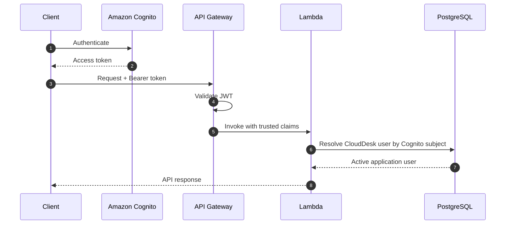

# CloudDesk API Documentation

> HTTP API reference for the CloudDesk multi-tenant SaaS backend.

---

## Document Status

| Field | Value |
|---|---|
| Project | CloudDesk Multi-Tenant SaaS Backend |
| Environment documented | `dev` |
| AWS Region | `us-east-1` |
| API type | Amazon API Gateway HTTP API |
| Authentication | Amazon Cognito JWT |
| Compute | AWS Lambda |
| Database | Amazon RDS for PostgreSQL |
| API version | Unversioned |
| Documentation status | Current through tenant membership management |

This document describes the API currently implemented by CloudDesk. It covers route behavior, authentication, authorization, request and response structures, business rules, error handling, security headers, and test workflows.

---

## 1. API Overview

CloudDesk exposes a serverless HTTP API for:

- platform health verification;
- database-connectivity verification;
- authenticated-user lookup;
- tenant creation and retrieval;
- tenant membership listing;
- member addition;
- member-role updates;
- membership soft deletion.

The API is implemented with:

- Amazon API Gateway HTTP API;
- AWS Lambda;
- Amazon Cognito;
- Amazon RDS for PostgreSQL;
- AWS Secrets Manager;
- a shared Lambda application layer.

Protected routes require a valid Cognito access token.

---

## 2. Base URL

The development API follows this format:

```text
https://<api-id>.execute-api.us-east-1.amazonaws.com/dev
```

Set it once for terminal testing:

```bash
export BASE_URL="https://<api-id>.execute-api.us-east-1.amazonaws.com/dev"
```

Replace `<api-id>` with the API Gateway identifier returned by the deployed CloudFormation stack.

When the API is configured with the `$default` stage, omit `/dev`. The deployed stack output is the source of truth for the active URL.

---

## 3. Authentication

Protected routes require:

```http
Authorization: Bearer <access-token>
```

Example:

```bash
curl \
  -H "Authorization: Bearer $TOKEN" \
  "$BASE_URL/me"
```

### Authentication flow



API Gateway validates the token before invoking a protected Lambda function.

Lambda does not repeat JWT signature verification. It reads the validated claims from the API Gateway event and maps the Cognito subject to the CloudDesk application user.

### Authentication failures

Authentication may fail when:

- the authorization header is missing;
- the token is malformed;
- the token has expired;
- the issuer is invalid;
- the audience is invalid;
- the CloudDesk application user does not exist;
- the CloudDesk user is inactive.

API Gateway may return its own `401` response before Lambda runs.

---

## 4. Request Content Type

Requests containing JSON must include:

```http
Content-Type: application/json
```

Example:

```bash
curl -X POST \
  -H "Authorization: Bearer $TOKEN" \
  -H "Content-Type: application/json" \
  -d '{"name":"NovaTech"}' \
  "$BASE_URL/tenants"
```

Malformed JSON returns a client error.

---

## 5. Response Format

CloudDesk Lambda handlers use a shared response helper.

### Successful response

```json
{
  "success": true,
  "message": "Operation completed successfully.",
  "data": {}
}
```

### Error response

```json
{
  "success": false,
  "message": "The request could not be completed."
}
```

### Response fields

| Field | Type | Description |
|---|---|---|
| `success` | boolean | Whether the application operation succeeded |
| `message` | string | Human-readable result |
| `data` | object, array, or null | Returned application data when applicable |

API Gateway-generated authentication errors may not use the CloudDesk response envelope.

---

## 6. Response Security Headers

Lambda-generated responses include:

```http
Content-Type: application/json
X-Content-Type-Options: nosniff
X-Frame-Options: DENY
Referrer-Policy: no-referrer
Cache-Control: no-store
```

The response helper also supports:

```http
X-Request-Id: <request-id>
```

Request-ID propagation is not yet enabled consistently across every handler.

---

## 7. Common HTTP Status Codes

| Status | Meaning |
|---|---|
| `200 OK` | Request completed successfully |
| `201 Created` | Resource created successfully |
| `400 Bad Request` | Invalid input or protected business-rule violation |
| `401 Unauthorized` | Authentication failed |
| `403 Forbidden` | Authenticated user lacks the required tenant permission |
| `404 Not Found` | Requested user, tenant, or membership was not found |
| `409 Conflict` | Resource conflict or duplicate state |
| `500 Internal Server Error` | Unexpected application or dependency failure |

---

## 8. Authorization Model

CloudDesk supports these tenant roles:

| Role | Description |
|---|---|
| `owner` | Highest tenant authority |
| `admin` | May add users and access tenant resources |
| `member` | Standard tenant access |

Shared authorization helpers enforce:

```python
require_membership()
require_admin()
require_owner()
```

### Permission matrix

| Endpoint | Member | Admin | Owner |
|---|:---:|:---:|:---:|
| `GET /tenants/{tenantId}` | Yes | Yes | Yes |
| `GET /tenants/{tenantId}/members` | Yes | Yes | Yes |
| `POST /tenants/{tenantId}/members` | No | Yes | Yes |
| `PUT /tenants/{tenantId}/members/{userId}` | No | No | Yes |
| `DELETE /tenants/{tenantId}/members/{userId}` | No | No | Yes |

An allowed role is not enough by itself. The membership must also be active.

---

# Platform Endpoints

## 9. Health Check

Confirms that API Gateway and the Lambda runtime are available.

### Request

```http
GET /health
```

### Authentication

Not required.

### Example

```bash
curl "$BASE_URL/health"
```

### Example response

```json
{
  "success": true,
  "message": "CloudDesk API is healthy.",
  "data": {
    "application": "CloudDesk",
    "environment": "dev"
  }
}
```

### Status codes

| Status | Meaning |
|---|---|
| `200` | API and Lambda are available |
| `500` | Lambda execution failed |

### Operational meaning

This endpoint confirms the API path and Lambda runtime. It does not prove that PostgreSQL or Secrets Manager is available.

---

## 10. Database Connectivity Test

Verifies that Lambda can:

1. retrieve the database secret;
2. reach PostgreSQL;
3. authenticate;
4. execute a basic query.

### Request

```http
GET /database-test
```

### Authentication

Depends on the deployed route configuration.

### Example

```bash
curl "$BASE_URL/database-test"
```

### Example response

```json
{
  "success": true,
  "message": "Database connection successful.",
  "data": {
    "database": "clouddesk",
    "user": "clouddesk_admin",
    "version": "PostgreSQL",
    "server_time": "2026-07-30T20:00:00+00:00"
  }
}
```

### Status codes

| Status | Meaning |
|---|---|
| `200` | Secret retrieval and database connection succeeded |
| `500` | Secret retrieval, network access, authentication, or query failed |

### Security note

This route is intended for deployment verification.

Before a real production release, it should be:

- removed;
- disabled;
- or restricted to trusted administrative access.

It must never return:

- database passwords;
- full secret values;
- credential-bearing connection strings;
- access tokens.

---

# User Endpoint

## 11. Get Current User

Returns the CloudDesk application user associated with the authenticated Cognito identity.

### Request

```http
GET /me
```

### Authentication

Required.

### Authorization

Any active, provisioned CloudDesk user.

### Example

```bash
curl \
  -H "Authorization: Bearer $TOKEN" \
  "$BASE_URL/me"
```

### Example response

```json
{
  "success": true,
  "message": "User retrieved successfully.",
  "data": {
    "id": "2e347506-254a-4d31-b4d0-74a3a24d7396",
    "cognito_sub": "12345678-1234-1234-1234-123456789012",
    "email": "owner@example.com",
    "first_name": "Simeon",
    "last_name": "Siaka",
    "status": "active",
    "created_at": "2026-07-20T15:20:30+00:00",
    "updated_at": "2026-07-20T15:20:30+00:00"
  }
}
```

### Error: application user not found

```json
{
  "success": false,
  "message": "Authenticated CloudDesk user was not found."
}
```

Status:

```text
401 Unauthorized
```

### Status codes

| Status | Meaning |
|---|---|
| `200` | User returned |
| `401` | Token invalid, user missing, or user inactive |
| `500` | Unexpected server or database error |

---

# Tenant Endpoints

## 12. Create Tenant

Creates a tenant and assigns the authenticated user as its owner.

### Request

```http
POST /tenants
```

### Authentication

Required.

### Authorization

Any active CloudDesk user.

### Request body

```json
{
  "name": "NovaTech"
}
```

### Fields

| Field | Type | Required | Description |
|---|---|:---:|---|
| `name` | string | Yes | Human-readable tenant name |

The handler generates the tenant slug from the supplied name.

Example:

```text
NovaTech Solutions
```

becomes a URL-safe slug such as:

```text
novatech-solutions
```

The database enforces slug uniqueness.

### Example

```bash
curl -X POST \
  -H "Authorization: Bearer $TOKEN" \
  -H "Content-Type: application/json" \
  -d '{"name":"NovaTech"}' \
  "$BASE_URL/tenants"
```

### Example response

```json
{
  "success": true,
  "message": "Tenant created successfully.",
  "data": {
    "id": "b763fbb4-8fe3-4198-a69b-990a1e35b92c",
    "name": "NovaTech",
    "slug": "novatech",
    "status": "active",
    "created_at": "2026-07-25T11:30:00+00:00",
    "updated_at": "2026-07-25T11:30:00+00:00"
  }
}
```

### Transactional behavior

The operation creates:

1. the tenant;
2. the owner's `tenant_users` membership.

Both writes occur in one PostgreSQL transaction.

If either write fails, both are rolled back.

### Error: missing name

```json
{
  "success": false,
  "message": "Tenant name is required."
}
```

Status:

```text
400 Bad Request
```

### Error: generated slug already exists

```json
{
  "success": false,
  "message": "A tenant with this slug already exists."
}
```

Status:

```text
409 Conflict
```

### Status codes

| Status | Meaning |
|---|---|
| `201` | Tenant and owner membership created |
| `400` | Invalid or missing tenant name |
| `401` | Authentication failed |
| `409` | Generated slug conflicts with an existing tenant |
| `500` | Unexpected application or database error |

---

## 13. List Current User's Tenants

Returns tenants where the authenticated user has an active membership.

### Request

```http
GET /tenants
```

### Authentication

Required.

### Authorization

Any active CloudDesk user.

### Example

```bash
curl \
  -H "Authorization: Bearer $TOKEN" \
  "$BASE_URL/tenants"
```

### Example response

```json
{
  "success": true,
  "message": "Tenants retrieved successfully.",
  "data": [
    {
      "id": "b763fbb4-8fe3-4198-a69b-990a1e35b92c",
      "name": "NovaTech",
      "slug": "novatech",
      "status": "active",
      "role": "owner",
      "membership_status": "active",
      "created_at": "2026-07-25T11:30:00+00:00",
      "updated_at": "2026-07-25T11:30:00+00:00"
    }
  ]
}
```

### Empty response

```json
{
  "success": true,
  "message": "Tenants retrieved successfully.",
  "data": []
}
```

### Status codes

| Status | Meaning |
|---|---|
| `200` | Tenant list returned |
| `401` | Authentication failed |
| `500` | Unexpected server or database error |

### Current limitation

Pagination is not currently implemented.

---

## 14. Get Tenant

Returns one tenant after verifying active membership.

### Request

```http
GET /tenants/{tenantId}
```

### Authentication

Required.

### Authorization

Active tenant membership.

Allowed roles:

- `owner`;
- `admin`;
- `member`.

### Path parameters

| Parameter | Type | Description |
|---|---|---|
| `tenantId` | UUID | Tenant identifier |

### Example

```bash
curl \
  -H "Authorization: Bearer $TOKEN" \
  "$BASE_URL/tenants/b763fbb4-8fe3-4198-a69b-990a1e35b92c"
```

### Example response

```json
{
  "success": true,
  "message": "Tenant retrieved successfully.",
  "data": {
    "id": "b763fbb4-8fe3-4198-a69b-990a1e35b92c",
    "name": "NovaTech",
    "slug": "novatech",
    "status": "active",
    "created_at": "2026-07-25T11:30:00+00:00",
    "updated_at": "2026-07-25T11:30:00+00:00"
  }
}
```

### Error: tenant ID missing

```json
{
  "success": false,
  "message": "Tenant ID is required."
}
```

Status:

```text
400 Bad Request
```

### Error: membership missing or inactive

```json
{
  "success": false,
  "message": "You do not have access to this tenant."
}
```

Status:

```text
403 Forbidden
```

### Error: tenant not found

```json
{
  "success": false,
  "message": "Tenant not found."
}
```

Status:

```text
404 Not Found
```

### Status codes

| Status | Meaning |
|---|---|
| `200` | Tenant returned |
| `400` | Tenant ID missing or invalid |
| `401` | Authentication failed |
| `403` | Active membership required |
| `404` | Tenant not found |
| `500` | Unexpected server or database error |

---

# Tenant Membership Endpoints

## 15. List Tenant Members

Returns active members of a tenant.

### Request

```http
GET /tenants/{tenantId}/members
```

### Authentication

Required.

### Authorization

Active tenant membership.

Allowed roles:

- `owner`;
- `admin`;
- `member`.

### Path parameters

| Parameter | Type | Description |
|---|---|---|
| `tenantId` | UUID | Tenant identifier |

### Example

```bash
curl \
  -H "Authorization: Bearer $TOKEN" \
  "$BASE_URL/tenants/$TENANT_ID/members"
```

### Example response

```json
{
  "success": true,
  "message": "Tenant members retrieved successfully.",
  "data": [
    {
      "tenant_id": "b763fbb4-8fe3-4198-a69b-990a1e35b92c",
      "user_id": "2e347506-254a-4d31-b4d0-74a3a24d7396",
      "email": "owner@example.com",
      "first_name": "Simeon",
      "last_name": "Siaka",
      "role": "owner",
      "status": "active",
      "created_at": "2026-07-25T11:30:00+00:00",
      "updated_at": "2026-07-25T11:30:00+00:00"
    },
    {
      "tenant_id": "b763fbb4-8fe3-4198-a69b-990a1e35b92c",
      "user_id": "716f39f8-6ec8-46c1-a8a9-e430a1f67310",
      "email": "member@example.com",
      "first_name": "Cloud",
      "last_name": "Member",
      "role": "admin",
      "status": "active",
      "created_at": "2026-07-26T09:15:00+00:00",
      "updated_at": "2026-07-27T10:20:00+00:00"
    }
  ]
}
```

### Status codes

| Status | Meaning |
|---|---|
| `200` | Active members returned |
| `400` | Tenant ID missing or invalid |
| `401` | Authentication failed |
| `403` | Active tenant membership required |
| `500` | Unexpected server or database error |

### Current limitation

Pagination is not currently implemented.

---

## 16. Add Tenant Member

Adds an existing CloudDesk user to a tenant.

### Request

```http
POST /tenants/{tenantId}/members
```

### Authentication

Required.

### Authorization

Tenant `owner` or `admin`.

### Path parameters

| Parameter | Type | Description |
|---|---|---|
| `tenantId` | UUID | Tenant identifier |

### Request body

```json
{
  "email": "member@example.com",
  "role": "member"
}
```

### Fields

| Field | Type | Required | Allowed values |
|---|---|:---:|---|
| `email` | string | Yes | Existing CloudDesk user's email |
| `role` | string | Yes | `member`, `admin` |

The endpoint does not allow assigning `owner`.

### Example

```bash
curl -X POST \
  -H "Authorization: Bearer $TOKEN" \
  -H "Content-Type: application/json" \
  -d '{"email":"member@example.com","role":"member"}' \
  "$BASE_URL/tenants/$TENANT_ID/members"
```

### Example response

```json
{
  "success": true,
  "message": "Tenant member added successfully.",
  "data": {
    "tenant_id": "b763fbb4-8fe3-4198-a69b-990a1e35b92c",
    "user_id": "716f39f8-6ec8-46c1-a8a9-e430a1f67310",
    "role": "member",
    "status": "active",
    "created_at": "2026-07-26T09:15:00+00:00",
    "updated_at": "2026-07-26T09:15:00+00:00"
  }
}
```

### Business rules

- The caller must be an active owner or admin.
- The target email must belong to an existing CloudDesk user.
- The role must be `member` or `admin`.
- `owner` cannot be assigned.
- An existing membership produces a conflict.
- Inactive membership reactivation is not currently defined.

### Error: email missing

```json
{
  "success": false,
  "message": "Email is required."
}
```

### Error: invalid role

```json
{
  "success": false,
  "message": "Role must be either member or admin."
}
```

### Error: insufficient permission

```json
{
  "success": false,
  "message": "Tenant administrator access is required."
}
```

### Error: user not found

```json
{
  "success": false,
  "message": "CloudDesk user not found."
}
```

### Error: membership exists

```json
{
  "success": false,
  "message": "The user is already a member of this tenant."
}
```

### Status codes

| Status | Meaning |
|---|---|
| `201` | Membership created |
| `400` | Invalid request body or role |
| `401` | Authentication failed |
| `403` | Owner or admin required |
| `404` | CloudDesk user not found |
| `409` | Membership already exists |
| `500` | Unexpected server or database error |

---

## 17. Update Tenant Member Role

Changes an active member's role.

### Request

```http
PUT /tenants/{tenantId}/members/{userId}
```

### Authentication

Required.

### Authorization

Tenant `owner` only.

### Path parameters

| Parameter | Type | Description |
|---|---|---|
| `tenantId` | UUID | Tenant identifier |
| `userId` | UUID | Target CloudDesk user |

### Request body

```json
{
  "role": "admin"
}
```

### Allowed roles

```text
member
admin
```

The endpoint does not assign `owner`.

### Example

```bash
curl -X PUT \
  -H "Authorization: Bearer $TOKEN" \
  -H "Content-Type: application/json" \
  -d '{"role":"admin"}' \
  "$BASE_URL/tenants/$TENANT_ID/members/$USER_ID"
```

### Example response

```json
{
  "success": true,
  "message": "Tenant member role updated successfully.",
  "data": {
    "tenant_id": "b763fbb4-8fe3-4198-a69b-990a1e35b92c",
    "user_id": "716f39f8-6ec8-46c1-a8a9-e430a1f67310",
    "role": "admin",
    "status": "active",
    "created_at": "2026-07-26T09:15:00+00:00",
    "updated_at": "2026-07-27T10:20:00+00:00"
  }
}
```

### Business rules

- Only the tenant owner may update roles.
- `owner` cannot be assigned.
- The current owner's role cannot be changed.
- The target membership must exist.
- The target membership must be eligible for update.

### Error: missing path parameters

```json
{
  "success": false,
  "message": "Tenant ID and User ID are required."
}
```

### Error: invalid role

```json
{
  "success": false,
  "message": "Role must be either member or admin."
}
```

### Error: owner permission required

```json
{
  "success": false,
  "message": "Tenant owner access is required."
}
```

### Error: membership not found

```json
{
  "success": false,
  "message": "Tenant member not found."
}
```

### Error: owner role protected

```json
{
  "success": false,
  "message": "The tenant owner's role cannot be changed."
}
```

### Status codes

| Status | Meaning |
|---|---|
| `200` | Role updated |
| `400` | Invalid role or protected-owner operation |
| `401` | Authentication failed |
| `403` | Owner permission required |
| `404` | Membership not found |
| `500` | Unexpected server or database error |

---

## 18. Remove Tenant Member

Removes a member by setting the membership status to `inactive`.

### Request

```http
DELETE /tenants/{tenantId}/members/{userId}
```

### Authentication

Required.

### Authorization

Tenant `owner` only.

### Path parameters

| Parameter | Type | Description |
|---|---|---|
| `tenantId` | UUID | Tenant identifier |
| `userId` | UUID | Target CloudDesk user |

### Example

```bash
curl -X DELETE \
  -H "Authorization: Bearer $TOKEN" \
  "$BASE_URL/tenants/$TENANT_ID/members/$USER_ID"
```

### Example response

```json
{
  "success": true,
  "message": "Tenant member removed successfully.",
  "data": {
    "tenant_id": "b763fbb4-8fe3-4198-a69b-990a1e35b92c",
    "user_id": "716f39f8-6ec8-46c1-a8a9-e430a1f67310",
    "role": "admin",
    "status": "inactive",
    "created_at": "2026-07-26T09:15:00+00:00",
    "updated_at": "2026-07-30T18:40:00+00:00"
  }
}
```

### Soft-delete behavior

The row remains in `tenant_users`.

```text
status = active
```

changes to:

```text
status = inactive
```

### Business rules

- Only the tenant owner may remove a member.
- The tenant owner cannot be removed.
- The caller cannot remove themselves through the current endpoint.
- The target membership must exist.

### Error: missing path parameters

```json
{
  "success": false,
  "message": "Tenant ID and User ID are required."
}
```

### Error: owner permission required

```json
{
  "success": false,
  "message": "Tenant owner access is required."
}
```

### Error: membership not found

```json
{
  "success": false,
  "message": "Tenant member not found."
}
```

### Error: tenant owner protected

```json
{
  "success": false,
  "message": "The tenant owner cannot be removed."
}
```

### Error: self-removal rejected

```json
{
  "success": false,
  "message": "You cannot remove yourself from the tenant."
}
```

### Status codes

| Status | Meaning |
|---|---|
| `200` | Membership deactivated |
| `400` | Invalid or protected removal |
| `401` | Authentication failed |
| `403` | Owner permission required |
| `404` | Membership not found |
| `500` | Unexpected server or database error |

---

# Error Handling

## 19. Authentication Errors

API Gateway can return:

```json
{
  "message": "Unauthorized"
}
```

Status:

```text
401 Unauthorized
```

Lambda-generated authentication errors use the CloudDesk response envelope.

Clients should not assume that every `401` response has identical JSON fields.

---

## 20. Authorization Errors

Authorization failures return:

```text
403 Forbidden
```

Example:

```json
{
  "success": false,
  "message": "Tenant owner access is required."
}
```

Authorization failures should not disclose information about inaccessible tenants.

---

## 21. Validation Errors

Validation failures include:

- malformed JSON;
- missing fields;
- missing path parameters;
- unsupported roles;
- protected owner operations;
- invalid business state.

Example:

```json
{
  "success": false,
  "message": "Role must be either member or admin."
}
```

Status:

```text
400 Bad Request
```

---

## 22. Conflict Errors

Conflicts include:

- duplicate generated tenant slug;
- duplicate tenant membership.

Example:

```json
{
  "success": false,
  "message": "The user is already a member of this tenant."
}
```

Status:

```text
409 Conflict
```

---

## 23. Server Errors

Unexpected failures return a generic response.

```json
{
  "success": false,
  "message": "Unable to complete the request."
}
```

Status:

```text
500 Internal Server Error
```

The API must not return:

- stack traces;
- SQL statements containing sensitive values;
- database credentials;
- secret values;
- tokens;
- internal network details.

Investigation occurs through CloudWatch Logs.

---

# API Security

## 24. Tenant Isolation

A tenant UUID is not an authorization mechanism.

Every tenant-scoped route must verify:

1. the authenticated application user;
2. the user's membership for the requested tenant;
3. membership status;
4. the required role.

Changing `tenantId` in the URL must never grant access to another tenant.

---

## 25. Token Handling

Tokens must not be:

- committed to Git;
- stored in screenshots;
- copied into public documentation;
- written to CloudWatch logs;
- shared in public channels.

Use temporary shell variables:

```bash
export TOKEN="<temporary-access-token>"
```

Unset after testing:

```bash
unset TOKEN
```

---

## 26. Sensitive Logging Rules

Structured logs may include:

- request ID;
- route;
- HTTP method;
- tenant ID;
- target user ID;
- current application user ID;
- operation outcome;
- status code.

Logs must not include:

- authorization header;
- access or ID tokens;
- passwords;
- secret values;
- full Cognito claims;
- raw database connection strings.

---

## 27. Response Caching

CloudDesk responses include:

```http
Cache-Control: no-store
```

This is appropriate for authenticated tenant and user data.

---

# Testing Workflow

## 28. Environment Variables

```bash
export BASE_URL="https://<api-id>.execute-api.us-east-1.amazonaws.com/dev"
export TOKEN="<cognito-access-token>"
export TENANT_ID="<tenant-id>"
export USER_ID="<user-id>"
```

---

## 29. Suggested Test Order

```text
1. GET /health
2. GET /database-test
3. GET /me
4. POST /tenants
5. GET /tenants
6. GET /tenants/{tenantId}
7. GET /tenants/{tenantId}/members
8. POST /tenants/{tenantId}/members
9. PUT /tenants/{tenantId}/members/{userId}
10. DELETE /tenants/{tenantId}/members/{userId}
```

This follows the natural resource lifecycle.

---

## 30. Authorization Test Cases

Test with separate users representing:

- tenant owner;
- tenant admin;
- tenant member;
- authenticated non-member.

Expected behavior:

| Test | Expected result |
|---|---|
| Member retrieves tenant | `200` |
| Non-member retrieves tenant | `403` |
| Admin adds member | `201` |
| Member adds member | `403` |
| Admin updates role | `403` |
| Owner updates role | `200` |
| Admin removes member | `403` |
| Owner removes member | `200` |
| Owner attempts self-removal | `400` |
| Owner attempts owner demotion | `400` |

---

## 31. Membership Lifecycle Verification

After adding:

```sql
SELECT
    tenant_id,
    user_id,
    role,
    status,
    created_at,
    updated_at
FROM tenant_users
WHERE tenant_id = '<tenant-id>'
  AND user_id = '<user-id>';
```

Expected:

```text
role = member
status = active
```

After role update:

```text
role = admin
status = active
```

After removal:

```text
role = admin
status = inactive
```

The row remains because removal is a soft delete.

---

## 32. Automated API-Related Tests

The project includes handler tests for critical workflows:

- tenant creation;
- member addition;
- member-role update;
- member removal.

Shared unit tests cover:

- authentication;
- authorization;
- response formatting;
- serialization;
- secrets;
- database helpers.

The complete project suite currently contains:

```text
79 passing tests
```

These tests use mocks and fixtures. They do not replace end-to-end tests against deployed AWS resources.

---

# Observability

## 33. Structured Operation Logs

The following high-value operations emit structured logs:

- create tenant;
- add member;
- update member role;
- remove member.

Logs include operation start, success, and failure context without exposing sensitive values.

---

## 34. Request Correlation

CloudWatch logs include AWS and API Gateway request identifiers where available.

The shared response helper supports `X-Request-Id`, but not every handler currently returns it.

Future hardening should propagate the request ID consistently.

---

## 35. Relevant Alarms

API failures may contribute to:

- Lambda error alarm;
- Lambda throttle alarm;
- API Gateway 5XX alarm;
- RDS high CPU alarm.

Alarm actions publish to the CloudDesk SNS alarm topic.

---

# Current Limitations

## 36. Existing User Requirement

The add-member endpoint requires the target user to already exist in CloudDesk.

It does not send an invitation to an unregistered email address.

A future invitation workflow may:

1. create an invitation;
2. email the recipient;
3. allow signup;
4. accept the invitation;
5. activate membership.

---

## 37. Ownership Transfer

The API does not support ownership transfer.

The owner role cannot be assigned through the standard membership endpoints.

A future ownership-transfer endpoint must update both parties transactionally and preserve at least one owner.

---

## 38. Membership Reactivation

Removal changes membership status to `inactive`.

There is no reactivation endpoint.

A future design must decide whether reactivation:

- uses a dedicated route;
- or is handled safely by the add-member workflow.

---

## 39. Pagination and Filtering

The list endpoints currently return complete result sets.

Not yet implemented:

- pagination;
- sorting;
- filtering;
- search;
- maximum page size.

These capabilities should be added before tenant and membership collections become large.

---

## 40. API Versioning

Current routes are unversioned:

```text
/tenants
```

A future public contract may use:

```text
/v1/tenants
```

Versioning should be introduced before incompatible changes.

---

## 41. Idempotency

Create and membership mutation routes do not currently document an idempotency-key contract.

Retries can therefore result in conflict responses when the first operation succeeded but the client did not receive the response.

A future design may support:

```http
Idempotency-Key: <unique-client-value>
```

for selected write operations.

---

## 42. Throttling and Abuse Protection

The current API documentation does not define per-client quotas or route-specific throttling.

Before public production use, define:

- API throttling;
- account concurrency controls;
- request-size limits;
- abuse monitoring;
- WAF controls when justified.

---

## 43. Database Test Route

`/database-test` is a development verification route, not a business API.

It should not be treated as a permanent production endpoint.

---

# Endpoint Summary

## 44. Complete Endpoint Table

| Method | Endpoint | Authentication | Required tenant role |
|---|---|:---:|---|
| `GET` | `/health` | No | Not applicable |
| `GET` | `/database-test` | Configuration-dependent | Not applicable |
| `GET` | `/me` | Yes | Not applicable |
| `POST` | `/tenants` | Yes | Not applicable |
| `GET` | `/tenants` | Yes | Not applicable |
| `GET` | `/tenants/{tenantId}` | Yes | Member, admin, or owner |
| `GET` | `/tenants/{tenantId}/members` | Yes | Member, admin, or owner |
| `POST` | `/tenants/{tenantId}/members` | Yes | Admin or owner |
| `PUT` | `/tenants/{tenantId}/members/{userId}` | Yes | Owner |
| `DELETE` | `/tenants/{tenantId}/members/{userId}` | Yes | Owner |

---

## 45. API Documentation Maintenance

Update this document whenever CloudDesk changes:

- routes;
- request bodies;
- response bodies;
- status codes;
- authorization rules;
- validation behavior;
- security headers;
- pagination;
- versioning;
- invitation workflows;
- ownership transfer;
- tenant-scoped business resources.

The Lambda handlers and automated tests are the implementation source of truth.
