# CloudDesk Architecture

> Technical architecture reference for the CloudDesk multi-tenant SaaS backend.

---

## Document Status

| Field | Value |
|---|---|
| Project | CloudDesk Multi-Tenant SaaS Backend |
| Environment | Development |
| AWS Region | `us-east-1` |
| CloudFormation stack | `clouddesk-backend` |
| Infrastructure as Code | AWS SAM |
| Runtime | Python 3.13 |
| Database | Amazon RDS for PostgreSQL |
| CI/CD | GitHub Actions with AWS OIDC |
| Observability | CloudWatch Logs, metrics, alarms, dashboard, and SNS |

CloudDesk is a production-inspired development environment. It applies production engineering practices, but it should not be described as a fully production-ready customer platform until environment isolation, recovery validation, security reviews, load testing, and operational procedures are completed.

---

## 1. Purpose

This document explains the architecture of CloudDesk, including:

- the business context;
- system components;
- trust boundaries;
- request flows;
- identity and authorization design;
- multi-tenant data isolation;
- networking;
- Infrastructure as Code;
- CI/CD;
- testing;
- monitoring and alerting;
- reliability, performance, security, and cost trade-offs;
- current limitations and future evolution.

The goal is to make the design understandable to another engineer without requiring them to reconstruct the architecture from source code alone.

---

## 2. Business Context

CloudDesk provides the backend foundation for a collaborative Software-as-a-Service platform.

Each customer organization is represented as a tenant.

A user may:

- create one or more tenants;
- own one or more tenants;
- belong to multiple tenants;
- hold a different role in each tenant;
- access only tenants where the user has an active membership.

The application must prevent a user from accessing another tenant's data merely by knowing or guessing a tenant identifier.

---

## 3. Architecture Goals

CloudDesk was designed to provide:

- secure managed authentication;
- tenant-level authorization;
- strong application-level tenant isolation;
- private database access;
- private database-secret retrieval;
- transactional tenant creation;
- reusable shared application components;
- repeatable Infrastructure as Code;
- automated quality gates;
- short-lived CI/CD credentials;
- structured operational logging;
- alarms and operator notifications;
- clear engineering trade-offs;
- cost-conscious service selection;
- scalability at the API and compute layers.

---

## 4. Architecture Principles

### 4.1 Business rules drive infrastructure

AWS services were selected because they solve a specific requirement. Additional tools were not added simply because they are popular.

### 4.2 Authentication and authorization are separate

Amazon Cognito authenticates identities. CloudDesk authorization is determined from application data stored in PostgreSQL.

### 4.3 Tenant identifiers are never trusted by themselves

A tenant-scoped operation must verify an active membership for the current application user.

### 4.4 Shared security logic is centralized

Authentication, authorization, database access, response formatting, serialization, secret retrieval, and observability are provided through a shared Lambda layer.

### 4.5 Secrets do not belong in source control

Database credentials are stored in AWS Secrets Manager and passed to the application by reference.

### 4.6 Automated deployment must not depend on static AWS keys

GitHub Actions exchanges an OIDC token for short-lived AWS STS credentials.

### 4.7 Production-oriented does not mean overengineered

RDS Proxy, Kubernetes, a NAT Gateway, Terraform, Prometheus, Grafana, and AWS WAF were not added because the current workload does not justify them.

---

## 5. System Context

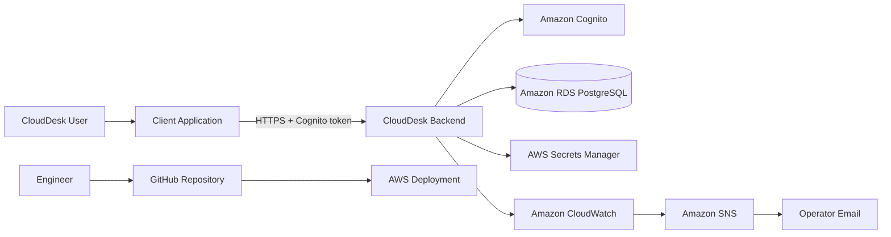

### External actors

| Actor | Responsibility |
|---|---|
| End user | Authenticates and calls CloudDesk APIs |
| Client application | Obtains tokens and sends HTTPS requests |
| Cloud engineer | Develops, tests, and deploys the backend |
| Operator | Receives alarm notifications and investigates incidents |

---

## 6. High-Level Architecture

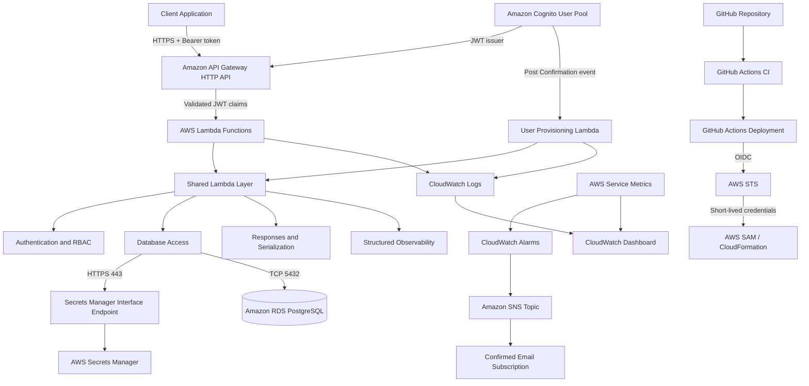

---

## 7. Trust Boundaries

CloudDesk crosses several security boundaries.

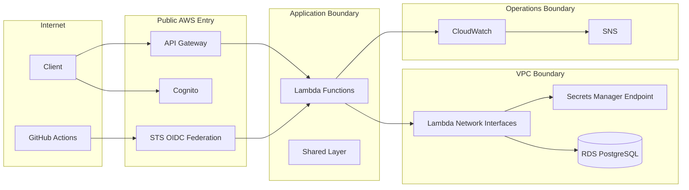

### Boundary controls

| Boundary | Primary controls |
|---|---|
| Client to API | HTTPS, Cognito token, JWT authorizer |
| API to Lambda | API Gateway route integration and trusted claims |
| Lambda to RDS | VPC connectivity and security-group rules |
| Lambda to Secrets Manager | Interface endpoint and IAM permission |
| GitHub to AWS | OIDC trust policy and short-lived STS credentials |
| CloudWatch to operator | Alarm actions and confirmed SNS subscription |

---

## 8. AWS Services

| AWS service | Responsibility |
|---|---|
| Amazon API Gateway HTTP API | Routes requests and validates JWTs |
| AWS Lambda | Executes application and provisioning logic |
| Amazon Cognito | Signup, confirmation, authentication, and token issuance |
| Amazon RDS for PostgreSQL | Users, tenants, memberships, roles, and statuses |
| AWS Secrets Manager | Database credentials |
| Amazon VPC | Private database and endpoint connectivity |
| AWS PrivateLink interface endpoint | Private Secrets Manager access |
| AWS IAM | Runtime and deployment permissions |
| AWS STS | Short-lived credentials for GitHub Actions |
| AWS CloudFormation | Provisions resources through AWS SAM |
| Amazon CloudWatch | Logs, metrics, alarms, and dashboard |
| Amazon SNS | Alarm email notifications |

---

## 9. Component Responsibilities

### 9.1 Client Application

The client may be:

- a web application;
- a mobile application;
- an API testing tool;
- another trusted service.

Protected requests include:

```http
Authorization: Bearer <access-token>
```

The client is responsible for obtaining a valid Cognito token and sending it over HTTPS.

---

### 9.2 Amazon API Gateway HTTP API

API Gateway is the public API entry point.

Responsibilities:

- expose HTTP routes;
- map routes to Lambda functions;
- validate JWTs;
- reject unauthenticated requests;
- forward trusted claims to Lambda;
- expose AWS service metrics.

HTTP API was selected instead of REST API because the current requirements do not need REST API-specific capabilities such as advanced request transformation or usage plans.

---

### 9.3 Amazon Cognito

Cognito manages identity.

Responsibilities:

- registration;
- passwords;
- account confirmation;
- authentication;
- identity claims;
- access and ID token issuance;
- Post Confirmation event generation.

Cognito does not store tenant membership or tenant authorization rules.

---

### 9.4 AWS Lambda

Each business operation is implemented as a focused Lambda function.

Current functions include:

- health;
- database test;
- user provisioning;
- current user;
- create tenant;
- list tenants;
- get tenant;
- list members;
- add member;
- update member;
- remove member.

Handlers perform:

- claim extraction;
- application-user resolution;
- input validation;
- authorization;
- business-rule enforcement;
- database operations;
- structured logging;
- standardized responses.

Functions remain stateless between requests.

---

### 9.5 Shared Lambda Layer

Common application code is stored in:

```text
backend/layers/shared/
├── requirements.txt
└── python/
    ├── shared/
    │   ├── __init__.py
    │   ├── auth.py
    │   ├── authorization.py
    │   ├── config.py
    │   ├── db.py
    │   ├── observability.py
    │   ├── response.py
    │   ├── secrets.py
    │   └── serialization.py
    ├── psycopg/
    ├── psycopg_binary/
    ├── psycopg_binary.libs/
    └── tzdata/
```

Application modules remain under:

```text
backend/layers/shared/python/shared/
```

Third-party dependencies remain directly under:

```text
backend/layers/shared/python/
```

This layout preserves the import path:

```python
from shared.auth import get_current_user
```

### Module responsibilities

| Module | Responsibility |
|---|---|
| `config.py` | Environment-based configuration |
| `secrets.py` | Retrieve, validate, and cache database credentials |
| `db.py` | PostgreSQL connections, transactions, and queries |
| `auth.py` | Trusted claim extraction and current-user lookup |
| `authorization.py` | Membership, admin, and owner enforcement |
| `response.py` | JSON responses and security headers |
| `serialization.py` | UUID, timestamp, date, and decimal serialization |
| `observability.py` | Structured, non-sensitive operation logs |

---

### 9.6 AWS Secrets Manager

Secrets Manager stores PostgreSQL connection information:

- host;
- port;
- database name;
- username;
- password.

Credentials are not stored in:

- Lambda source;
- `template.yaml`;
- Git;
- API requests;
- CloudWatch logs.

Secrets are cached within a warm Lambda execution environment to reduce repeated Secrets Manager calls.

---

### 9.7 Amazon RDS for PostgreSQL

PostgreSQL stores CloudDesk application data.

Primary tables:

```text
users
tenants
tenant_users
```

PostgreSQL was selected because CloudDesk requires:

- relational joins;
- many-to-many memberships;
- transactions;
- foreign keys;
- uniqueness constraints;
- tenant-role queries;
- consistent tenant-and-owner creation.

The RDS instance is an existing resource and is not created by the current SAM template.

---

## 10. Identity Architecture

CloudDesk separates authentication identity from application identity.

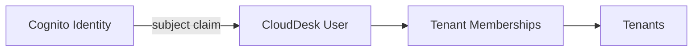

Cognito answers:

> Who authenticated?

PostgreSQL answers:

> Who is this identity inside CloudDesk, and what may the user do?

This prevents the identity provider from becoming the application database.

---

## 11. User Provisioning Flow

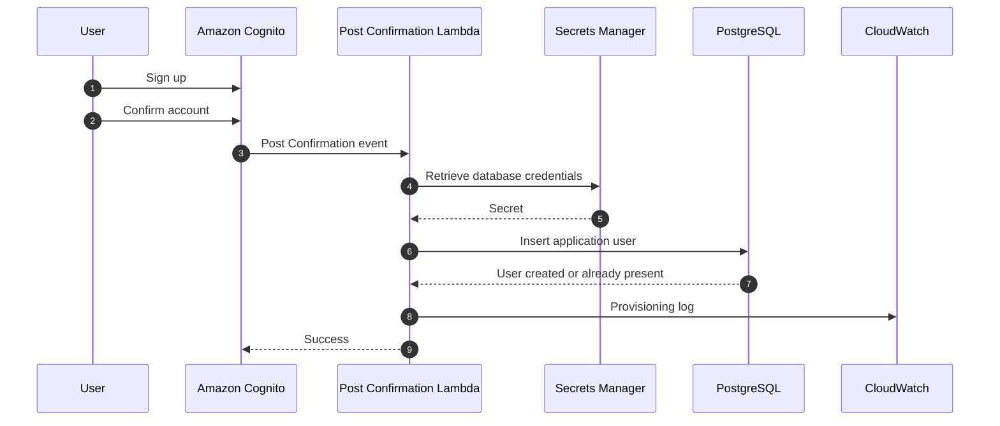

Provisioning avoids querying or synchronizing identity attributes during every API request.

---

## 12. Authentication Flow

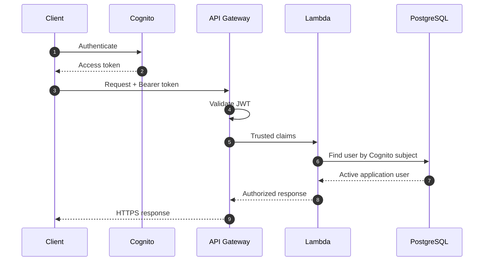

API Gateway validates:

- signature;
- issuer;
- audience;
- expiration.

Lambda:

- reads the trusted claims;
- extracts the Cognito subject;
- resolves the CloudDesk user;
- rejects missing, inactive, or unprovisioned users.

Lambda does not repeat JWT signature verification.

---

## 13. Authorization Architecture

Authentication identifies the user.

Authorization decides whether the user may perform a tenant operation.

CloudDesk centralizes authorization in:

```text
backend/layers/shared/python/shared/authorization.py
```

Reusable guards:

```python
require_membership()
require_admin()
require_owner()
```

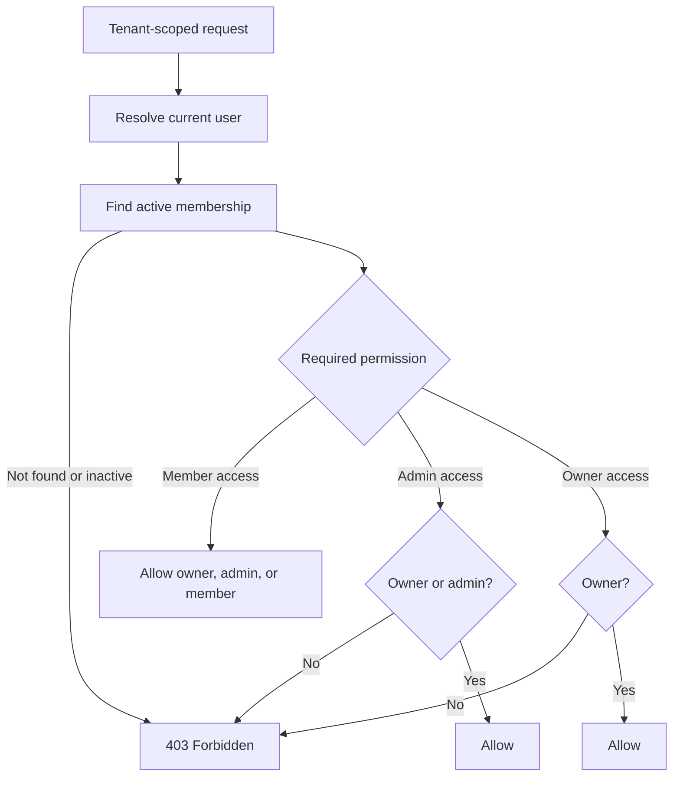

Benefits:

- consistent tenant checks;
- readable handlers;
- reduced duplication;
- centralized permission changes;
- testable authorization behavior.

---

## 14. Role Model

| Role | Description |
|---|---|
| `owner` | Highest tenant authority |
| `admin` | Adds members and accesses tenant resources |
| `member` | Standard tenant access |

### Permission matrix

| Action | Member | Admin | Owner |
|---|:---:|:---:|:---:|
| View tenant | Yes | Yes | Yes |
| List members | Yes | Yes | Yes |
| Add member | No | Yes | Yes |
| Update member role | No | No | Yes |
| Remove member | No | No | Yes |
| Demote owner | No | No | No |
| Remove owner | No | No | No |

The owner role cannot be assigned through the regular member endpoint.

---

## 15. Multi-Tenant Data Model

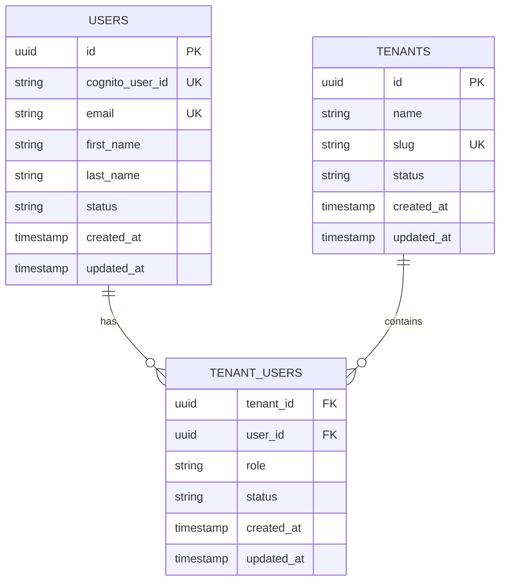

### `users`

Stores application users provisioned after Cognito confirmation.

### `tenants`

Stores customer organizations.

### `tenant_users`

Stores the many-to-many relationship between users and tenants, including:

- tenant;
- user;
- tenant-specific role;
- membership status;
- creation and update timestamps.

This table is the authorization source for tenant-scoped operations.

---

## 16. Tenant Isolation Model

Tenant isolation is enforced at the application and query layers.

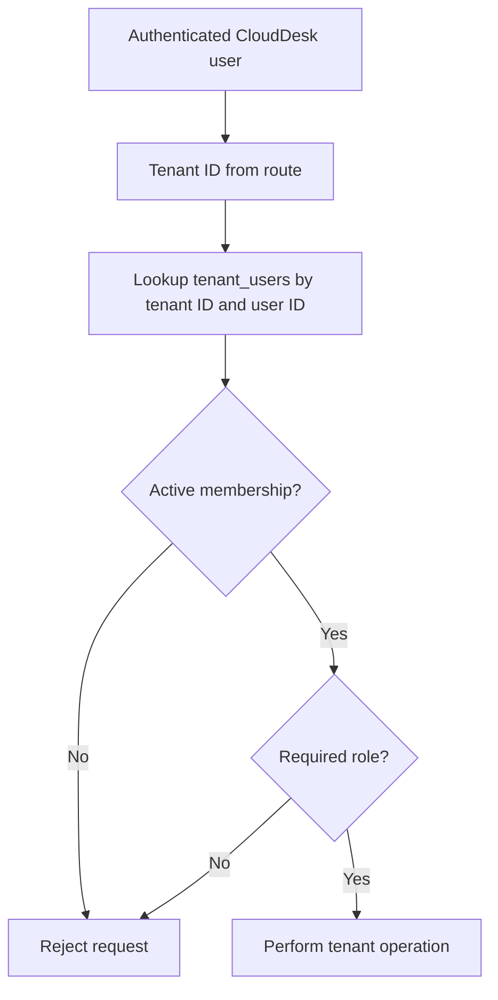

A request is rejected when:

- the Cognito token is invalid;
- the CloudDesk user does not exist;
- the CloudDesk user is inactive;
- the tenant membership does not exist;
- the membership is inactive;
- the tenant role is insufficient.

A tenant UUID alone is never enough to authorize access.

---

## 17. Tenant Creation Flow

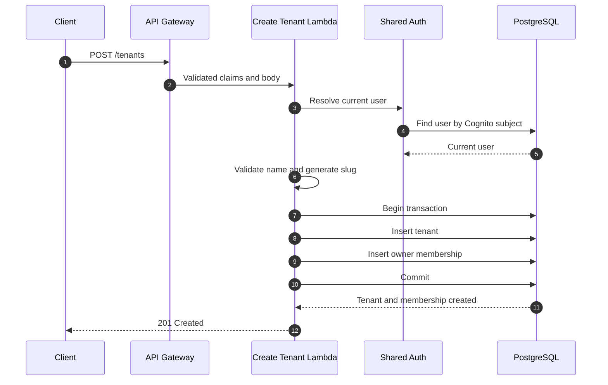

Tenant creation and owner assignment occur in one transaction.

If either insert fails, the transaction rolls back, preventing an ownerless tenant.

---

## 18. Membership Management Flows

### 18.1 Add Member

```mermaid
sequenceDiagram
    autonumber
    participant Actor as Owner or Admin
    participant API
    participant Lambda as Add Member Lambda
    participant Authz as Authorization Helper
    participant DB as PostgreSQL

    Actor->>API: POST /tenants/{tenantId}/members
    API->>Lambda: Request
    Lambda->>Authz: require_admin()
    Authz->>DB: Verify active owner/admin membership
    DB-->>Authz: Authorized
    Lambda->>DB: Find user by email
    Lambda->>DB: Check existing membership
    Lambda->>DB: Insert member or admin membership
    Lambda-->>Actor: 201 Created
```

Only existing CloudDesk users can currently be added.

### 18.2 Update Member Role

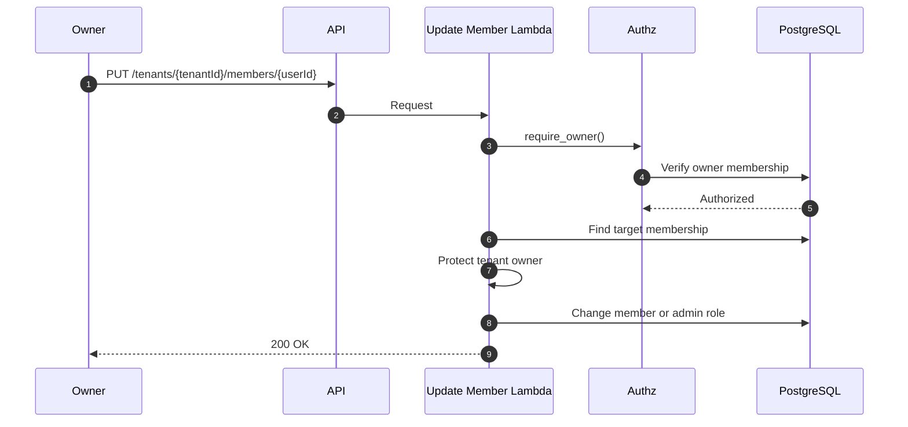

The endpoint does not assign `owner`.

### 18.3 Remove Member

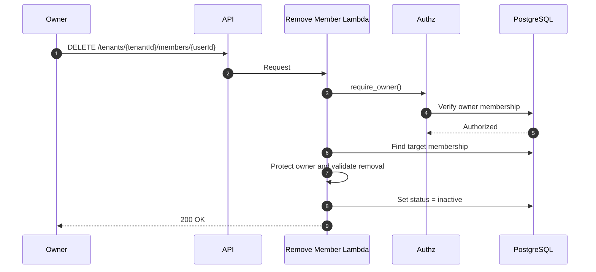

Membership removal is a soft delete.

---

## 19. Membership Lifecycle

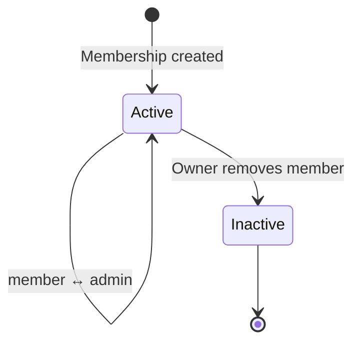

Soft deletion provides:

- historical membership data;
- future audit support;
- possible restoration;
- protection from accidental permanent deletion.

Reactivation is not currently implemented.

---

## 20. API Route Architecture

### Public routes

```http
GET /health
```

### Deployment-verification route

```http
GET /database-test
```

### Protected user route

```http
GET /me
```

### Protected tenant routes

```http
POST /tenants
GET  /tenants
GET  /tenants/{tenantId}
```

### Protected membership routes

```http
GET    /tenants/{tenantId}/members
POST   /tenants/{tenantId}/members
PUT    /tenants/{tenantId}/members/{userId}
DELETE /tenants/{tenantId}/members/{userId}
```

Detailed contracts are maintained in:

```text
docs/api.md
```

---

## 21. Network Architecture

Database-connected Lambda functions run inside the configured VPC.

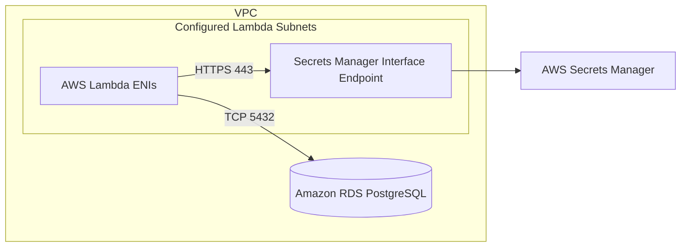

### Existing-resource model

The SAM template receives these existing values as parameters:

- VPC ID;
- Lambda subnet IDs;
- RDS security-group ID;
- database-secret ARN.

The application stack creates its own Lambda security group, endpoint security group, endpoint, and RDS ingress rule.

---

## 22. Security Group Design

### Lambda security group

The Lambda security group permits the required outbound communication.

It is used as the source in dependent inbound rules.

### RDS security group

```text
Protocol: TCP
Port: 5432
Source: Lambda security group
```

RDS is not opened to `0.0.0.0/0`.

### Endpoint security group

```text
Protocol: TCP
Port: 443
Source: Lambda security group
```

This restricts private endpoint access to the application functions.

---

## 23. Private Secret Retrieval

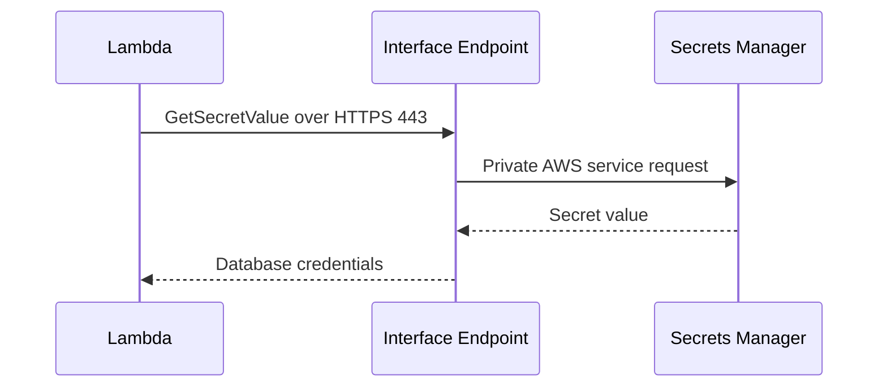

This design avoids deploying a NAT Gateway solely for Secrets Manager access.

The interface endpoint has a recurring hourly and data-processing cost, but it is appropriate for the current private-access requirement.

---

## 24. IAM Architecture

### Lambda runtime permissions

Database-connected functions require permission to:

- create CloudWatch log streams and events;
- manage VPC network interfaces;
- retrieve the configured database secret.

The SAM template uses VPC execution permissions and secret-specific access.

### Deployment permissions

The GitHub deployment role requires permissions to manage:

- CloudFormation;
- SAM deployment artifacts;
- Lambda;
- API Gateway;
- Cognito;
- VPC-related application resources;
- IAM roles used by the stack;
- SNS;
- CloudWatch alarms and dashboard;
- log retention operations.

The deployment policy is broader than the final desired production policy and should be reduced after the resource set stabilizes.

### Separation of responsibilities

Runtime Lambda permissions and GitHub deployment permissions are separate.

---

## 25. Response Architecture

Handlers return standardized JSON responses using `response.py`.

### Security headers

```text
Content-Type: application/json
X-Content-Type-Options: nosniff
X-Frame-Options: DENY
Referrer-Policy: no-referrer
Cache-Control: no-store
```

### Request ID support

The response helper supports an optional:

```text
X-Request-Id
```

Not all handlers currently propagate the request ID to the response. This is a documented hardening improvement.

---

## 26. Observability Architecture

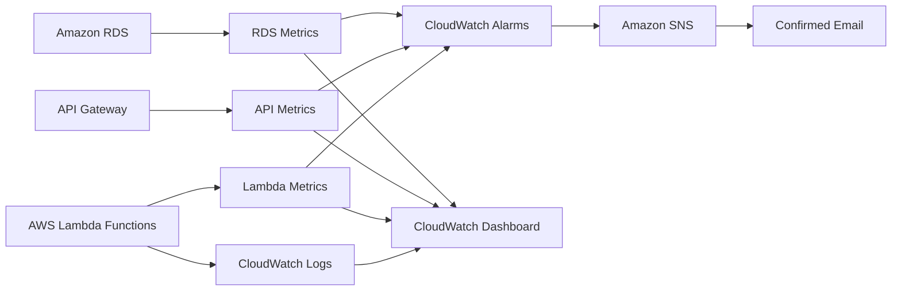

### Structured logging

The shared `observability.py` helper captures non-sensitive context:

- AWS request ID;
- API Gateway request ID;
- function name;
- route key;
- HTTP method;
- path;
- tenant ID;
- target user ID;
- current user ID;
- operation outcome;
- HTTP status.

Instrumented workflows:

- tenant creation;
- member addition;
- member-role update;
- member removal.

### Sensitive values excluded from logs

- access tokens;
- authorization headers;
- database passwords;
- secret values;
- full Cognito claims.

---

## 27. Log Retention

CloudDesk Lambda log groups use a 30-day retention policy.

Retention is applied after deployment to existing log groups.

This approach was selected because defining every Lambda log group as a CloudFormation resource caused deployment failure when Lambda had already created some groups automatically.

### Trade-off

The post-deployment workflow only applies retention to groups that exist at execution time. A newly created function that has never been invoked may not yet have a log group.

A future improvement could explicitly manage all expected log groups before first invocation or run a separate retention reconciliation process.

---

## 28. Alarms and Notifications

### Current alarms

| Alarm | Condition |
|---|---|
| Lambda errors | At least one error during a five-minute period |
| Lambda throttles | At least one throttle during a five-minute period |
| API Gateway 5XX | At least one server error during a five-minute period |
| RDS high CPU | Average CPU above 80% for two evaluation periods |

Alarm actions publish to:

```text
clouddesk-dev-alarms
```

The email subscription is confirmed.

### Current dashboard

The `clouddesk-dev` dashboard displays:

- Lambda invocations;
- Lambda errors;
- Lambda duration;
- API Gateway 5XX errors;
- RDS CPU utilization;
- RDS database connections.

---

## 29. Testing Architecture

CloudDesk uses automated unit and handler tests.

Current suite:

```text
79 passing tests
```

### Coverage areas

- JWT claim extraction;
- authenticated-user resolution;
- inactive-user rejection;
- tenant membership;
- admin and owner authorization;
- response formatting;
- serialization;
- secret validation and caching;
- database connection caching;
- transaction commit and rollback;
- query helpers;
- tenant creation;
- duplicate tenant rejection;
- member addition;
- duplicate membership rejection;
- role validation;
- owner protection;
- soft deletion.

### Test layers

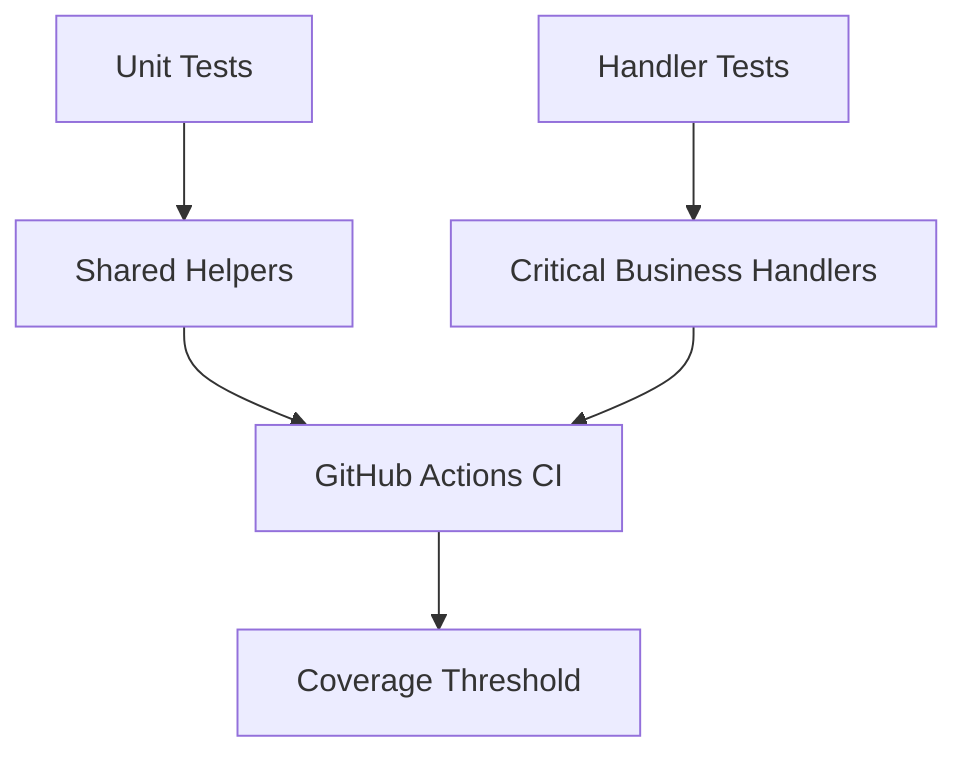

Tests use mocks and fixtures to isolate business behavior from live AWS and PostgreSQL dependencies.

---

## 30. CI/CD Architecture

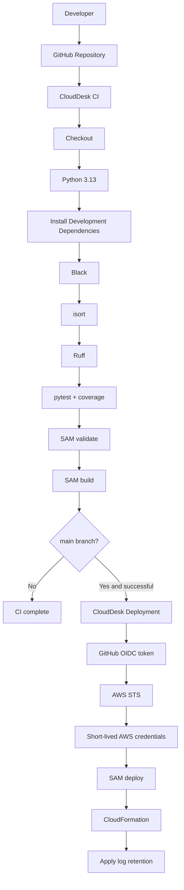

### Continuous Integration

CI runs on pushes and pull requests for `dev` and `main`.

Quality gates include:

```bash
black --check .
isort --check-only .
ruff check .
pytest
sam validate
sam build
```

### Continuous Deployment

Deployment runs only after successful CI on `main`.

The deployment workflow checks out the exact commit SHA validated by CI.

---

## 31. GitHub OIDC Trust

GitHub Actions authenticates to AWS through OpenID Connect.

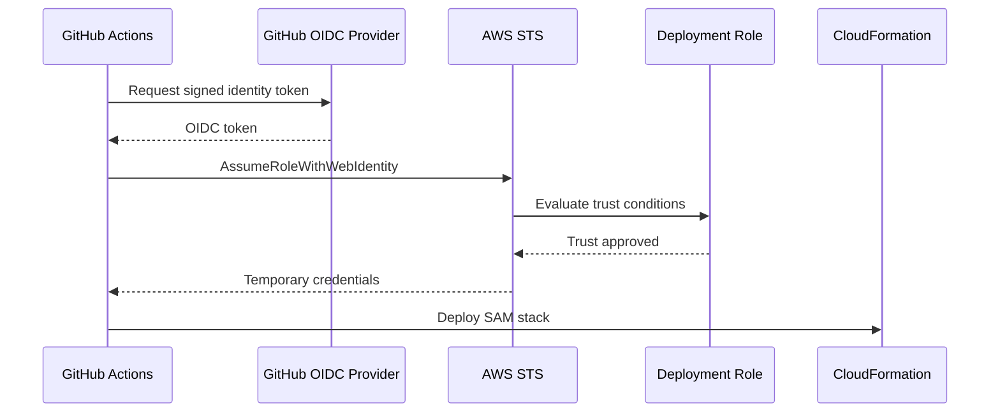

The IAM trust policy is restricted to:

- the expected token audience;
- the repository's immutable GitHub OIDC subject;
- the `main` branch.

No long-lived AWS access key is stored in GitHub.

---

## 32. Infrastructure as Code

Infrastructure is defined in:

```text
backend/template.yaml
```

Deployment configuration is stored in:

```text
backend/samconfig.toml
```

The SAM template provisions or configures:

- API Gateway HTTP API;
- Cognito User Pool;
- Cognito application client;
- JWT authorizer;
- Cognito Post Confirmation integration;
- Lambda functions;
- shared Lambda layer;
- IAM execution permissions;
- Lambda security group;
- RDS security-group ingress;
- Secrets Manager interface endpoint;
- endpoint security group;
- SNS topic and email subscription;
- CloudWatch alarms;
- CloudWatch dashboard;
- stack outputs.

AWS SAM was selected because the application is serverless-first.

Terraform was not added because maintaining the same stack in two Infrastructure as Code systems would create unnecessary complexity.

---

## 33. Deployment Architecture

```mermaid
flowchart LR
    Engineer[Engineer] -->|git push| GitHub[GitHub]
    GitHub --> CI[CI Workflow]
    CI -->|success on main| CD[Deployment Workflow]
    CD -->|OIDC| AWS[AWS Account]
    AWS --> CFN[CloudFormation Stack]
    CFN --> API[API Gateway]
    CFN --> Cognito[Cognito]
    CFN --> Lambda[Lambda]
    CFN --> Layer[Shared Layer]
    CFN --> Network[Security Groups and Endpoint]
    CFN --> Ops[Alarms, SNS, Dashboard]
```

Current deployment:

```text
Environment: dev
Region: us-east-1
Stack: clouddesk-backend
RDS identifier: clouddesk-db
Dashboard: clouddesk-dev
Alarm topic: clouddesk-dev-alarms
```

---

## 34. Reliability Architecture

Reliability controls include:

- managed API routing;
- managed identity;
- stateless Lambda functions;
- PostgreSQL transactions;
- foreign keys and uniqueness constraints;
- tenant creation and owner assignment in one transaction;
- membership soft deletion;
- CloudFormation rollback;
- automated CI validation;
- CloudWatch alarms;
- SNS notifications;
- reusable error responses.

### Known reliability gaps

- backup and restore procedures have not been validated;
- production Multi-AZ configuration is not documented as tested;
- database migration automation is not implemented;
- end-to-end cloud integration tests are not implemented;
- no formal service-level objective exists.

---

## 35. Scalability Architecture

API Gateway and Lambda scale automatically with requests.

```mermaid
flowchart LR
    Traffic[Incoming Requests] --> API[API Gateway]
    API --> Concurrent[Concurrent Lambda Invocations]
    Concurrent --> Connections[PostgreSQL Connections]
    Connections --> RDS[(RDS PostgreSQL)]
```

The relational database is the primary scaling boundary.

### Current optimization

- stateless handlers;
- cached secrets;
- warm database connection reuse;
- indexed tenant and membership lookups;
- targeted SQL queries;
- HTTP API.

### Scaling risks

- Lambda concurrency may create database connection pressure;
- list endpoints require future pagination;
- API and account concurrency quotas need planning;
- RDS CPU, connections, storage, and latency require monitoring.

### Future scaling controls

- RDS Proxy when connection pressure is demonstrated;
- instance or storage scaling;
- read replicas for read-heavy workloads;
- pagination and query limits;
- API throttling;
- reserved concurrency where required.

---

## 36. Performance Architecture

Performance considerations include:

- API Gateway HTTP API instead of REST API;
- separate, focused Lambda handlers;
- reusable shared layer;
- secret caching;
- connection reuse during warm invocations;
- indexed relational lookups;
- serialization helpers;
- minimal duplicated authorization logic.

CloudDesk has not yet completed formal load or concurrency testing.

Performance claims should therefore remain architectural expectations rather than measured production guarantees.

---

## 37. Cost Architecture

Cost-conscious choices include:

- Lambda instead of permanently running servers;
- HTTP API instead of REST API;
- no ECS;
- no EKS;
- no Kubernetes;
- no NAT Gateway solely for secret retrieval;
- no RDS Proxy at the current scale;
- no second Infrastructure as Code system;
- native CloudWatch instead of a separate monitoring platform;
- 30-day log retention.

### Continuous-cost components

- RDS database;
- Secrets Manager;
- interface VPC endpoint;
- CloudWatch logs and metrics;
- SNS usage;
- API Gateway and Lambda usage.

RDS is expected to be the largest baseline cost.

---

## 38. Security Architecture Review

Implemented controls:

- Cognito authentication;
- JWT validation at API Gateway;
- application-user mapping;
- active-user enforcement;
- tenant-level RBAC;
- active-membership checks;
- owner protection;
- Secrets Manager credential storage;
- VPC database access;
- security-group restrictions;
- private secret retrieval;
- secret-specific runtime access;
- OIDC deployment;
- short-lived deployment credentials;
- response security headers;
- no credentials committed to Git;
- structured logs that exclude sensitive values.

### Security gaps before production

- deployment IAM should be reduced further;
- staging and production accounts or environments are not separated;
- no WAF or abuse protection;
- no formal threat model;
- no automated security scanning documented;
- no penetration testing;
- no tenant-level audit-event store;
- request IDs are not returned by every handler;
- no tested incident-response procedure.

---

## 39. Failure Modes and Recovery

| Failure | Expected behavior | Recovery |
|---|---|---|
| Invalid JWT | API Gateway rejects request | Reauthenticate |
| User not provisioned | Lambda returns authentication error | Investigate Post Confirmation execution |
| Missing secret | Lambda fails before DB connection | Restore secret reference or secret |
| RDS unavailable | API operations fail and alarm may trigger | Restore DB availability and inspect connections |
| Unauthorized tenant access | Request returns 403 | No recovery required; expected security control |
| CI failure | Deployment does not run | Fix validation, test, lint, or build error |
| Deployment failure | CloudFormation rolls back | Inspect events, permissions, and parameters |
| Alarm notification failure | Alarm changes state without email | Verify SNS subscription and alarm action |

Detailed issue-specific guidance is maintained in:

```text
docs/troubleshooting.md
```

---

## 40. Current Limitations

The architecture does not currently include:

- tenant invitation for unregistered users;
- ownership transfer;
- tenant-scoped business resources;
- pagination and filtering;
- membership reactivation;
- automated database migration execution;
- end-to-end cloud integration tests;
- formal load testing;
- backup and restore validation;
- separate staging and production environments;
- custom domain;
- WAF;
- formal audit-event storage;
- complete request-ID propagation;
- RDS Proxy;
- formal SLOs and runbooks.

These are documented future improvements, not hidden omissions.

---

## 41. Future Architecture Evolution

### Product capabilities

- tenant-scoped resources;
- invitation workflow;
- ownership transfer;
- membership reactivation;
- audit-event history;
- pagination and filtering.

### Security

- separate AWS environments;
- tighter deployment IAM;
- custom domain and certificate;
- throttling and abuse protection;
- WAF when risk justifies it;
- organization-wide Security Hub, GuardDuty, and Config where appropriate.

### Reliability

- automated migrations;
- restore testing;
- Multi-AZ validation;
- runbooks;
- deployment approvals;
- recovery objectives.

### Performance

- load testing;
- connection-pressure testing;
- RDS Proxy when justified;
- query profiling;
- API quotas and pagination.

### Observability

- full request-ID propagation;
- service-level indicators;
- formal alarm tuning;
- audit events;
- tracing when debugging needs justify it.

---

## 42. AWS Well-Architected Alignment

### Operational Excellence

- Infrastructure defined with AWS SAM;
- CI quality gates;
- OIDC-based deployment;
- structured logs;
- CloudWatch alarms and dashboard;
- SNS notifications;
- documented decisions and troubleshooting.

### Security

- Cognito authentication;
- JWT validation;
- tenant RBAC;
- Secrets Manager;
- VPC connectivity;
- security-group restrictions;
- OIDC short-lived credentials;
- response security headers.

### Reliability

- managed AWS services;
- stateless compute;
- transactions;
- relational constraints;
- soft deletion;
- CloudFormation rollback;
- monitoring alarms.

### Performance Efficiency

- HTTP API;
- serverless compute;
- indexed PostgreSQL access;
- secret caching;
- connection reuse;
- targeted queries.

### Cost Optimization

- no permanent application servers;
- no container orchestration;
- no NAT Gateway solely for secrets;
- no duplicate IaC platform;
- no RDS Proxy without a proven need;
- finite log retention.

### Sustainability

- request-driven compute;
- no unnecessary always-on application tier;
- managed services reduce infrastructure-management overhead;
- shared code reduces duplicated deployment artifacts.

---

## 43. Architecture Summary

CloudDesk uses a serverless API architecture with relational multi-tenant data.

```text
Amazon Cognito
      │
      ▼
API Gateway HTTP API
      │
      ▼
AWS Lambda Functions
      │
      ├── Shared authentication and RBAC
      ├── Structured observability
      ├── Secrets Manager through a private endpoint
      └── PostgreSQL through private VPC connectivity
```

The current architecture provides:

- managed authentication;
- application-level identity;
- tenant isolation;
- role-based authorization;
- owner safeguards;
- private database connectivity;
- private credential retrieval;
- transactional tenant creation;
- membership soft deletion;
- reusable Lambda components;
- automated tests;
- automated CI/CD;
- short-lived deployment credentials;
- structured logs;
- CloudWatch alarms;
- SNS notifications;
- an operational dashboard;
- repeatable Infrastructure as Code.

The design is intentionally production-oriented while avoiding infrastructure that the current workload does not require.
