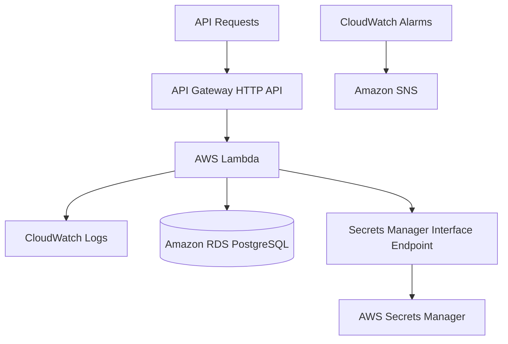

# CloudDesk Cost Optimization Guide

> Cost drivers, optimization decisions, trade-offs, and future controls for the CloudDesk multi-tenant SaaS backend.

---

## Document Status

| Field | Value |
|---|---|
| Project | CloudDesk Multi-Tenant SaaS Backend |
| Environment | `dev` |
| AWS Region | `us-east-1` |
| Cost posture | Cost-conscious development environment |
| Primary baseline cost | Amazon RDS |
| Cost model | Managed and serverless services |

This document avoids exact prices because AWS pricing changes by region, date, configuration, and usage.

Use AWS Pricing Calculator, Cost Explorer, and Budgets for current estimates.

---

## 1. Cost Optimization Goals

CloudDesk should:

- avoid always-on application compute;
- avoid unnecessary managed services;
- minimize idle resources;
- retain enough logs for operations without keeping them indefinitely;
- use private networking without adding a NAT Gateway solely for one service;
- scale application compute with demand;
- introduce additional services only when they solve a demonstrated problem;
- make the database cost visible;
- support future environment-level budgets and alerts.

---

## 2. Current Cost Architecture



### Usage-based components

- API Gateway;
- Lambda;
- CloudWatch log ingestion;
- SNS notifications;
- Secrets Manager API calls.

### Baseline or continuous components

- RDS instance;
- RDS storage;
- interface VPC endpoint;
- Secrets Manager secret;
- CloudWatch custom resources where applicable.

---

## 3. Primary Cost Driver: Amazon RDS

RDS is expected to be the largest continuous cost.

Cost factors include:

- instance class;
- storage size;
- storage type;
- backup retention;
- I/O;
- Multi-AZ configuration;
- data transfer;
- snapshots;
- monitoring options.

### Current Decision

Use standard RDS PostgreSQL rather than Aurora.

### Rationale

The current workload does not justify Aurora's additional scope.

### Optimization Actions

- choose the smallest instance class that supports development;
- monitor CPU and connections;
- avoid oversized storage;
- review backup retention;
- delete unused snapshots;
- stop or delete the development database when the project is no longer active, if operationally acceptable.

### Warning

Do not reduce database resources below the level needed for stable operation merely to lower cost.

---

## 4. Lambda Cost

Lambda is usage-based.

Cost factors include:

- invocation count;
- execution duration;
- memory allocation;
- architecture;
- provisioned concurrency;
- data transfer.

### Current Optimization

- stateless functions;
- focused handlers;
- moderate memory allocation;
- no provisioned concurrency;
- shared code through a layer;
- secret caching;
- connection reuse.

### Avoided Cost

No permanently running EC2 or container application tier.

### Future Review

Use Lambda Power Tuning only when measured performance and cost data justify it.

---

## 5. API Gateway Cost

CloudDesk uses HTTP API instead of REST API.

### Rationale

HTTP API satisfies:

- routing;
- Lambda integration;
- JWT authorization.

It avoids paying for REST API features the application does not use.

### Future Cost Risks

- high request volume;
- unnecessary polling;
- unbounded client retries;
- abusive traffic.

### Future Controls

- throttling;
- caching only when safe and useful;
- client retry discipline;
- WAF when justified by traffic and risk.

---

## 6. Interface VPC Endpoint Cost

The Secrets Manager interface endpoint has a recurring cost.

### Why It Was Chosen

It provides private access to Secrets Manager without a NAT Gateway.

### Alternative Considered

NAT Gateway.

### Why NAT Was Rejected

A NAT Gateway would add:

- larger recurring cost;
- data-processing charges;
- broader internet egress;
- unnecessary complexity for the current requirement.

### Optimization Consideration

If future workloads require broad private-subnet internet access, compare the cost of:

- multiple interface endpoints;
- centralized NAT;
- centralized egress architecture.

---

## 7. Secrets Manager Cost

Cost factors include:

- number of secrets;
- API calls;
- rotation.

### Current Optimization

- one database secret;
- warm-environment caching;
- no repeated retrieval for every query.

### Future Consideration

Enable rotation only with a tested application and cache-invalidation plan.

---

## 8. CloudWatch Logs Cost

Cost factors include:

- log ingestion;
- retained storage;
- queries;
- verbose logging.

### Current Optimization

- 30-day retention;
- structured logs;
- no indefinite retention;
- no sensitive values;
- critical-operation instrumentation rather than excessive logging everywhere.

### Cost Risks

- logging entire events;
- logging complete JWT claims;
- duplicate logs;
- debug logging left enabled;
- high-volume failed requests.

### Recommended Practice

Log enough context to troubleshoot, but not entire payloads by default.

---

## 9. CloudWatch Metrics, Alarms, and Dashboard

CloudDesk uses native AWS monitoring.

### Cost Benefits

- no separate monitoring servers;
- no Prometheus infrastructure;
- no Grafana hosting;
- no third-party observability subscription.

### Current Resources

- Lambda error alarms;
- Lambda throttle alarms;
- API 5XX alarm;
- RDS CPU alarm;
- one dashboard;
- SNS notifications.

### Optimization Principle

Create alarms that lead to action.

Avoid alarms that produce noise without an operational response.

---

## 10. SNS Cost

SNS email notifications are low-volume and event-driven.

### Current Use

Only alarm notifications.

### Cost Risk

Minimal for the current environment.

### Operational Risk

Unconfirmed subscriptions provide no value.

---

## 11. CI/CD Cost

GitHub Actions runs:

- formatting;
- linting;
- tests;
- SAM validation;
- SAM build;
- deployment.

### Optimization

- run deployment only after successful CI;
- deploy only from `main`;
- avoid duplicate workflows;
- cache dependencies only if it materially reduces runtime;
- stop workflows early on failure.

### Hidden Benefit

CI prevents failed or low-quality deployments that could create operational cost.

---

## 12. Avoided Services

CloudDesk intentionally does not use:

- ECS;
- EKS;
- Kubernetes;
- NAT Gateway;
- RDS Proxy;
- Aurora;
- Prometheus;
- Grafana;
- WAF;
- additional Infrastructure as Code tools.

These services are not inherently bad.

They were excluded because they do not currently solve a demonstrated requirement.

---

## 13. RDS Proxy Decision

RDS Proxy can reduce database connection pressure.

### Why It Is Not Included

- no measured connection exhaustion;
- additional recurring cost;
- additional infrastructure;
- direct connection reuse is currently sufficient.

### Add It When

- Lambda concurrency grows;
- database connections approach limits;
- failover connection handling becomes important.

---

## 14. Environment Cost Strategy

Current environment:

```text
dev
```

This avoids paying for duplicate staging and production resources while the project is still a portfolio implementation.

### Production Requirement

Real production should use isolated environments despite higher cost.

Cost optimization must not remove necessary environment separation.

---

## 15. Log Retention Decision

Current retention:

```text
30 days
```

### Rationale

Provides enough history for development troubleshooting without indefinite storage.

### Revisit When

- compliance requires longer retention;
- security investigations need more history;
- archive storage is introduced.

---

## 16. Data Transfer

Potential data-transfer sources:

- API responses;
- Lambda to AWS services;
- RDS cross-AZ traffic;
- deployment artifacts;
- logs.

### Optimization

- keep dependent resources in the same region;
- avoid unnecessary large API payloads;
- paginate list endpoints;
- avoid cross-region architecture without a requirement.

---

## 17. Database Query Cost Efficiency

Poor queries increase RDS CPU and can force earlier scaling.

Current measures:

- indexed lookups;
- targeted tenant and membership queries;
- relational constraints;
- no unnecessary full-table scans in core paths.

Future measures:

- query profiling;
- pagination;
- slow-query analysis;
- selective indexes;
- connection monitoring.

---

## 18. API Payload Efficiency

Current responses return only application data required by the client.

Future improvements:

- pagination;
- field selection where justified;
- response compression where supported;
- avoid embedding large unrelated datasets.

---

## 19. Budget Controls

Recommended AWS Budgets:

### Monthly Cost Budget

Alert at:

```text
50%
80%
100%
```

of the selected monthly budget.

### Forecast Alert

Notify when forecasted spend exceeds the budget.

### Service-Level Review

Review costs for:

- RDS;
- EC2 networking;
- CloudWatch;
- Secrets Manager;
- API Gateway;
- Lambda.

---

## 20. Cost Explorer Review

Review monthly:

- service spend;
- daily trend;
- region;
- usage type;
- tags;
- unexpected new resources.

Questions:

- Did RDS grow?
- Did endpoint cost remain justified?
- Did log ingestion spike?
- Are old snapshots present?
- Are unused Lambda versions accumulating?
- Did a new service appear unexpectedly?

---

## 21. Tagging Strategy

Recommended tags:

```text
Application=CloudDesk
Environment=dev
ManagedBy=AWS-SAM
Portfolio=AWS80Projects
Owner=SimeonSiaka
```

Tags support:

- cost allocation;
- ownership;
- cleanup;
- reporting.

Do not use tags to store sensitive information.

---

## 22. Development Cleanup

When pausing the project, review:

- active RDS instance;
- old snapshots;
- unused secrets;
- interface endpoints;
- CloudWatch log groups;
- old Lambda versions;
- SAM artifact buckets;
- failed CloudFormation stacks.

### Warning

Delete only resources confirmed to belong to CloudDesk.

---

## 23. Cost Optimization Checklist

- [ ] RDS size matches workload
- [ ] No unused snapshots
- [ ] Log retention is 30 days
- [ ] No NAT Gateway exists solely for Secrets Manager
- [ ] No provisioned concurrency
- [ ] No unused interface endpoints
- [ ] Secret count is minimal
- [ ] Dashboard and alarms are actionable
- [ ] CI does not run duplicate deployments
- [ ] Resources are tagged
- [ ] AWS Budget exists
- [ ] Cost Explorer is reviewed
- [ ] Old stacks and artifacts are removed safely

---

## 24. Cost vs Reliability Trade-Offs

### Single Development Environment

Lower cost, but not sufficient for production isolation.

### Standard RDS

Lower complexity, but production availability may require Multi-AZ.

### No RDS Proxy

Lower cost, but connection pressure remains a future risk.

### No WAF

Lower cost, but public production security is incomplete.

### Thirty-Day Logs

Lower storage cost, but shorter investigation history.

Cost decisions must not be presented as permanent architecture rules.

---

## 25. Future Cost Improvements

- right-size RDS using actual metrics;
- automate non-production scheduling where safe;
- create budgets and anomaly detection;
- review interface-endpoint economics as architecture grows;
- paginate list endpoints;
- profile expensive SQL;
- archive logs if longer retention is required;
- remove unused Lambda versions;
- use separate production accounts with independent budgets.

---

## 26. Cost Optimization Summary

CloudDesk reduces cost by using:

- Lambda;
- API Gateway HTTP API;
- standard RDS PostgreSQL;
- one shared layer;
- Secrets Manager caching;
- private endpoint instead of NAT for the current requirement;
- 30-day logs;
- native CloudWatch;
- no container orchestration;
- no duplicate IaC system;
- no RDS Proxy without evidence.

The primary lesson is:

> Cost optimization is not choosing the cheapest possible service. It is choosing the simplest architecture that meets the requirement, measuring the real cost, and adding complexity only when it produces measurable value.
