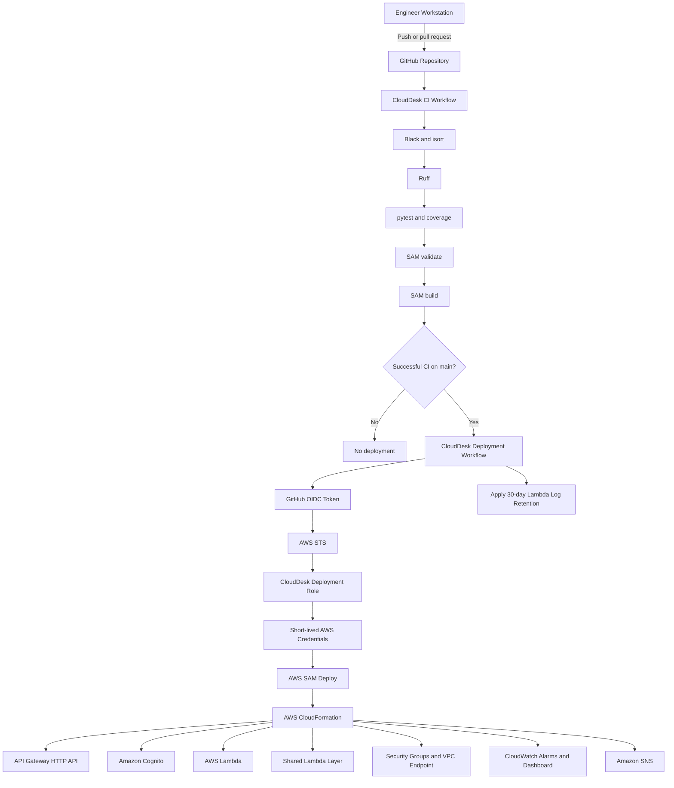
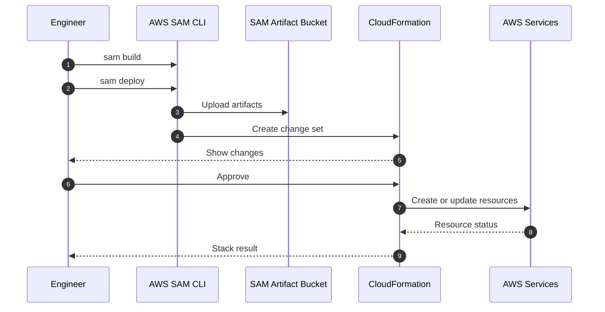
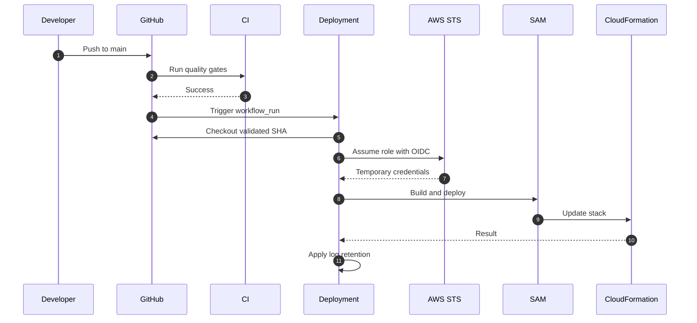

# CloudDesk Deployment Guide

> End-to-end deployment reference for the CloudDesk multi-tenant SaaS backend.

---

## Document Status

| Field | Value |
|---|---|
| Project | CloudDesk Multi-Tenant SaaS Backend |
| Environment documented | `dev` |
| AWS Region | `us-east-1` |
| CloudFormation stack | `clouddesk-backend` |
| Infrastructure as Code | AWS SAM |
| Deployment automation | GitHub Actions |
| AWS authentication for CI/CD | GitHub OIDC and AWS STS |
| Database | Existing Amazon RDS for PostgreSQL |
| Runtime | Python 3.13 |

This guide documents both local deployment from an engineer workstation and automated deployment through GitHub Actions.

The current architecture is production-inspired, but the documented deployment is for the development environment.

---

## 1. Deployment Objectives

The CloudDesk deployment process must:

- validate the application before release;
- run automated tests;
- build Lambda deployment artifacts;
- deploy infrastructure through AWS SAM and CloudFormation;
- avoid long-lived AWS credentials in GitHub;
- pass environment-specific values securely;
- preserve database credentials outside source control;
- apply CloudWatch log-retention settings;
- create alarms, notifications, and the operational dashboard;
- provide a repeatable verification process;
- support rollback through CloudFormation and Git.

---

## 2. Deployment Architecture



---

## 3. Deployment Boundaries

The SAM application deploys the CloudDesk serverless backend and supporting operational resources.

### Managed by the SAM stack

The stack provisions or configures:

- Amazon API Gateway HTTP API;
- Cognito User Pool;
- Cognito application client;
- JWT authorizer;
- Cognito Post Confirmation integration;
- Lambda functions;
- shared Lambda layer;
- Lambda execution permissions;
- Lambda security group;
- RDS security-group ingress;
- Secrets Manager interface VPC endpoint;
- endpoint security group;
- SNS alarm topic and subscription;
- CloudWatch alarms;
- CloudWatch dashboard;
- stack outputs.

### Existing resources supplied to the stack

The current deployment expects existing:

- VPC;
- Lambda subnet IDs;
- RDS security group;
- RDS PostgreSQL instance;
- Secrets Manager database secret.

The RDS instance itself is not created by the current SAM template.

---

## 4. Repository Layout

```text
clouddesk-multi-tenant-saas/
├── .github/
│   └── workflows/
│       ├── ci.yml
│       └── deploy.yml
├── backend/
│   ├── database/
│   │   └── migrations/
│   │       └── 001_initial_schema.sql
│   ├── layers/
│   │   └── shared/
│   ├── tests/
│   ├── pyproject.toml
│   ├── requirements-dev.txt
│   ├── samconfig.toml
│   └── template.yaml
├── docs/
│   ├── architecture.md
│   ├── api.md
│   ├── decisions.md
│   ├── deployment.md
│   └── troubleshooting.md
└── README.md
```

---

## 5. Deployment Prerequisites

### 5.1 Local software

Install:

- Git;
- Python 3.13;
- AWS CLI;
- AWS SAM CLI;
- PostgreSQL client tools;
- a terminal such as Git Bash, PowerShell, or Windows Terminal.

Verify:

```bash
git --version
python --version
aws --version
sam --version
psql --version
```

Expected Python version:

```text
Python 3.13
```

### 5.2 AWS authentication

For local deployment, configure an AWS CLI profile or another supported AWS credential source.

Verify the active identity:

```bash
aws sts get-caller-identity
```

Confirm that the output belongs to the intended AWS account before deploying.

Set the region:

```bash
aws configure set region us-east-1
```

Or use a named profile:

```bash
export AWS_PROFILE="<profile-name>"
export AWS_REGION="us-east-1"
```

### 5.3 Existing AWS resources

Before deploying, identify:

```text
VPC ID
Lambda subnet IDs
RDS security-group ID
Database secret ARN
Alarm email address
```

The current development database identifier is:

```text
clouddesk-db
```

Do not place secret values in Git, `template.yaml`, public documentation, screenshots, or workflow logs.

---

## 6. Required SAM Parameters

| Parameter | Purpose |
|---|---|
| `Environment` | Deployment environment such as `dev` |
| `VpcId` | VPC containing Lambda networking and RDS |
| `LambdaSubnetIds` | Subnets used by database-connected Lambda functions |
| `RdsSecurityGroupId` | Existing RDS security-group ID |
| `DatabaseSecretArn` | Secrets Manager ARN containing PostgreSQL credentials |
| `AlarmEmail` | Email address subscribed to alarm notifications |

Example placeholders:

```text
Environment=dev
VpcId=vpc-xxxxxxxxxxxxxxxxx
LambdaSubnetIds=subnet-aaaaaaaaaaaaaaaaa,subnet-bbbbbbbbbbbbbbbbb
RdsSecurityGroupId=sg-xxxxxxxxxxxxxxxxx
DatabaseSecretArn=arn:aws:secretsmanager:us-east-1:<account-id>:secret:<secret-name>
AlarmEmail=operator@example.com
```

---

## 7. Database Secret Requirements

The Secrets Manager secret must provide the connection values expected by:

```text
backend/layers/shared/python/shared/secrets.py
```

Typical keys:

```json
{
  "host": "<database-endpoint>",
  "port": 5432,
  "dbname": "<database-name>",
  "username": "<database-user>",
  "password": "<database-password>"
}
```

Verify that the secret exists:

```bash
aws secretsmanager describe-secret   --secret-id "<database-secret-arn>"   --region us-east-1
```

Do not run `get-secret-value` in a recorded terminal session or copy the returned password into documentation.

---

## 8. Local Development Environment

Move to the backend:

```bash
cd clouddesk-multi-tenant-saas/backend
```

Create a virtual environment:

```bash
python -m venv .venv
```

Activate it in Git Bash:

```bash
source .venv/Scripts/activate
```

Activate it in PowerShell:

```powershell
.\.venv\Scripts\Activate.ps1
```

Install development dependencies:

```bash
python -m pip install --upgrade pip
python -m pip install -r requirements-dev.txt
```

The development dependencies include pytest, pytest-cov, Black, isort, Ruff, Psycopg binary support, and boto3 for local testing.

---

## 9. Pre-Deployment Quality Gate

Run the same checks used by CI.

### 9.1 Formatting

```bash
black --check .
isort --check-only .
```

Apply formatting locally when required:

```bash
black .
isort .
```

### 9.2 Linting

```bash
ruff check .
```

Third-party packages bundled in the Lambda layer are excluded through:

```text
backend/pyproject.toml
```

Do not reformat vendored Psycopg packages.

### 9.3 Tests

```bash
pytest
```

The current suite contains:

```text
79 passing tests
```

Run with coverage:

```bash
pytest tests/unit tests/handlers   --cov=layers/shared/python/shared   --cov-report=term-missing
```

Generate an HTML report:

```bash
pytest tests/unit tests/handlers   --cov=layers/shared/python/shared   --cov-report=html
```

### 9.4 Validate SAM

```bash
sam validate
```

Where supported:

```bash
sam validate --lint
```

### 9.5 Build SAM

```bash
sam build
```

A successful build creates:

```text
backend/.aws-sam/
```

This directory is generated and must not be committed.

---

## 10. Local Deployment

### 10.1 First deployment

```bash
sam deploy --guided
```

Use:

```text
Stack Name: clouddesk-backend
AWS Region: us-east-1
Confirm changes before deploy: Yes
Allow SAM CLI IAM role creation: Yes
Disable rollback: No
Save arguments to configuration file: Yes
SAM configuration file: samconfig.toml
SAM configuration environment: default
```

Provide the required parameter values when prompted.

### 10.2 Subsequent deployments

```bash
sam deploy
```

Review the CloudFormation change set before approval.

### 10.3 Explicit deployment example

```bash
sam deploy   --stack-name clouddesk-backend   --region us-east-1   --capabilities CAPABILITY_IAM   --resolve-s3   --parameter-overrides       Environment="dev"       VpcId="<vpc-id>"       LambdaSubnetIds="<subnet-id-1>,<subnet-id-2>"       RdsSecurityGroupId="<rds-security-group-id>"       DatabaseSecretArn="<database-secret-arn>"       AlarmEmail="<alarm-email>"
```

---

## 11. SAM Configuration

Deployment configuration is stored in:

```text
backend/samconfig.toml
```

It should define:

```text
stack_name = "clouddesk-backend"
region = "us-east-1"
capabilities = "CAPABILITY_IAM"
confirm_changeset = true
resolve_s3 = true
```

Before committing `samconfig.toml`, inspect it for:

- account IDs;
- secret ARNs;
- email addresses;
- private network identifiers;
- sensitive parameters.

For a public repository, prefer placeholders or pass sensitive values through deployment arguments or GitHub variables.

---

## 12. Database Migration

The initial schema is:

```text
backend/database/migrations/001_initial_schema.sql
```

It creates:

- status and role types;
- `users`;
- `tenants`;
- `tenant_users`;
- constraints;
- foreign keys;
- indexes;
- timestamp update triggers.

Run the migration from a machine or service with network access to RDS.

Do not make RDS publicly accessible solely to simplify migration.

Apply the migration:

```bash
psql   --host="<database-endpoint>"   --port=5432   --username="<database-user>"   --dbname="<database-name>"   --file=database/migrations/001_initial_schema.sql
```

Verify inside `psql`:

```sql
\dt
```

Expected tables:

```text
users
tenants
tenant_users
```

The current project applies the initial migration manually. Automated migration execution remains a future improvement because it requires ordering, rollback, backup, concurrency, and approval safeguards.

---

## 13. CloudFormation Deployment Lifecycle



Successful stack states:

```text
CREATE_COMPLETE
UPDATE_COMPLETE
```

Rollback states can include:

```text
ROLLBACK_COMPLETE
UPDATE_ROLLBACK_COMPLETE
UPDATE_ROLLBACK_FAILED
```

Inspect events before retrying.

---

## 14. Verify the Stack

Show stack status:

```bash
aws cloudformation describe-stacks   --stack-name clouddesk-backend   --region us-east-1   --query "Stacks[0].StackStatus"   --output text
```

List recent events:

```bash
aws cloudformation describe-stack-events   --stack-name clouddesk-backend   --region us-east-1   --max-items 20
```

Retrieve outputs:

```bash
aws cloudformation describe-stacks   --stack-name clouddesk-backend   --region us-east-1   --query "Stacks[0].Outputs"   --output table
```

---

## 15. Post-Deployment Verification

### 15.1 API Gateway routes

```bash
aws apigatewayv2 get-apis   --region us-east-1   --query "Items[?contains(Name, 'clouddesk')]"
```

Then:

```bash
aws apigatewayv2 get-routes   --api-id "<api-id>"   --region us-east-1
```

Expected routes:

```text
GET /health
GET /database-test
GET /me
POST /tenants
GET /tenants
GET /tenants/{tenantId}
GET /tenants/{tenantId}/members
POST /tenants/{tenantId}/members
PUT /tenants/{tenantId}/members/{userId}
DELETE /tenants/{tenantId}/members/{userId}
```

### 15.2 Health endpoint

```bash
curl "https://<api-id>.execute-api.us-east-1.amazonaws.com/health"
```

Expected:

```text
HTTP 200
```

Append the stage when the API does not use `$default`.

### 15.3 Database verification

```bash
curl "https://<api-id>.execute-api.us-east-1.amazonaws.com/database-test"
```

The endpoint must not expose passwords, secret values, full connection strings, or database endpoints.

Restrict or remove it before real production use if it exposes unnecessary operational information.

### 15.4 Cognito

```bash
aws cognito-idp list-user-pools   --max-results 20   --region us-east-1
```

Confirm:

- User Pool exists;
- application client exists;
- Post Confirmation trigger is configured;
- API authorizer uses the correct issuer and audience.

### 15.5 Lambda functions

```bash
aws lambda list-functions   --region us-east-1   --query "Functions[?contains(FunctionName, 'clouddesk')].FunctionName"
```

Verify a function:

```bash
aws lambda get-function-configuration   --function-name "<function-name>"   --region us-east-1
```

Check runtime, VPC configuration, layer, timeout, memory, and role.

### 15.6 Secrets Manager endpoint

```bash
aws ec2 describe-vpc-endpoints   --region us-east-1   --filters       "Name=service-name,Values=com.amazonaws.us-east-1.secretsmanager"
```

Confirm:

```text
VpcEndpointType = Interface
PrivateDnsEnabled = true
State = available
```

### 15.7 CloudWatch dashboard

```bash
aws cloudwatch list-dashboards   --dashboard-name-prefix "clouddesk"   --region us-east-1
```

Expected:

```text
clouddesk-dev
```

### 15.8 CloudWatch alarms

```bash
aws cloudwatch describe-alarms   --alarm-name-prefix "clouddesk"   --region us-east-1
```

Expected categories:

- Lambda errors;
- Lambda throttles;
- API Gateway 5XX;
- RDS high CPU.

### 15.9 SNS subscription

```bash
aws sns list-subscriptions-by-topic   --topic-arn "<topic-arn>"   --region us-east-1
```

Confirm the subscription is not:

```text
PendingConfirmation
```

### 15.10 Log retention

Git Bash may rewrite paths beginning with `/`.

Use:

```bash
MSYS_NO_PATHCONV=1 aws logs describe-log-groups   --log-group-name-prefix "/aws/lambda/clouddesk-dev-"   --region us-east-1   --query "logGroups[].{Name:logGroupName,Retention:retentionInDays}"   --output table
```

Expected retention:

```text
30
```

A function that has never run may not yet have a log group.

---

## 16. API Smoke Tests

Set:

```bash
export API_URL="https://<api-id>.execute-api.us-east-1.amazonaws.com"
export TOKEN="<cognito-access-token>"
```

Append the stage when required.

Retrieve the user:

```bash
curl   -H "Authorization: Bearer $TOKEN"   "$API_URL/me"
```

Create a tenant:

```bash
curl -X POST   -H "Authorization: Bearer $TOKEN"   -H "Content-Type: application/json"   -d '{"name":"NovaTech"}'   "$API_URL/tenants"
```

List tenants:

```bash
curl   -H "Authorization: Bearer $TOKEN"   "$API_URL/tenants"
```

Never commit or publish the token.

---

## 17. Continuous Integration

Workflow:

```text
.github/workflows/ci.yml
```

CI runs for pushes and pull requests targeting:

```text
dev
main
```

Responsibilities:

- checkout;
- Python 3.13 setup;
- SAM CLI setup;
- development dependency installation;
- Black;
- isort;
- Ruff;
- pytest and coverage;
- SAM validation;
- SAM build.

Backend commands run from:

```text
backend/
```

A failed CI run blocks deployment.

---

## 18. GitHub OIDC Configuration

GitHub Actions authenticates to AWS through OIDC.

No AWS access key or secret access key is stored in GitHub.

### OIDC provider

The AWS account must contain the provider:

```text
token.actions.githubusercontent.com
```

Audience:

```text
sts.amazonaws.com
```

### Deployment role

```text
CloudDeskGitHubActionsDeployRole
```

### Immutable subject pattern

The repository uses immutable subject claims similar to:

```text
repo:<owner>@<owner-id>/<repository>@<repository-id>:ref:refs/heads/main
```

The trust policy must match the actual subject emitted by GitHub.

### Workflow permissions

```yaml
permissions:
  id-token: write
  contents: read
```

---

## 19. GitHub Repository Variables

Configure under:

```text
Repository Settings
  → Secrets and variables
  → Actions
  → Variables
```

| Variable | Purpose |
|---|---|
| `AWS_DEPLOY_ROLE_ARN` | Deployment-role ARN |
| `AWS_REGION` | `us-east-1` |
| `DATABASE_SECRET_ARN` | Database-secret ARN |
| `ALARM_EMAIL` | Alarm email |

Do not print these values in logs.

---

## 20. Automated Deployment

Workflow:

```text
.github/workflows/deploy.yml
```

Deployment runs after successful CI on `main`.



The workflow checks out the exact commit validated by CI.

---

## 21. Deployment Role Permissions

The deployment role requires permissions for:

- CloudFormation;
- SAM artifact storage;
- Lambda;
- API Gateway;
- Cognito;
- IAM roles used by the stack;
- EC2 networking resources;
- Secrets Manager metadata;
- CloudWatch Logs;
- CloudWatch alarms;
- CloudWatch dashboards;
- SNS topics and subscriptions.

The deployment policy is broader than the desired final production policy and should be reduced after resource names and required actions stabilize.

Do not reuse the deployment role as a Lambda execution role.

---

## 22. Log Retention Step

Explicit CloudFormation log-group resources caused `AlreadyExists` failures when Lambda had created groups automatically.

The current workflow applies retention after deployment.

Conceptually:

```bash
for each existing /aws/lambda/clouddesk-dev-* log group:
    aws logs put-retention-policy --retention-in-days 30
```

With Git Bash, prefix paths with:

```bash
MSYS_NO_PATHCONV=1
```

Only existing groups receive retention. A newly deployed, never-invoked function may require first invocation and another retention reconciliation.

---

## 23. Rollback Strategy

### CloudFormation rollback

CloudFormation rolls back failed updates unless rollback is disabled.

Inspect:

```bash
aws cloudformation describe-stack-events   --stack-name clouddesk-backend   --region us-east-1
```

Fix the first failed resource and redeploy.

### Git rollback

```bash
git log --oneline
git revert <bad-commit-sha>
git push origin main
```

CI validates the revert before deployment.

### Known-good commit

```bash
git checkout <known-good-sha>
cd backend
sam build
sam deploy
```

Use this only with clear change control.

---

## 24. Common Deployment Failures

### OIDC role assumption denied

Symptom:

```text
Not authorized to perform sts:AssumeRoleWithWebIdentity
```

Check:

- actual immutable OIDC subject;
- branch condition;
- audience;
- `id-token: write`.

### Required SAM parameter missing

Symptom:

```text
Parameters: [AlarmEmail] must have values
```

Add the repository variable and the parameter override.

### SNS permission denied

Add the required topic and subscription management actions to the deployment role.

### Dashboard permission denied

Add dashboard create, update, and deletion permissions required for deployment and rollback.

### Lambda log group already exists

Remove conflicting explicit log-group resources and apply retention after deployment.

### Stack rollback

Inspect the earliest failed resource:

```bash
aws cloudformation describe-stack-events   --stack-name clouddesk-backend   --region us-east-1   --max-items 50
```

### Local Psycopg import failure

Windows local tests must use the locally installed binary package before the Linux-compatible Lambda-layer packages.

See:

```text
docs/troubleshooting.md
```

---

## 25. Deployment Security Checklist

Before deployment:

- [ ] Correct AWS account verified
- [ ] Correct region verified
- [ ] No secrets committed
- [ ] Database secret exists
- [ ] VPC and subnet IDs are correct
- [ ] RDS security group is correct
- [ ] Alarm email is correct
- [ ] Black passes
- [ ] isort passes
- [ ] Ruff passes
- [ ] 79 tests pass
- [ ] Coverage threshold passes
- [ ] SAM validates
- [ ] SAM builds
- [ ] Change set reviewed

After deployment:

- [ ] Stack is complete
- [ ] Health endpoint returns 200
- [ ] Database test succeeds
- [ ] Missing token is rejected
- [ ] `/me` resolves a valid user
- [ ] Tenant creation succeeds
- [ ] Cross-tenant access is rejected
- [ ] Alarms exist
- [ ] SNS subscription is confirmed
- [ ] Dashboard exists
- [ ] Log retention is 30 days
- [ ] Logs contain no sensitive values

---

## 26. Environment Strategy

The current environment is:

```text
dev
```

Future environments should be separate:

```text
dev
staging
prod
```

Each should have separate:

- CloudFormation stack;
- Cognito resources;
- database;
- secret;
- alarms;
- SNS topic;
- dashboard;
- deployment role;
- GitHub environment;
- approval policy.

Recommended future names:

```text
clouddesk-dev
clouddesk-staging
clouddesk-prod
```

The current active stack remains:

```text
clouddesk-backend
```

CloudFormation stacks cannot be directly renamed.

---

## 27. Production Deployment Improvements

Before real production use, add:

- separate environments or accounts;
- deployment approvals;
- protected GitHub environments;
- tighter deployment IAM;
- automated migration controls;
- backup and restore validation;
- RDS Multi-AZ verification;
- load and concurrency testing;
- cloud integration tests;
- custom domain and certificate;
- API throttling;
- WAF when justified;
- formal incident runbooks;
- service-level indicators;
- complete request-ID propagation;
- dependency and security scanning.

---

## 28. Stack Deletion

The RDS database is external to the current SAM stack.

Deleting the stack does not necessarily delete the database.

Delete the stack:

```bash
sam delete   --stack-name clouddesk-backend   --region us-east-1
```

Verify deletion:

```bash
aws cloudformation describe-stacks   --stack-name clouddesk-backend   --region us-east-1
```

Review remaining:

- RDS;
- Secrets Manager secret;
- interface endpoint;
- Lambda log groups;
- SNS subscription;
- SAM artifact bucket;
- old CloudFormation stacks.

Do not delete shared or external resources without confirming ownership.

---

## 29. Final Deployment Summary

CloudDesk deployment provides:

- local validation;
- automated formatting and linting;
- 79 tests;
- coverage enforcement;
- SAM validation and build;
- GitHub OIDC authentication;
- short-lived AWS credentials;
- CloudFormation deployment;
- private database and secret connectivity;
- CloudWatch alarms and dashboard;
- SNS notifications;
- 30-day log retention;
- rollback through CloudFormation and Git.

The deployment avoids:

- long-lived GitHub AWS keys;
- duplicate Infrastructure as Code tools;
- container orchestration;
- a NAT Gateway used only for Secrets Manager;
- RDS Proxy without demonstrated need;
- external monitoring platforms that do not solve a current requirement.
