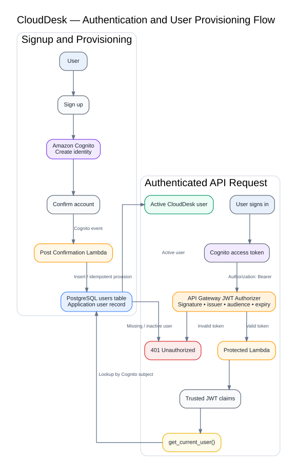
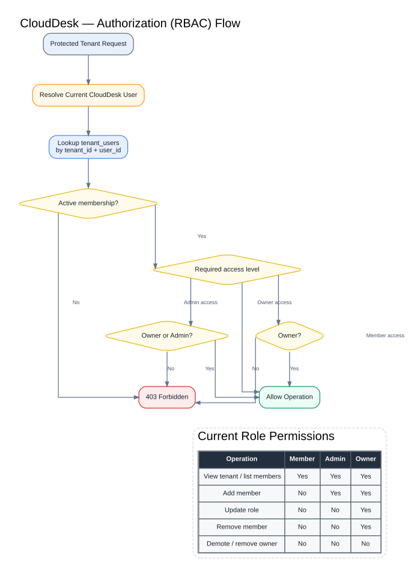
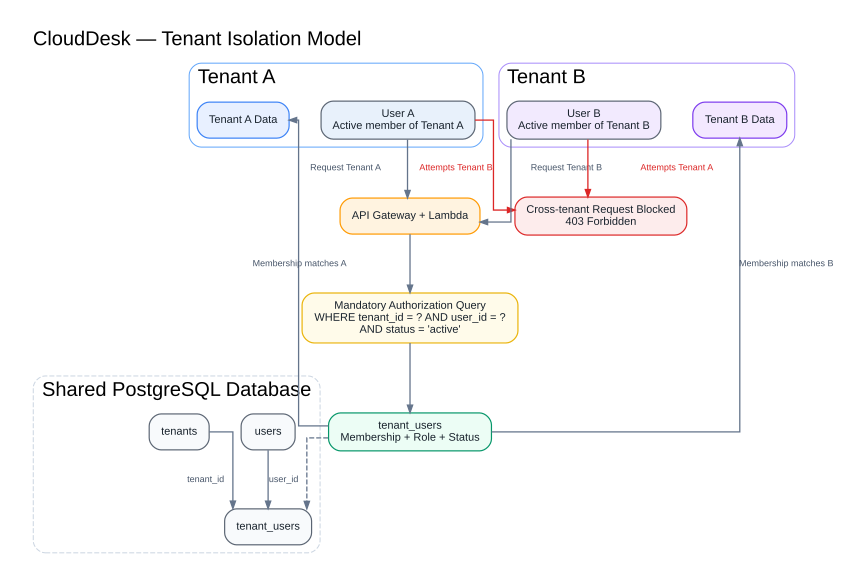
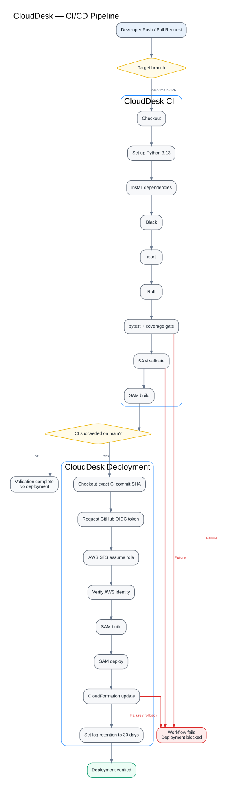
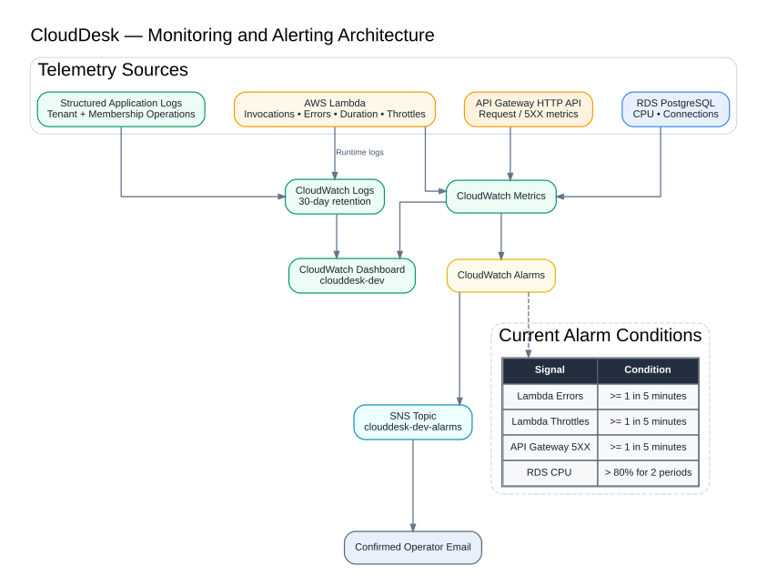
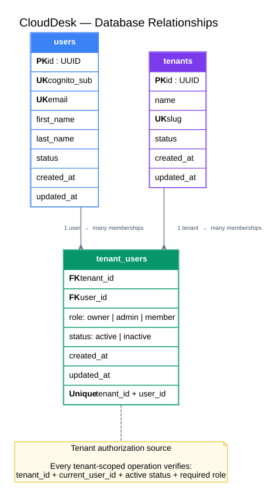

# CloudDesk Professional Diagrams

This directory contains the final Phase 5 architecture diagrams for CloudDesk.

Each diagram is supplied in:

- **SVG** — recommended for GitHub and documentation because it scales cleanly.
- **PNG** — useful for LinkedIn, portfolio pages, and image previews.
- **DOT** — editable Graphviz source.

## Files

### 01-solution-architecture

Complete AWS application architecture and service interactions.


- [01-solution-architecture.svg](01-solution-architecture.svg)


### 02-deployment-architecture

SAM, CloudFormation, GitHub Actions, OIDC, and existing-resource inputs.


- [02-deployment-architecture.svg](02-deployment-architecture.svg)


### 03-authentication-flow

Cognito signup, Post Confirmation provisioning, JWT validation, and user resolution.



- [03-authentication-flow.svg](03-authentication-flow.svg)

### 04-authorization-rbac-flow

Membership validation and Owner/Admin/Member authorization decisions.



- [04-authorization-rbac-flow.svg](04-authorization-rbac-flow.svg)


### 05-tenant-isolation

Shared database isolation using tenant and current-user membership checks.



- [05-tenant-isolation.svg](05-tenant-isolation.svg)


### 06-request-lifecycle

End-to-end lifecycle for a protected API request.


- [06-request-lifecycle.svg](06-request-lifecycle.svg)


### 07-ci-cd-pipeline

Continuous integration, deployment gating, OIDC, and post-deployment retention.



- [07-ci-cd-pipeline.svg](07-ci-cd-pipeline.svg)


### 08-monitoring-alerting

CloudWatch logs, metrics, dashboard, alarms, SNS, and current thresholds.



- [08-monitoring-alerting.svg](08-monitoring-alerting.svg)


### 09-database-relationships

Users, tenants, and tenant_users relational model.



- [09-database-relationships.svg](09-database-relationships.svg)


## Recommended README Embeds

```markdown


```

## Regenerating a Diagram

```bash
dot -Tsvg diagram.dot -o diagram.svg
dot -Tpng -Gdpi=180 diagram.dot -o diagram.png
```
