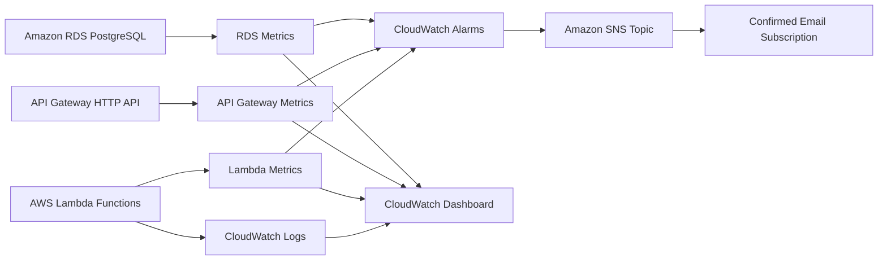
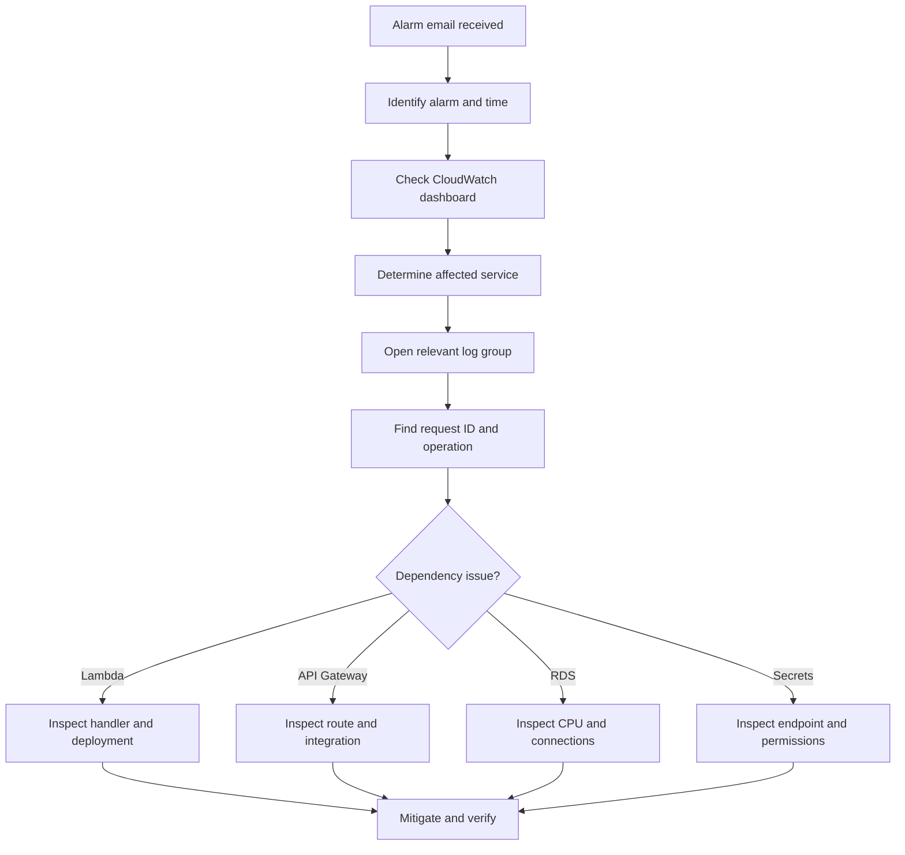

# CloudDesk Monitoring and Observability Guide

> Operational visibility, logging, metrics, alarms, notifications, dashboards, and incident investigation for the CloudDesk multi-tenant SaaS backend.

---

## Document Status

| Field | Value |
|---|---|
| Project | CloudDesk Multi-Tenant SaaS Backend |
| Environment | `dev` |
| AWS Region | `us-east-1` |
| Dashboard | `clouddesk-dev` |
| Alarm topic | `clouddesk-dev-alarms` |
| Log retention | 30 days |
| Monitoring platform | Amazon CloudWatch |
| Notification platform | Amazon SNS |

---

## 1. Observability Objectives

CloudDesk observability must help an engineer answer:

- Is the API receiving traffic?
- Are Lambda functions failing?
- Are functions being throttled?
- Are API Gateway server errors increasing?
- Is PostgreSQL under CPU or connection pressure?
- Which tenant operation failed?
- Which request ID should be investigated?
- Did an alarm notify the operator?
- Are logs retained long enough for troubleshooting?
- Is sensitive information excluded from logs?

---

## 2. Observability Architecture



---

## 3. Monitoring Scope

Current monitoring covers:

- Lambda invocations;
- Lambda errors;
- Lambda throttles;
- Lambda duration;
- API Gateway 5XX errors;
- RDS CPU utilization;
- RDS database connections;
- structured application operation logs;
- SNS alarm notifications;
- 30-day Lambda log retention.

Current monitoring does not yet include:

- formal SLOs;
- custom business metrics;
- distributed tracing;
- audit-event storage;
- latency alarms;
- RDS storage alarms;
- synthetic tests;
- security-event analytics.

---

## 4. Structured Logging

CloudDesk uses:

```text
backend/layers/shared/python/shared/observability.py
```

The helper adds consistent context to application logs.

### Captured context

Where available, logs may include:

- AWS Lambda request ID;
- API Gateway request ID;
- function name;
- route key;
- HTTP method;
- request path;
- tenant ID;
- target user ID;
- current CloudDesk user ID;
- operation name;
- outcome;
- HTTP status code.

### Instrumented workflows

Current structured logging covers:

- tenant creation;
- member addition;
- member-role update;
- member removal.

Other functions still rely primarily on standard Lambda execution logs.

---

## 5. Logging Events

A high-value business operation should emit:

```text
operation_started
operation_succeeded
operation_failed
```

Example conceptual log:

```json
{
  "level": "INFO",
  "operation": "create_tenant",
  "outcome": "success",
  "tenant_id": "b763fbb4-8fe3-4198-a69b-990a1e35b92c",
  "current_user_id": "2e347506-254a-4d31-b4d0-74a3a24d7396",
  "aws_request_id": "example-request-id",
  "http_status": 201
}
```

The exact serialized fields depend on the helper implementation.

---

## 6. Sensitive Data Exclusions

Logs must not contain:

- passwords;
- database credentials;
- secret values;
- access tokens;
- authorization headers;
- full Cognito claims;
- complete connection strings;
- private keys.

Tenant IDs and application user IDs are operational identifiers, but log access must still be restricted.

---

## 7. Log Levels

Recommended usage:

| Level | Use |
|---|---|
| `INFO` | Successful business operations and normal lifecycle events |
| `WARNING` | Rejected or unusual but handled conditions |
| `ERROR` | Failed operation requiring investigation |
| `EXCEPTION` | Unexpected failure with stack trace |

Avoid using `ERROR` for expected authorization denials unless the volume or behavior is operationally suspicious.

---

## 8. Request Correlation

CloudDesk records AWS and API Gateway request IDs where available.

These identifiers help correlate:

```text
Client request
    ↓
API Gateway request
    ↓
Lambda invocation
    ↓
CloudWatch log events
```

The response helper supports:

```http
X-Request-Id
```

Current limitation:

- not every handler returns the request ID to the client.

Future hardening should propagate one request identifier consistently through all handlers and responses.

---

## 9. CloudWatch Log Groups

Lambda creates log groups using:

```text
/aws/lambda/<function-name>
```

CloudDesk log groups typically use a prefix similar to:

```text
/aws/lambda/clouddesk-dev-
```

List them in Git Bash:

```bash
MSYS_NO_PATHCONV=1 aws logs describe-log-groups \
  --log-group-name-prefix "/aws/lambda/clouddesk-dev-" \
  --region us-east-1 \
  --output table
```

`MSYS_NO_PATHCONV=1` prevents Git Bash from converting `/aws/lambda/...` into a Windows path.

---

## 10. Log Retention

CloudDesk uses:

```text
30 days
```

for Lambda log retention.

### Why retention is applied after deployment

Explicit CloudFormation log-group resources caused deployment failures when Lambda had already created some log groups.

The deployment workflow therefore:

1. deploys the SAM stack;
2. discovers existing CloudDesk Lambda log groups;
3. applies a 30-day retention policy.

### Limitation

A function that has never been invoked may not yet have a log group.

For a new function:

1. invoke it once;
2. rerun retention reconciliation;
3. verify retention.

---

## 11. Log Retention Verification

```bash
MSYS_NO_PATHCONV=1 aws logs describe-log-groups \
  --log-group-name-prefix "/aws/lambda/clouddesk-dev-" \
  --region us-east-1 \
  --query "logGroups[].{Name:logGroupName,Retention:retentionInDays}" \
  --output table
```

Expected:

```text
Retention = 30
```

A blank retention value means logs are retained indefinitely and the policy must be applied.

---

## 12. Current CloudWatch Alarms

| Alarm category | Condition |
|---|---|
| Lambda errors | At least one error in a five-minute period |
| Lambda throttles | At least one throttle in a five-minute period |
| API Gateway 5XX | At least one server error in a five-minute period |
| RDS high CPU | Average CPU above 80% for two evaluation periods |

The exact generated alarm names are defined by the SAM template.

---

## 13. Lambda Error Alarm

### Purpose

Detects unhandled Lambda failures.

### Typical causes

- application exception;
- database connection failure;
- missing secret;
- timeout;
- invalid runtime dependency;
- unexpected handler bug.

### Investigation

1. identify the alarm time;
2. identify the affected function;
3. open the function's log group;
4. search for `ERROR`, `Exception`, or the request ID;
5. inspect recent deployment changes;
6. verify RDS and Secrets Manager connectivity.

---

## 14. Lambda Throttle Alarm

### Purpose

Detects requests rejected because Lambda concurrency is unavailable.

### Typical causes

- account concurrency pressure;
- reserved-concurrency exhaustion;
- sudden request spike;
- another workload consuming account concurrency.

### Investigation

- inspect `Throttles`;
- inspect `ConcurrentExecutions`;
- inspect request volume;
- check account and function concurrency configuration;
- review whether the database can support higher concurrency before increasing limits.

Increasing Lambda concurrency without reviewing RDS connection capacity may move the failure to PostgreSQL.

---

## 15. API Gateway 5XX Alarm

### Purpose

Detects server-side API failures.

### Typical causes

- Lambda invocation failure;
- malformed integration response;
- timeout;
- unhandled dependency error;
- deployment misconfiguration.

### Investigation

- compare API 5XX timestamps with Lambda error metrics;
- inspect affected routes;
- inspect Lambda logs;
- verify integration configuration;
- inspect recent deployments.

A 4XX response is usually a client, authentication, validation, or authorization outcome and is not covered by the current 5XX alarm.

---

## 16. RDS CPU Alarm

### Current threshold

```text
Average CPU > 80%
Two evaluation periods
Five minutes per period
```

### Purpose

Detects sustained database CPU pressure.

### Typical causes

- expensive queries;
- high Lambda concurrency;
- missing indexes;
- large list operations;
- connection storm;
- maintenance activity.

### Investigation

- inspect CPU history;
- inspect database connections;
- inspect Lambda invocation volume;
- identify high-frequency routes;
- inspect slow queries where available;
- review recent application changes.

The current alarm does not cover all database failure modes.

---

## 17. Amazon SNS Notifications

Alarm actions publish to:

```text
clouddesk-dev-alarms
```

The SNS email subscription has been confirmed.

### Verification

```bash
aws sns list-topics \
  --region us-east-1
```

```bash
aws sns list-subscriptions-by-topic \
  --topic-arn "<topic-arn>" \
  --region us-east-1
```

The subscription should not show:

```text
PendingConfirmation
```

---

## 18. Alarm Verification

List CloudDesk alarms:

```bash
aws cloudwatch describe-alarms \
  --alarm-name-prefix "clouddesk" \
  --region us-east-1 \
  --output table
```

Check:

- alarm name;
- state;
- metric;
- threshold;
- evaluation periods;
- SNS action.

---

## 19. CloudWatch Dashboard

Current dashboard:

```text
clouddesk-dev
```

### Widgets

The dashboard displays:

- Lambda invocations;
- Lambda errors;
- Lambda duration;
- API Gateway 5XX errors;
- RDS CPU utilization;
- RDS database connections.

### Purpose

The dashboard provides a single operational view for:

- traffic;
- function health;
- API health;
- database pressure.

It is not a complete incident-management system.

---

## 20. Dashboard Verification

```bash
aws cloudwatch list-dashboards \
  --dashboard-name-prefix "clouddesk" \
  --region us-east-1
```

Retrieve the dashboard body:

```bash
aws cloudwatch get-dashboard \
  --dashboard-name "clouddesk-dev" \
  --region us-east-1
```

---

## 21. Operational Investigation Workflow



---

## 22. Lambda Log Investigation

Tail a function's logs:

```bash
sam logs \
  -n <LogicalFunctionName> \
  --stack-name clouddesk-backend \
  --region us-east-1 \
  --tail
```

Or use AWS CLI:

```bash
MSYS_NO_PATHCONV=1 aws logs tail \
  "/aws/lambda/<function-name>" \
  --region us-east-1 \
  --since 30m \
  --follow
```

Search for errors:

```bash
MSYS_NO_PATHCONV=1 aws logs filter-log-events \
  --log-group-name "/aws/lambda/<function-name>" \
  --filter-pattern "ERROR" \
  --region us-east-1
```

---

## 23. Useful Operational Questions

### API unavailable

Check:

- `/health`;
- API Gateway 5XX;
- Lambda errors;
- latest deployment status.

### Database operations failing

Check:

- `/database-test`;
- Secrets Manager permissions;
- interface endpoint state;
- Lambda VPC configuration;
- RDS availability;
- RDS CPU and connections.

### User authenticated but `/me` fails

Check:

- Cognito Post Confirmation logs;
- user record in PostgreSQL;
- Cognito subject mapping;
- user status.

### Tenant operation denied

Check:

- current application user;
- tenant ID;
- membership record;
- membership status;
- role;
- authorization log context.

---

## 24. Monitoring Deployment

Monitoring resources are defined in:

```text
backend/template.yaml
```

The SAM stack manages:

- SNS topic;
- email subscription;
- CloudWatch alarms;
- CloudWatch dashboard.

Log retention is applied in:

```text
.github/workflows/deploy.yml
```

after successful SAM deployment.

---

## 25. Monitoring Security

Monitoring data may reveal:

- internal function names;
- tenant IDs;
- user IDs;
- error patterns;
- infrastructure behavior.

CloudWatch and SNS access should follow least privilege.

Do not expose dashboard screenshots containing:

- AWS account IDs;
- email addresses;
- private endpoints;
- secret ARNs;
- sensitive log values.

---

## 26. Current Monitoring Gaps

Not yet implemented:

- API latency alarm;
- API 4XX anomaly alarm;
- RDS free-storage alarm;
- RDS low-memory alarm;
- RDS connection threshold alarm;
- custom business metrics;
- authentication-failure metrics;
- authorization-denial metrics;
- tenant-operation volume metrics;
- distributed tracing;
- synthetic API checks;
- formal SLOs;
- incident runbooks;
- audit-event storage.

---

## 27. Recommended Future Alarms

Introduce only when justified.

### API

- latency percentile;
- sustained 4XX increase;
- request-count anomaly;
- integration latency.

### Lambda

- duration near timeout;
- concurrent-execution pressure;
- iterator age if event sources are added;
- cold-start custom metric only if measured need exists.

### RDS

- free storage;
- freeable memory;
- database connections;
- read and write latency;
- failover event monitoring.

### Security

- repeated authorization failures;
- unusual member-management activity;
- unexpected deployment-role use.

---

## 28. Service-Level Indicators

Future production indicators may include:

- successful request rate;
- API latency;
- Lambda error rate;
- tenant mutation success rate;
- database connection failure rate;
- authentication success rate.

Example future objective:

```text
99.9% successful protected API requests over 30 days
```

No formal SLO is currently implemented.

---

## 29. Tracing Decision

AWS X-Ray is not currently enabled.

Reason:

- logs, metrics, alarms, and dashboard currently satisfy the project milestone;
- distributed tracing would add cost and operational complexity;
- there is not yet a demonstrated tracing problem.

Enable tracing when:

- requests span more services;
- latency diagnosis becomes difficult;
- asynchronous workflows are introduced;
- correlation through logs is insufficient.

---

## 30. External Monitoring Decision

Prometheus and Grafana were not added.

Reason:

- CloudWatch already exposes the required AWS service metrics;
- the workload is AWS-native;
- an additional monitoring stack would add hosting and maintenance overhead;
- no monitoring requirement is currently unmet.

This decision should be revisited if CloudDesk becomes multi-cloud, container-based, or requires advanced custom dashboards.

---

## 31. Monitoring Checklist

After deployment:

- [ ] Dashboard exists
- [ ] Lambda alarm resources exist
- [ ] API 5XX alarm exists
- [ ] RDS CPU alarm exists
- [ ] SNS topic exists
- [ ] Email subscription is confirmed
- [ ] Alarm actions reference SNS
- [ ] Lambda log groups exist
- [ ] Retention is 30 days
- [ ] Structured logs appear for tenant mutations
- [ ] Logs contain no secrets
- [ ] Dashboard metrics populate after traffic

---

## 32. Monitoring Summary

CloudDesk currently provides:

- structured logs for critical tenant operations;
- AWS and API Gateway request context;
- 30-day Lambda log retention;
- Lambda error alarm;
- Lambda throttle alarm;
- API Gateway 5XX alarm;
- RDS CPU alarm;
- confirmed SNS email notification;
- operational CloudWatch dashboard;
- deployment-time monitoring configuration.

The current monitoring approach is intentionally simple and AWS-native.

It provides enough visibility for the development environment while leaving room for production additions driven by measured operational needs.
