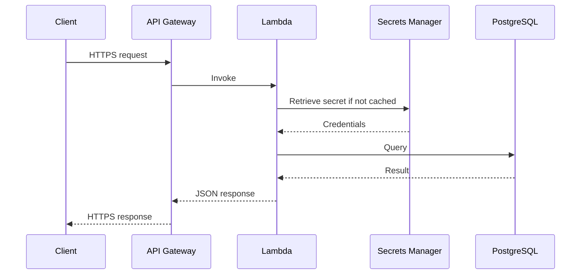
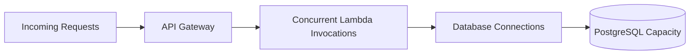

# CloudDesk Performance Guide

> Performance characteristics, scaling boundaries, risks, measurements, and future optimization strategy for the CloudDesk multi-tenant SaaS backend.

---

## Document Status

| Field | Value |
|---|---|
| Project | CloudDesk Multi-Tenant SaaS Backend |
| Environment | `dev` |
| API | API Gateway HTTP API |
| Compute | AWS Lambda |
| Database | Amazon RDS for PostgreSQL |
| Current state | Architecturally optimized, not formally load-tested |

CloudDesk has not completed formal performance or load testing.

This document distinguishes architectural expectations from measured results.

---

## 1. Performance Objectives

CloudDesk should:

- respond quickly for normal tenant operations;
- scale API and compute automatically;
- avoid unnecessary AWS service calls;
- reuse resources inside warm Lambda environments;
- keep database queries targeted;
- prevent unbounded list operations;
- identify PostgreSQL as the primary scaling boundary;
- introduce optimization only after measurement.

---

## 2. Request Path



Potential latency components:

- network latency;
- API Gateway processing;
- Lambda cold start;
- secret retrieval;
- database connection;
- SQL execution;
- serialization;
- response transfer.

---

## 3. API Gateway Performance

HTTP API was selected for a lightweight serverless API layer.

Benefits:

- lower overhead than a more feature-heavy API layer;
- native Lambda integration;
- JWT authorization;
- automatic scaling.

Potential limitations:

- downstream Lambda or database failures dominate request latency;
- account and API quotas still apply;
- large payloads increase transfer and serialization time.

---

## 4. Lambda Performance

Lambda performance depends on:

- memory allocation;
- CPU allocation;
- cold starts;
- package size;
- VPC initialization;
- runtime initialization;
- dependency loading;
- database connection time.

### Current Measures

- focused handlers;
- shared code layer;
- Python 3.13;
- stateless execution;
- no unnecessary frameworks;
- secret caching;
- connection reuse.

### Cold Starts

Cold starts may be affected by:

- VPC networking;
- Psycopg imports;
- shared layer size;
- function package size.

No provisioned concurrency is enabled because the current workload does not justify the continuous cost.

---

## 5. Lambda Memory

Lambda CPU increases with memory allocation.

The correct memory setting should be selected by measurement rather than guesswork.

Future tuning process:

1. collect duration data;
2. test multiple memory sizes;
3. compare latency and cost;
4. select the best balance.

Do not assume the lowest memory always produces the lowest cost.

---

## 6. Shared Layer Performance

The shared layer reduces duplicated packaging but can increase initialization size.

Current layer includes:

- application helpers;
- Psycopg;
- timezone data.

Optimization principles:

- keep only required dependencies;
- remove unused packages;
- avoid large frameworks;
- monitor cold-start duration.

---

## 7. Secret Retrieval Performance

Secrets Manager access adds latency when the secret is not cached.

### Current Optimization

The secret is cached in the warm Lambda execution environment.

Expected behavior:

```text
Cold environment
  → Retrieve secret
  → Cache secret

Warm environment
  → Reuse cached secret
```

Trade-off:

- lower latency and fewer API calls;
- rotated credentials may remain cached temporarily.

---

## 8. Database Connection Performance

Opening a PostgreSQL connection is expensive compared with reusing one.

### Current Optimization

The database helper may reuse a connection during a warm invocation environment.

### Risks

- stale connection;
- closed connection;
- connection exhaustion under concurrency;
- failover behavior.

Tests verify connection caching behavior.

---

## 9. Database as the Primary Scaling Boundary



API Gateway and Lambda can scale faster than PostgreSQL.

This can create:

- connection exhaustion;
- high CPU;
- increased latency;
- timeouts;
- failed transactions.

Scaling Lambda without reviewing RDS can worsen reliability.

---

## 10. Query Performance

CloudDesk benefits from:

- primary keys;
- foreign keys;
- unique constraints;
- indexed user lookup;
- indexed tenant lookup;
- indexed membership lookup;
- targeted SQL.

Critical query patterns:

- find user by Cognito subject;
- find user by email;
- list user's active tenants;
- find active membership by tenant and user;
- list active tenant members;
- detect duplicate slug;
- detect existing membership.

---

## 11. Tenant Isolation and Query Performance

Tenant isolation checks add database work, but they are required security controls.

A tenant request may require:

1. current-user lookup;
2. membership lookup;
3. role validation;
4. business query.

Optimization must not bypass authorization.

Possible future optimization:

- combine safe lookups;
- reduce duplicate queries;
- cache only where correctness is preserved;
- use efficient joins.

---

## 12. Transaction Performance

Tenant creation performs:

- tenant insert;
- owner membership insert;
- commit.

This is intentionally transactional.

Transactions add small overhead but prevent inconsistent state.

Correctness is more important than eliminating the transaction.

---

## 13. Serialization Performance

Database results may contain:

- UUID;
- datetime;
- date;
- decimal.

The shared serialization helper converts them into JSON-compatible values.

This avoids repeated handler logic.

For current payload sizes, serialization is not expected to be a primary bottleneck.

---

## 14. Response Size

Large payloads increase:

- serialization time;
- API Gateway transfer;
- client parsing;
- CloudWatch logging risk.

Current list endpoints do not yet use pagination.

This is acceptable for small development data but must be addressed before large tenants exist.

---

## 15. Pagination

Future list endpoints should support:

- page size;
- cursor or offset;
- maximum page size;
- stable ordering.

Preferred future approach:

- cursor-based pagination for large datasets;
- explicit maximum page size;
- indexed ordering column.

---

## 16. Concurrency

Lambda concurrency can increase quickly.

Potential constraints:

- account concurrency;
- function concurrency;
- database connections;
- RDS CPU;
- RDS memory;
- VPC networking.

Future controls:

- reserved concurrency;
- RDS Proxy;
- API throttling;
- queue-based smoothing for asynchronous workloads.

---

## 17. RDS Proxy Decision

RDS Proxy is not currently included.

### Add It When

- database connection count approaches capacity;
- connection storms appear;
- concurrency grows significantly;
- failover connection handling needs improvement.

### Do Not Add It Because

- it is popular;
- it appears in a generic serverless checklist.

---

## 18. RDS Scaling Options

Potential future options:

- larger instance class;
- storage autoscaling;
- Multi-AZ;
- read replica;
- Aurora PostgreSQL;
- RDS Proxy;
- query optimization.

Choose based on metrics.

---

## 19. Read Scaling

Current workload is not demonstrated to be read-heavy.

A read replica would add:

- cost;
- replication lag;
- routing complexity.

Introduce only when:

- read traffic dominates;
- the primary is constrained;
- eventual consistency is acceptable.

---

## 20. Write Scaling

Tenant and membership operations require strong consistency.

Write performance depends on:

- transaction duration;
- indexes;
- lock contention;
- database instance capacity.

Do not add unnecessary indexes because every index also increases write cost.

---

## 21. Monitoring Performance

Current dashboard includes:

- Lambda invocations;
- Lambda errors;
- Lambda duration;
- API 5XX;
- RDS CPU;
- RDS connections.

Current alarm:

```text
RDS CPU > 80% for two five-minute periods
```

Future performance alarms:

- Lambda duration near timeout;
- API latency;
- RDS connection threshold;
- freeable memory;
- storage;
- query latency.

---

## 22. Performance Test Plan

### Phase 1: Baseline

Measure:

- `/health`;
- `/me`;
- `GET /tenants`;
- `GET /tenants/{tenantId}`;
- membership list.

### Phase 2: Mutations

Measure:

- create tenant;
- add member;
- update role;
- remove member.

### Phase 3: Concurrency

Increase concurrent clients while tracking:

- p50 latency;
- p95 latency;
- p99 latency;
- error rate;
- Lambda concurrency;
- database connections;
- RDS CPU.

### Phase 4: Failure Boundary

Identify when:

- throttles begin;
- connection failures begin;
- latency becomes unacceptable;
- RDS CPU remains high.

---

## 23. Load Testing Safety

Do not load-test the active development database without preparation.

Before testing:

- create a dedicated environment;
- define limits;
- configure budgets;
- prepare cleanup;
- avoid real user data;
- monitor alarms;
- define a stop condition.

---

## 24. Performance Metrics

Recommended metrics:

### API

- request count;
- 4XX;
- 5XX;
- integration latency;
- total latency.

### Lambda

- invocation count;
- duration;
- errors;
- throttles;
- concurrent executions;
- init duration where available.

### RDS

- CPU;
- database connections;
- freeable memory;
- storage;
- read latency;
- write latency;
- IOPS.

---

## 25. Performance Logging

Structured logs should include operation duration in the future.

Possible fields:

```json
{
  "operation": "create_tenant",
  "duration_ms": 142,
  "outcome": "success"
}
```

Do not log complete request bodies to measure performance.

---

## 26. Caching Strategy

Current caching:

- database secret;
- database connection reuse.

Not currently used:

- API response cache;
- application data cache;
- Redis;
- ElastiCache.

Reason:

- current data requires strong consistency;
- no measured caching need;
- caching adds invalidation complexity.

---

## 27. API Response Caching

CloudDesk returns:

```text
Cache-Control: no-store
```

This protects authenticated user and tenant data.

Response caching should not be introduced without a route-specific security and consistency review.

---

## 28. Performance and Security Trade-Off

Authorization queries add latency.

They must not be removed.

Valid optimization:

- efficient indexed membership query.

Invalid optimization:

- trust `tenantId` without checking membership.

---

## 29. Performance and Cost Trade-Off

Possible faster options:

- higher Lambda memory;
- larger RDS instance;
- provisioned concurrency;
- RDS Proxy;
- read replicas.

Each increases cost.

Use metrics to justify each change.

---

## 30. Current Performance Limitations

- no formal load test;
- no p95 or p99 baseline;
- no API latency alarm;
- no pagination;
- no RDS Proxy;
- no reserved concurrency strategy;
- no query profiling;
- no slow-query dashboard;
- no distributed tracing;
- no measured cold-start baseline.

---

## 31. Future Improvements

- add pagination;
- measure cold starts;
- add duration context to structured logs;
- run Lambda Power Tuning;
- profile SQL;
- add RDS connection alarm;
- test concurrency;
- introduce RDS Proxy only when needed;
- define route latency objectives;
- create dedicated load-test environment.

---

## 32. Performance Checklist

- [ ] Lambda duration monitored
- [ ] RDS CPU monitored
- [ ] RDS connections monitored
- [ ] Secrets cached
- [ ] Connections reused safely
- [ ] Queries use indexes
- [ ] Tenant checks remain enforced
- [ ] Payloads remain small
- [ ] Pagination planned
- [ ] No unnecessary cache
- [ ] No unmeasured scaling service added
- [ ] Load testing uses a dedicated environment

---

## 33. Performance Summary

CloudDesk currently uses a sensible performance design:

- lightweight HTTP API;
- stateless Lambda;
- focused handlers;
- shared code;
- secret caching;
- connection reuse;
- indexed PostgreSQL queries;
- transactional correctness;
- CloudWatch metrics.

The main scaling constraint is PostgreSQL connection and compute capacity.

The correct next step is measurement, not additional infrastructure.
