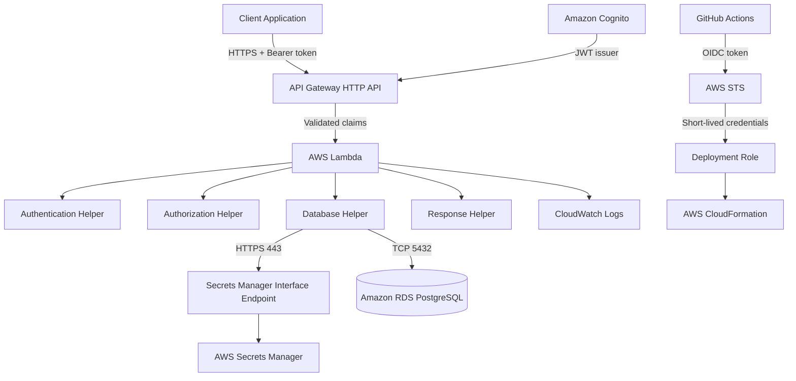
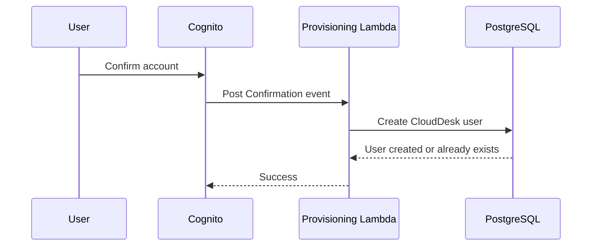
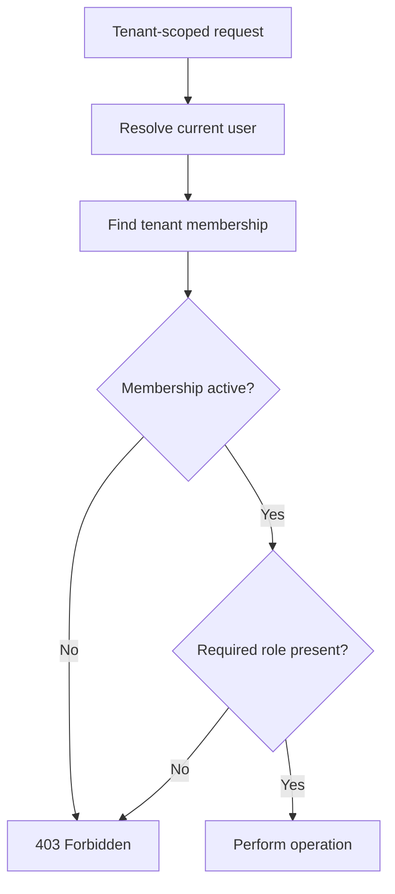
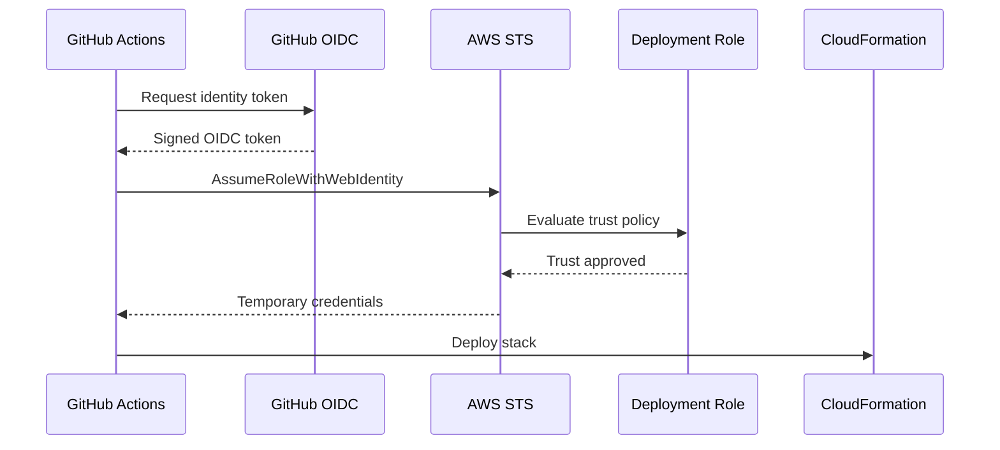

# CloudDesk Security Guide

> Security architecture, controls, trust boundaries, risks, and production hardening requirements for the CloudDesk multi-tenant SaaS backend.

---

## Document Status

| Field | Value |
|---|---|
| Project | CloudDesk Multi-Tenant SaaS Backend |
| Environment documented | `dev` |
| AWS Region | `us-east-1` |
| Authentication | Amazon Cognito |
| Authorization | Tenant-level RBAC |
| Database | Amazon RDS for PostgreSQL |
| Secret storage | AWS Secrets Manager |
| Deployment authentication | GitHub OIDC and AWS STS |
| Current posture | Production-inspired development environment |

CloudDesk applies layered security controls, but the current environment should not be described as fully production-ready until the remaining hardening items in this document are completed.

---

## 1. Security Objectives

CloudDesk must:

- authenticate users securely;
- prevent unauthenticated API access;
- prevent cross-tenant data access;
- enforce tenant roles consistently;
- protect the tenant owner from accidental removal or demotion;
- keep database credentials out of source control;
- keep database traffic private;
- avoid long-lived AWS credentials in GitHub;
- minimize sensitive information in responses and logs;
- isolate application runtime permissions from deployment permissions;
- provide evidence for security-relevant events;
- support future production hardening without redesigning the application.

---

## 2. Security Architecture



---

## 3. Trust Boundaries

| Boundary | Risk | Control |
|---|---|---|
| Client to API Gateway | Unauthenticated or forged requests | HTTPS and Cognito JWT authorizer |
| API Gateway to Lambda | Untrusted identity data | API Gateway forwards validated claims |
| Lambda to PostgreSQL | Unauthorized database access | VPC, security groups, database credentials |
| Lambda to Secrets Manager | Secret theft | IAM scope and interface endpoint |
| GitHub to AWS | Compromised deployment credentials | OIDC, STS, branch-restricted trust |
| Application logs | Sensitive-data exposure | Structured logging and explicit exclusions |
| Tenant route to tenant data | Cross-tenant access | Active membership and role validation |

---

## 4. Identity Security

Amazon Cognito manages:

- signup;
- password handling;
- account confirmation;
- authentication;
- access-token issuance;
- identity claims.

CloudDesk does not store passwords.

Cognito identities are mapped to CloudDesk application users through the Cognito subject claim.

```text
Cognito subject
      ↓
CloudDesk user
      ↓
Tenant memberships
```

This separation prevents the identity provider from becoming the application authorization database.

---

## 5. JWT Validation

Protected routes use the API Gateway JWT authorizer.

API Gateway validates:

- token signature;
- issuer;
- audience;
- expiration;
- token structure.

Lambda reads the trusted claims supplied by API Gateway.

Lambda does not repeat JWT signature verification.

### Security benefit

This prevents each Lambda handler from implementing its own token-validation logic and reduces the risk of inconsistent validation.

### Required client header

```http
Authorization: Bearer <access-token>
```

Tokens must never be:

- committed to Git;
- included in public screenshots;
- written to CloudWatch logs;
- copied into documentation;
- shared in public channels.

---

## 6. Application User Provisioning

After account confirmation, Cognito invokes the Post Confirmation Lambda.



This ensures that authenticated identities have a corresponding application-user record.

A protected request is rejected when:

- the application user does not exist;
- the application user is inactive;
- trusted claims are unavailable.

---

## 7. Authorization Model

CloudDesk uses tenant-level role-based access control.

Roles:

```text
owner
admin
member
```

Reusable authorization helpers:

```python
require_membership()
require_admin()
require_owner()
```

### Permission matrix

| Operation | Member | Admin | Owner |
|---|:---:|:---:|:---:|
| Retrieve tenant | Yes | Yes | Yes |
| List tenant members | Yes | Yes | Yes |
| Add member | No | Yes | Yes |
| Update member role | No | No | Yes |
| Remove member | No | No | Yes |

### Owner safeguards

- `owner` cannot be assigned through the standard member endpoint;
- the current owner cannot be demoted;
- the current owner cannot be removed;
- self-removal is rejected.

These controls prevent accidental tenant orphaning.

---

## 8. Tenant Isolation

A tenant UUID is not an authorization mechanism.

Every tenant-scoped request must verify:

1. the authenticated CloudDesk user;
2. the requested tenant;
3. active membership for that user and tenant;
4. the required tenant role.



Cross-tenant protection depends on consistently applying this pattern to every tenant-scoped handler and query.

---

## 9. Database Security

CloudDesk stores application data in PostgreSQL.

Security controls include:

- private VPC connectivity;
- RDS security-group ingress from the Lambda security group;
- no `0.0.0.0/0` database rule;
- Secrets Manager credentials;
- transactions for multi-write operations;
- foreign keys and uniqueness constraints;
- soft deletion for memberships.

### RDS ingress rule

```text
Protocol: TCP
Port: 5432
Source: Lambda security group
```

The application must not expose the database endpoint or credentials in API responses.

---

## 10. Secret Management

Database credentials are stored in AWS Secrets Manager.

The application retrieves them at runtime through:

```text
Lambda
  ↓ HTTPS 443
Secrets Manager Interface Endpoint
  ↓
AWS Secrets Manager
```

Credentials must not be stored in:

- application source;
- `template.yaml`;
- GitHub workflows;
- `README.md`;
- screenshots;
- CloudWatch logs.

### Secret caching

The shared secret helper caches the secret inside a warm Lambda execution environment.

Benefits:

- fewer Secrets Manager calls;
- lower latency;
- lower request cost.

Risk:

- rotated credentials may remain cached until a new execution environment is created.

A future rotation design should define cache invalidation behavior.

---

## 11. Network Security

Database-connected Lambda functions use configured subnets and a dedicated Lambda security group.

### Lambda security group

Provides outbound connectivity to:

- PostgreSQL on `5432`;
- the Secrets Manager endpoint on `443`.

### Endpoint security group

```text
Protocol: TCP
Port: 443
Source: Lambda security group
```

### Security benefit

The application does not require a NAT Gateway solely to retrieve Secrets Manager values.

### Current limitation

The current development environment reuses existing VPC resources. Production should use a clearly separated network design and dedicated environment boundaries.

---

## 12. IAM Security

### Runtime permissions

Database-connected Lambda functions need permission to:

- write CloudWatch logs;
- manage VPC network interfaces;
- retrieve the configured database secret.

Runtime permissions should remain limited to the resources required by the function.

### Deployment permissions

GitHub Actions uses a separate deployment role.

The role can manage the resources required by the SAM stack.

Current reality:

- runtime permissions are comparatively narrow;
- the deployment policy is broader than the final desired production policy.

The deployment role should be reduced after resource names and required actions stabilize.

### Separation of duties

The deployment role must not be used as a Lambda execution role.

---

## 13. GitHub OIDC Security

GitHub Actions does not use static AWS access keys.



Trust conditions restrict:

- token audience;
- repository identity;
- immutable repository subject;
- `main` branch.

Required workflow permissions:

```yaml
permissions:
  id-token: write
  contents: read
```

---

## 14. Response Security

The shared response helper adds:

```http
Content-Type: application/json
X-Content-Type-Options: nosniff
X-Frame-Options: DENY
Referrer-Policy: no-referrer
Cache-Control: no-store
```

### Purpose

| Header | Purpose |
|---|---|
| `X-Content-Type-Options` | Prevent MIME-type sniffing |
| `X-Frame-Options` | Prevent framing |
| `Referrer-Policy` | Reduce referrer leakage |
| `Cache-Control` | Prevent storage of authenticated API data |

The helper supports `X-Request-Id`, but not every handler currently returns it.

---

## 15. Logging Security

Structured logs may include:

- AWS request ID;
- API Gateway request ID;
- function name;
- route;
- HTTP method;
- tenant ID;
- target user ID;
- current user ID;
- operation outcome;
- status code.

Logs must not contain:

- passwords;
- database credentials;
- secret values;
- access tokens;
- authorization headers;
- complete Cognito claims;
- full connection strings.

CloudWatch access should be limited to engineers who require operational visibility.

---

## 16. Secure Error Handling

Client responses should not reveal:

- stack traces;
- SQL internals;
- credential values;
- database endpoints;
- IAM details;
- internal network addresses.

Unexpected failures return generic messages such as:

```json
{
  "success": false,
  "message": "Unable to complete the request."
}
```

Detailed diagnostics remain in CloudWatch Logs.

---

## 17. Data Integrity Controls

PostgreSQL provides:

- foreign keys;
- unique constraints;
- role and status constraints;
- transaction boundaries;
- timestamp triggers.

Tenant creation and owner assignment occur in one transaction.

```text
Create tenant
   +
Create owner membership
   =
Single transaction
```

This prevents an ownerless tenant.

---

## 18. Membership Soft Deletion

Membership removal changes:

```text
status = active
```

to:

```text
status = inactive
```

The row remains in PostgreSQL.

Security and operational benefits:

- preserves historical context;
- reduces accidental permanent deletion;
- supports future auditing;
- allows future controlled restoration.

Current limitation:

- no reactivation endpoint exists.

---

## 19. Security-Relevant Monitoring

Current alarms include:

- Lambda errors;
- Lambda throttles;
- API Gateway 5XX responses;
- high RDS CPU.

Alarm actions publish to the CloudDesk SNS topic.

These alarms provide operational warning but are not a complete security monitoring solution.

Future security monitoring may include:

- unusual authentication failures;
- repeated authorization failures;
- member-management anomalies;
- GuardDuty;
- Security Hub;
- AWS Config;
- IAM Access Analyzer;
- audit-event storage.

---

## 20. Threat Scenarios

### Cross-tenant identifier manipulation

Threat:

```text
User changes tenantId in the URL
```

Control:

- active membership lookup;
- role enforcement;
- no authorization based only on the path identifier.

### Stolen GitHub AWS key

Threat:

```text
Long-lived deployment credential is exposed
```

Control:

- no static AWS keys;
- OIDC;
- short-lived STS credentials;
- branch-restricted trust.

### Database credential exposure

Threat:

```text
Credential committed to Git or logged
```

Control:

- Secrets Manager;
- secret ARN references;
- logging exclusions;
- repository review.

### Owner removal

Threat:

```text
Tenant loses its only owner
```

Control:

- owner cannot be demoted;
- owner cannot be removed;
- self-removal rejected.

### Excessive Lambda concurrency

Threat:

```text
Connection exhaustion causes availability loss
```

Control:

- monitoring;
- warm connection reuse;
- future RDS Proxy when demonstrated.

### Public database exposure

Threat:

```text
RDS reachable from the internet
```

Control:

- private connectivity;
- security-group source restriction;
- no broad ingress rule.

---

## 21. Security Testing

The automated suite validates security-sensitive behavior, including:

- missing JWT claims;
- inactive users;
- unprovisioned users;
- inactive memberships;
- insufficient roles;
- owner-only operations;
- owner demotion protection;
- owner removal protection;
- self-removal protection;
- invalid role rejection;
- secret-validation failures;
- transaction rollback.

The current project suite contains:

```text
79 passing tests
```

These tests do not replace penetration testing or cloud integration testing.

---

## 22. Secure Deployment Checklist

Before deployment:

- [ ] Correct AWS account and region verified
- [ ] No secrets in Git
- [ ] No access tokens in documentation
- [ ] Secret ARN passed securely
- [ ] OIDC trust restricted to the repository and `main`
- [ ] Runtime and deployment roles are separate
- [ ] Tests pass
- [ ] SAM validates
- [ ] Change set reviewed
- [ ] RDS ingress is not public

After deployment:

- [ ] Protected route rejects missing token
- [ ] Non-member tenant access returns `403`
- [ ] Owner safeguards work
- [ ] Log output contains no sensitive values
- [ ] SNS subscription is confirmed
- [ ] Alarms exist
- [ ] Log retention is 30 days
- [ ] `/database-test` is appropriately restricted

---

## 23. Current Security Limitations

The current implementation does not yet include:

- separate production AWS account;
- formal threat model;
- WAF;
- route-level throttling policy;
- production custom domain;
- automated dependency scanning;
- automated secret scanning documented in CI;
- penetration testing;
- complete audit-event history;
- formal incident-response runbook;
- complete request-ID propagation;
- production IAM review;
- end-to-end authorization tests against deployed AWS resources.

---

## 24. Production Hardening Roadmap

### Identity and API

- define token lifetimes and refresh strategy;
- add throttling;
- add abuse detection;
- introduce WAF when justified;
- define API versioning.

### IAM

- reduce deployment permissions;
- create separate roles per environment;
- use GitHub protected environments;
- require production approvals.

### Network and data

- verify RDS Multi-AZ;
- test backup and restore;
- separate production VPC resources;
- review endpoint policies;
- define recovery objectives.

### Security operations

- add audit-event storage;
- enable organization-level GuardDuty, Security Hub, and Config where appropriate;
- use IAM Access Analyzer;
- create incident runbooks;
- perform security review and penetration testing.

### CI/CD

- add dependency and secret scanning;
- pin third-party actions;
- review workflow permissions;
- protect `main`;
- require pull-request review.

---

## 25. Security Summary

CloudDesk currently provides:

- managed authentication;
- API Gateway JWT validation;
- application-user mapping;
- tenant-level RBAC;
- active-membership enforcement;
- owner safeguards;
- private database access;
- private secret retrieval;
- Secrets Manager credentials;
- runtime and deployment role separation;
- GitHub OIDC;
- short-lived AWS credentials;
- secure response headers;
- structured logging with sensitive-data exclusions;
- automated tests for critical security behavior.

The strongest control in CloudDesk is the consistent separation of:

```text
Identity
Authorization
Tenant membership
Database access
Deployment access
Operational visibility
```

The main remaining security work is production hardening, not a redesign of the core architecture.
