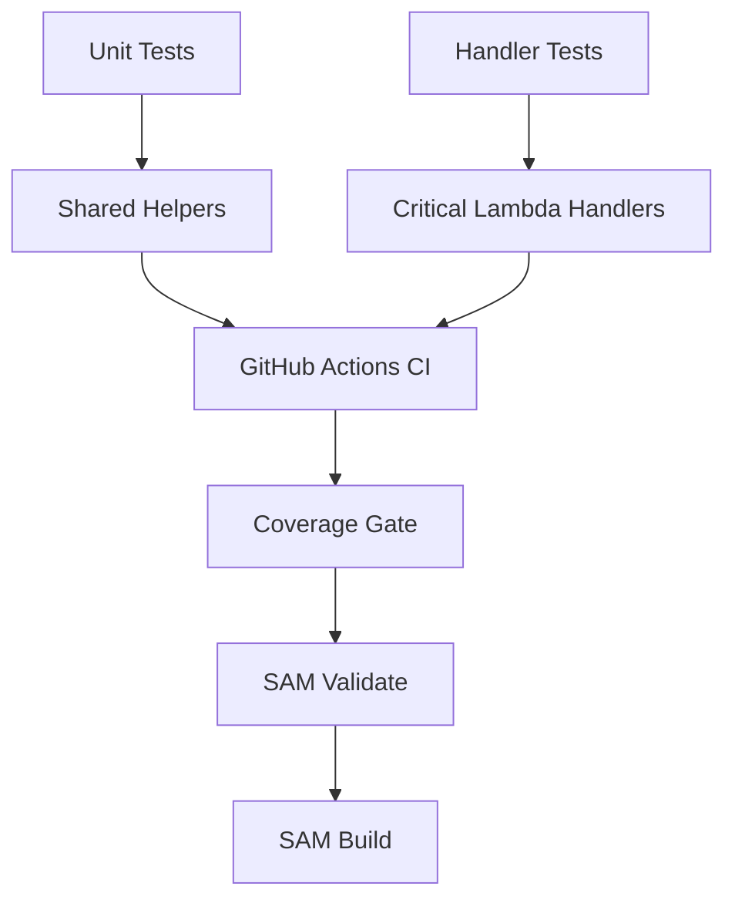
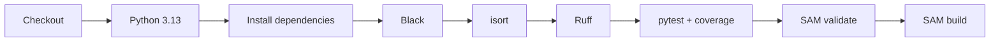

# CloudDesk Testing Guide

> Automated test strategy, local execution, coverage, quality gates, mocking, and future test expansion for the CloudDesk multi-tenant SaaS backend.

---

## Document Status

| Field | Value |
|---|---|
| Project | CloudDesk Multi-Tenant SaaS Backend |
| Runtime | Python 3.13 |
| Test framework | pytest |
| Coverage tool | pytest-cov |
| Formatting | Black |
| Import ordering | isort |
| Linting | Ruff |
| Current result | 79 passing tests |
| CI platform | GitHub Actions |

---

## 1. Testing Objectives

CloudDesk tests must:

- verify authentication behavior;
- verify tenant authorization;
- protect owner-only rules;
- validate tenant isolation behavior;
- test critical database helpers;
- verify transaction commit and rollback;
- validate secret retrieval and caching;
- validate response serialization;
- test critical business handlers;
- prevent deployment when tests fail;
- remain fast enough for pull-request and push workflows.

---

## 2. Test Strategy

CloudDesk uses a layered test strategy.



### Current layers

| Layer | Purpose |
|---|---|
| Unit tests | Validate isolated shared modules and helper behavior |
| Handler tests | Validate critical Lambda business workflows |
| CI validation | Enforce quality before deployment |
| SAM validation and build | Verify infrastructure and packaging |

### Not yet implemented

- deployed integration tests;
- end-to-end Cognito tests;
- live PostgreSQL tests;
- load tests;
- failure-injection tests;
- migration tests.

---

## 3. Test Repository Structure

```text
backend/
├── tests/
│   ├── handlers/
│   ├── unit/
│   ├── __init__.py
│   ├── conftest.py
│   └── fixtures.py
├── requirements-dev.txt
├── pyproject.toml
└── template.yaml
```

The test suite runs from:

```text
backend/
```

---

## 4. Development Dependencies

Development dependencies are defined in:

```text
backend/requirements-dev.txt
```

They include:

- pytest;
- pytest-cov;
- Black;
- isort;
- Ruff;
- boto3;
- Psycopg binary support.

Install:

```bash
cd backend
python -m pip install -r requirements-dev.txt
```

---

## 5. Local Virtual Environment

Create:

```bash
python -m venv .venv
```

Activate in Git Bash:

```bash
source .venv/Scripts/activate
```

Activate in PowerShell:

```powershell
.\.venv\Scripts\Activate.ps1
```

Upgrade pip:

```bash
python -m pip install --upgrade pip
```

Install dependencies:

```bash
python -m pip install -r requirements-dev.txt
```

---

## 6. Running the Test Suite

Run all tests:

```bash
pytest
```

Current expected result:

```text
79 passed
```

Run only unit tests:

```bash
pytest tests/unit
```

Run only handler tests:

```bash
pytest tests/handlers
```

Run one file:

```bash
pytest tests/unit/test_auth.py
```

Run one test:

```bash
pytest tests/unit/test_auth.py::test_name
```

Use verbose output:

```bash
pytest -v
```

Stop after the first failure:

```bash
pytest -x
```

Show local variables on failure:

```bash
pytest -l
```

---

## 7. Coverage

Run with terminal coverage:

```bash
pytest tests/unit tests/handlers \
  --cov=layers/shared/python/shared \
  --cov-report=term-missing
```

Generate HTML coverage:

```bash
pytest tests/unit tests/handlers \
  --cov=layers/shared/python/shared \
  --cov-report=html
```

Open:

```text
backend/htmlcov/index.html
```

The CI workflow enforces a minimum coverage threshold.

Coverage is a quality signal, not proof of correctness.

A test suite can achieve high coverage while missing important business scenarios, so critical authorization and tenant-isolation paths must be tested explicitly.

---

## 8. Current Test Coverage Areas

### Authentication

Tests cover:

- trusted claim extraction;
- missing authentication context;
- Cognito subject lookup;
- CloudDesk user resolution;
- unprovisioned user rejection;
- inactive user rejection.

### Authorization

Tests cover:

- active membership;
- missing membership;
- inactive membership;
- admin authorization;
- owner authorization;
- insufficient-role rejection.

### Response Handling

Tests cover:

- successful responses;
- error responses;
- JSON body structure;
- security headers;
- optional request ID behavior.

### Serialization

Tests cover values such as:

- UUID;
- datetime;
- date;
- decimal;
- nested structures.

### Secrets

Tests cover:

- Secrets Manager retrieval;
- JSON parsing;
- required-key validation;
- caching;
- client failures;
- malformed secret data.

### Database Helpers

Tests cover:

- connection creation;
- connection caching;
- query helpers;
- transactions;
- commit;
- rollback;
- error propagation.

### Critical Handlers

Tests cover:

- create tenant;
- add member;
- update member role;
- remove member.

---

## 9. Critical Business Rules Under Test

### Tenant creation

- authenticated user required;
- tenant name required;
- slug generation;
- duplicate tenant conflict;
- tenant and owner membership created together;
- rollback on failure.

### Add member

- owner or admin required;
- target user must exist;
- role must be `member` or `admin`;
- `owner` cannot be assigned;
- duplicate membership rejected.

### Update role

- owner required;
- target membership required;
- role must be valid;
- owner role cannot be assigned;
- current owner cannot be demoted.

### Remove member

- owner required;
- target membership required;
- owner cannot be removed;
- self-removal rejected;
- membership is soft-deleted.

---

## 10. Test Isolation

Tests use mocks and fixtures to avoid requiring live AWS services or a live PostgreSQL database.

Mocked dependencies include:

- Secrets Manager client;
- PostgreSQL connection;
- database cursor;
- application query helpers;
- API Gateway event data;
- Lambda context;
- authorization helpers where appropriate.

Benefits:

- fast execution;
- deterministic results;
- no AWS cost;
- no dependency on network availability;
- safe execution in CI.

Trade-off:

- mocked tests cannot prove that deployed AWS integrations are correctly configured.

---

## 11. Test Fixtures

Shared fixtures are maintained in:

```text
backend/tests/fixtures.py
```

and:

```text
backend/tests/conftest.py
```

Typical fixture categories include:

- Cognito claims;
- API Gateway events;
- Lambda context;
- application user;
- tenant;
- membership;
- mocked database connection;
- mocked cursor;
- generated UUID values.

Fixtures should remain readable and represent realistic application data.

---

## 12. Handler Test Pattern

A handler test typically:

1. creates an API Gateway event;
2. patches external dependencies;
3. invokes the Lambda handler;
4. asserts HTTP status;
5. parses the JSON response;
6. verifies the response body;
7. verifies database or authorization calls;
8. verifies commit or rollback behavior.

Example pattern:

```python
def test_handler_returns_success(mock_dependency, event, context):
    response = handler(event, context)

    assert response["statusCode"] == 200

    body = json.loads(response["body"])
    assert body["success"] is True
```

---

## 13. Authentication Test Pattern

Authentication tests should verify both positive and negative behavior.

Positive:

```text
Valid claims
  +
Active CloudDesk user
  =
Authenticated user returned
```

Negative:

```text
Missing claims
Invalid subject
User not found
Inactive user
```

Each negative case should assert the expected authentication error.

---

## 14. Authorization Test Pattern

Authorization tests should cover the complete role matrix.

| Scenario | Expected |
|---|---|
| Active member uses member route | Allowed |
| Non-member uses tenant route | Denied |
| Inactive member uses tenant route | Denied |
| Admin uses admin route | Allowed |
| Member uses admin route | Denied |
| Owner uses owner route | Allowed |
| Admin uses owner route | Denied |

This protects against accidental permission broadening.

---

## 15. Transaction Testing

Critical multi-write operations must verify:

- transaction begins;
- all writes succeed before commit;
- commit occurs exactly once;
- failure triggers rollback;
- no partial result is returned.

Tenant creation is the key example:

```text
Insert tenant
Insert owner membership
Commit
```

On failure:

```text
Rollback
No ownerless tenant
```

---

## 16. Secret Caching Tests

The secret helper caches credentials inside the Lambda execution environment.

Tests should verify:

1. the first call invokes Secrets Manager;
2. the returned secret is validated;
3. a later call uses the cache;
4. the client is not called again.

Also test:

- malformed JSON;
- missing required keys;
- Secrets Manager exception.

---

## 17. Database Connection Caching Tests

The database helper may reuse a connection during a warm Lambda invocation.

Tests should verify:

- a new connection is created when none exists;
- a healthy cached connection is reused;
- an invalid or closed connection is replaced;
- connection failures are surfaced safely.

These tests protect performance behavior and database stability.

---

## 18. Response Security Tests

The response helper should be tested for:

```text
Content-Type
X-Content-Type-Options
X-Frame-Options
Referrer-Policy
Cache-Control
```

When a request ID is supplied, test:

```text
X-Request-Id
```

Not every handler currently passes the request ID to the helper, so end-to-end propagation is a future test area.

---

## 19. Code Formatting

Check formatting:

```bash
black --check .
```

Apply formatting:

```bash
black .
```

Black keeps formatting consistent and removes style debates from reviews.

---

## 20. Import Ordering

Check:

```bash
isort --check-only .
```

Apply:

```bash
isort .
```

isort keeps standard-library, third-party, and local imports organized.

---

## 21. Linting

Run:

```bash
ruff check .
```

Ruff catches issues such as:

- unused imports;
- undefined names;
- style violations;
- suspicious code patterns.

Configuration is stored in:

```text
backend/pyproject.toml
```

Vendored Lambda-layer packages are excluded.

---

## 22. Why Vendored Dependencies Are Excluded

The shared Lambda layer contains Linux-compatible packages:

```text
backend/layers/shared/python/psycopg/
backend/layers/shared/python/psycopg_binary/
backend/layers/shared/python/psycopg_binary.libs/
backend/layers/shared/python/tzdata/
```

These are third-party deployment artifacts.

They should not be:

- reformatted;
- linted as application source;
- measured as application coverage;
- edited manually.

Application code remains under:

```text
backend/layers/shared/python/shared/
```

---

## 23. Windows and Psycopg Test Issue

The Lambda layer includes Linux binaries.

When the layer path is inserted before local site-packages, Windows may attempt to import the Linux package and fail.

The test setup should ensure that locally installed development dependencies remain preferred.

The shared application path should be appended without forcing Linux binary packages ahead of the Windows environment.

This issue is documented in:

```text
docs/troubleshooting.md
```

---

## 24. CI Quality Gate

Workflow:

```text
.github/workflows/ci.yml
```

The CI workflow runs on pushes and pull requests targeting:

```text
dev
main
```

Quality-gate sequence:



Deployment does not run when CI fails.

---

## 25. CI Test Commands

The workflow executes the equivalent of:

```bash
cd backend
black --check .
isort --check-only .
ruff check .
pytest
sam validate
sam build
```

The exact coverage command and threshold are defined in the workflow and project configuration.

---

## 26. CI Failure Categories

### Formatting failure

Fix:

```bash
black .
isort .
```

Commit the changes.

### Lint failure

Run:

```bash
ruff check .
```

Fix the reported issue rather than suppressing it without justification.

### Test failure

Run the failing test locally:

```bash
pytest <path-to-test> -v
```

Inspect:

- event fixture;
- mock configuration;
- expected response;
- changed business rule.

### Coverage failure

Add meaningful tests for uncovered logic.

Do not add low-value assertions only to raise the percentage.

### SAM validation failure

Run:

```bash
sam validate
```

Inspect template syntax and resource properties.

### SAM build failure

Run:

```bash
sam build
```

Inspect dependency packaging, handler paths, and layer structure.

---

## 27. Test Data Rules

Use synthetic values.

Do not use:

- real passwords;
- real access tokens;
- production email addresses;
- actual secret ARNs;
- personal data;
- live database endpoints.

Example safe values:

```text
owner@example.com
member@example.com
00000000-0000-0000-0000-000000000001
```

---

## 28. Testing Security

Tests must not print:

- access tokens;
- passwords;
- full secrets;
- database credentials;
- authorization headers.

Captured output in CI may be retained and visible to repository collaborators.

---

## 29. Manual API Verification

Automated unit tests should be complemented by smoke tests against the deployed development API.

Recommended order:

```text
1. GET /health
2. GET /database-test
3. GET /me
4. POST /tenants
5. GET /tenants
6. GET /tenants/{tenantId}
7. GET /tenants/{tenantId}/members
8. POST /tenants/{tenantId}/members
9. PUT /tenants/{tenantId}/members/{userId}
10. DELETE /tenants/{tenantId}/members/{userId}
```

Manual verification confirms deployed route integration, authentication, networking, and database connectivity.

---

## 30. Authorization Smoke Tests

Use separate test users:

- owner;
- admin;
- member;
- authenticated non-member.

Expected results:

| Test | Expected |
|---|---|
| Member reads tenant | `200` |
| Non-member reads tenant | `403` |
| Admin adds member | `201` |
| Member adds member | `403` |
| Owner updates role | `200` |
| Admin updates role | `403` |
| Owner removes member | `200` |
| Admin removes member | `403` |
| Owner removes self | `400` |
| Owner demotion attempt | `400` |

---

## 31. Current Test Gaps

Not yet implemented:

- live Cognito signup and confirmation test;
- API Gateway integration test;
- live Secrets Manager test;
- live Lambda-to-RDS test;
- migration test;
- full endpoint end-to-end suite;
- concurrency test;
- connection-exhaustion test;
- load test;
- security penetration test;
- alarm behavior test;
- deployment rollback test;
- log-retention test;
- request-ID propagation test across every handler.

---

## 32. Future Integration Testing

A future integration suite should verify:

- stack outputs;
- API route availability;
- Cognito token acceptance;
- Post Confirmation provisioning;
- database connectivity;
- tenant creation;
- cross-tenant rejection;
- role matrix;
- membership lifecycle;
- CloudWatch log creation;
- alarm resource existence.

Integration tests should run against a dedicated test environment, not the development or production database.

---

## 33. Future End-to-End Testing

An end-to-end flow may:

1. create a temporary Cognito user;
2. confirm the user;
3. retrieve an access token;
4. verify `/me`;
5. create a tenant;
6. create a second user;
7. add the second user;
8. update the role;
9. verify authorization;
10. remove the user;
11. delete test data.

The test must include cleanup logic.

---

## 34. Future Load Testing

Load testing should measure:

- request throughput;
- p50, p95, and p99 latency;
- Lambda concurrency;
- cold starts;
- database connections;
- RDS CPU;
- error rate;
- throttle rate.

The goal is not to prove unlimited scale. It is to identify the database and concurrency boundaries of the current design.

---

## 35. Test Maintenance Rules

When a business rule changes:

1. update the handler;
2. update the relevant helper;
3. update tests;
4. update `api.md`;
5. update architecture or decisions when the change is architectural;
6. run the full suite;
7. verify CI;
8. perform a deployed smoke test when required.

Do not update tests merely to accept incorrect behavior.

---

## 36. Pull Request Checklist

- [ ] New behavior has tests
- [ ] Authorization rules are tested
- [ ] Negative paths are tested
- [ ] Owner safeguards remain intact
- [ ] No secrets appear in fixtures
- [ ] Black passes
- [ ] isort passes
- [ ] Ruff passes
- [ ] pytest passes
- [ ] Coverage threshold passes
- [ ] SAM validates
- [ ] SAM builds
- [ ] Documentation is updated

---

## 37. Testing Summary

CloudDesk currently provides:

- 79 passing automated tests;
- shared-helper unit tests;
- critical-handler tests;
- authentication tests;
- authorization tests;
- tenant business-rule tests;
- owner-protection tests;
- transaction tests;
- secret and connection caching tests;
- response and serialization tests;
- formatting, import, and lint checks;
- coverage enforcement;
- SAM validation and build checks;
- deployment blocking when CI fails.

The current test suite provides strong confidence in isolated application behavior.

The main remaining gap is validating the same behavior end to end against deployed AWS resources.
